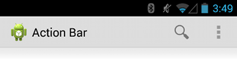

# 添加Action Bar

> 編寫:[Vincent 4J](http://github.com/vincent4j) - 原文:<http://developer.android.com/training/basics/actionbar/index.html>

Action Bar是我們可以為activity實現的最重要的設計元素之一。其提供了多種 UI 特性，可以讓我們的 app 與其他 Android app 保持較高的一致性，從而為用戶所熟悉。核心的功能包括：

* 一個專門的空間用來顯示你的app的標識，以及指出目前所處在app的哪個頁面。
* 以一種可預見的方式訪問重要的操作（比如搜索）。
* 支持導航和視圖切換（通過Tabs和下拉列表）

本章為 action bar 的基本知識提供了一個快速指南。關於 action bar 的更多特性，請查看 [Action Bar](https://developer.android.com/guide/topics/ui/actionbar.html) 指南。

## Lessons

* [**建立ActionBar**](setting-up.html)

  學習如何為 activity 添加一個基本的 action bar，是僅僅支持 Android 3.0及以上的版本，還是同時也支持至Android 2.1的版本（通過使用 Andriod Support Library）。

* [**添加Action按鈕**](adding-buttons.html)

  學習如何在 action bar 中添加和響應用戶操作。

* [**ActionBar的風格化**](styling.html)

  學習如何自定義 action bar 的外觀。

* [**ActionBar覆蓋疊加**](overlaying.html)

  學習如何在佈局上面疊加 action bar，允許 action bar 隱藏時無縫過渡。
