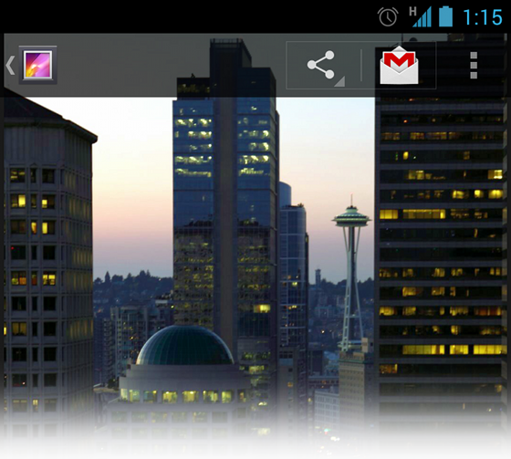

# ActionBar的覆蓋疊加

> 編寫:[Vincent 4J](http://github.com/vincent4j) - 原文:<http://developer.android.com/training/basics/actionbar/overlaying.html>

默認情況下，action bar 顯示在 activity 窗口的頂部，會稍微地減少其他佈局的有效空間。如果在用戶交互過程中要隱藏和顯示 action bar，可以通過調用 [ActionBar](https://developer.android.com/reference/android/app/ActionBar.html) 中的 <a href="https://developer.android.com/reference/android/app/ActionBar.html#hide()">hide()</a>和<a href="https://developer.android.com/reference/android/app/ActionBar.html#show()">show()</a>來實現。但是，這將導致 activity 基於新尺寸重新計算與繪製佈局。

為避免在 action bar 隱藏和顯示過程中調整佈局的大小，可以為 action bar 啟用疊加模式(**overlay mode**)。在疊加模式下，所有可用的空間都會被用來佈局就像ActionBar不存在一樣，並且 action bar 會疊加在佈局之上。這樣佈局頂部就會有點被遮擋，但當 action bar 隱藏或顯示時，系統不再需要調整佈局而是無縫過渡。

> **Note**：如果希望 action bar 下面的佈局部分可見，可以創建一個背景部分透明的自定義式樣的 action bar，如圖 1 所示。關於如何定義 action bar 的背景，請查看 [自定義ActionBar的風格](styling.html)。



圖 1. 疊加模式下的 gallery action bar

## 啟用疊加模式(Overlay Mode)

要為 action bar 啟用疊加模式，需要自定義一個主題，該主題繼承於已經存在的 action bar 主題，並設置 `android:windowActionBarOverlay` 屬性的值為 `true`。

### 僅支持 Android 3.0 和以上

如果 [minSdkVersion](https://developer.android.com/guide/topics/manifest/uses-sdk-element.html#min) 為 `11` 或更高，自定義主題必須繼承 [Theme.Holo](https://developer.android.com/reference/android/R.style.html#Theme_Holo) 主題（或者其子主題）。例如：

```xml
<resources>
    <!-- 為程序或者活動應用的主題樣式 -->
    <style name="CustomActionBarTheme"
           parent="@android:style/Theme.Holo">
        <item name="android:windowActionBarOverlay">true</item>
    </style>
</resources>
```

###  支持 Android 2.1 和更高

如果為了兼容運行在 Android 3.0 以下版本的設備而使用了 Support 庫，自定義主題必須繼承 [Theme.AppCompat](https://developer.android.com/reference/android/support/v7/appcompat/R.style.html#Theme_AppCompat) 主題（或者其子主題）。例如：

```xml
<resources>
    <!-- 為程序或者活動應用的主題樣式 -->
    <style name="CustomActionBarTheme"
           parent="@android:style/Theme.AppCompat">
        <item name="android:windowActionBarOverlay">true</item>

        <!-- 兼容支持庫 -->
        <item name="windowActionBarOverlay">true</item>
    </style>
</resources>
```

注意，該主題包含兩種不同的 `windowActionBarOverlay` 式樣定義：一個帶 `android:` 前綴，另一個不帶。帶前綴的適用於包含該式樣的 Android 系統版本，不帶前綴的適用於通過從 Support 庫中讀取式樣的舊版本。

## 指定佈局的頂部邊距

當 action bar 啟用疊加模式時，它可能會遮擋住本應保持可見狀態的佈局。為了確保這些佈局始終位於 action bar 下部，可以使用 [actionBarSize](https://developer.android.com/reference/android/R.attr.html#actionBarSize) 屬性來指定頂部margin或padding的高度來到達。例如：

```xml
<RelativeLayout xmlns:android="http://schemas.android.com/apk/res/android"
    android:layout_width="match_parent"
    android:layout_height="match_parent"
    android:paddingTop="?android:attr/actionBarSize">
    ...
</RelativeLayout>
```

如果在 action bar 中使用 Support 庫，需要移除 `android:` 前綴。例如：

```xml
<!-- 兼容支持庫 -->
<RelativeLayout xmlns:android="http://schemas.android.com/apk/res/android"
    android:layout_width="match_parent"
    android:layout_height="match_parent"
    android:paddingTop="?attr/actionBarSize">
    ...
</RelativeLayout>
```

在這種情況下，不帶前綴的 `?attr/actionBarSize` 適用於包括Android 3.0 和更高的所有版本。

