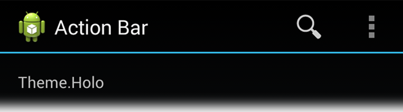
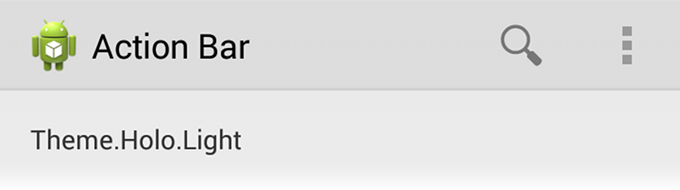
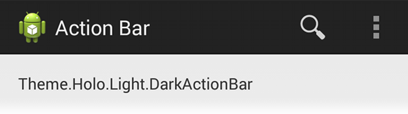
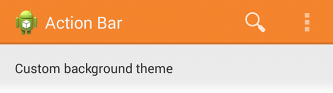
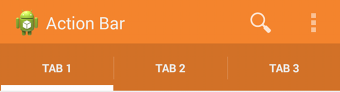

# 自定義ActionBar的風格

> 編寫:[Vincent 4J](http://github.com/vincent4j) -  原文:<http://developer.android.com/training/basics/actionbar/styling.html>

Action bar 為用戶提供一種熟悉可預測的方式來展示操作和導航，但是這並不意味著我們的 app 要看起來和其他 app 一樣。如果想將 action bar 的風格設計的合乎我們產品的定位，只需簡單地使用 Android 的 [樣式和主題](https://developer.android.com/guide/topics/ui/themes.html) 資源。

Android 包括一少部分內置的 activity 主題，這些主題中包含 “dark” 或 “light” 的 action bar 樣式。我們也可以擴展這些主題，以便於更好的為 action bar 自定義外觀。

> **注意**：如果我們為 action bar 使用了 Support 庫的 API，那我們必須使用（或重寫） [Theme.AppCompat](https://developer.android.com/reference/android/support/v7/appcompat/R.style.html#Theme_AppCompat) 家族樣式（甚至 [Theme.Holo](https://developer.android.com/reference/android/R.style.html#Theme_Holo) 家族，在 API level 11 或更高版本中可用）。如此一來，聲明的每一個樣式屬性都必須被聲明兩次：一次使用系統平臺的樣式屬性（[android:](http://developer.android.com/reference/android/R.attr.html) 屬性），另一次使用 Support 庫中的樣式屬性（[appcompat.R.attr](http://developer.android.com/reference/android/support/v7/appcompat/R.attr.html) 屬性 - 這些屬性的上下文其實就是我們的 app）。更多細節請查看下面的示例。

## 使用一個 Android 主題

Android 包含兩個基本的 activity 主題，這兩個主題決定了 action bar 的顏色：

* [Theme.Holo](https://developer.android.com/reference/android/R.style.html#Theme_Holo)，一個 “dark” 的主題
* [Theme.Holo.Light](https://developer.android.com/reference/android/R.style.html#Theme_Holo_Light)，一個 “light” 的主題





這些主題即可以被應用到 app 全局，也可以通過在 manifest 文件中設置 [`<application>`](https://developer.android.com/guide/topics/manifest/application-element.html) 元素 或 [`<activity>`](https://developer.android.com/guide/topics/manifest/application-element.html) 元素的 `android:theme` 屬性，對單一的 activity 進行設置。

例如：

```xml
<application android:theme="@android:style/Theme.Holo.Light" ... />
```

可以通過聲明 activity 的主題為 [Theme.Holo.Light.DarkActionBar](https://developer.android.com/reference/android/R.style.html#Theme_Holo_Light_DarkActionBar) 來達到如下效果：action bar 為dark，其他部分為light。



當使用 Support 庫時，必須使用 [Theme.AppCompat](https://developer.android.com/reference/android/support/v7/appcompat/R.style.html#Theme_AppCompat) 主題替代：

* [Theme.AppCompat](https://developer.android.com/reference/android/support/v7/appcompat/R.style.html#Theme_AppCompat)，一個“dark”的主題
* [Theme.AppCompat.Light](https://developer.android.com/reference/android/support/v7/appcompat/R.style.html#Theme_AppCompat_Light)，一個“light”的主題
* [Theme.AppCompat.Light.DarkActionBar](https://developer.android.com/reference/android/support/v7/appcompat/R.style.html#Theme_AppCompat_Light_DarkActionBar)，一個帶有“dark” action bar 的“light”主題

一定要確保我們使用的 action bar icon 的顏色與 action bar 本身的顏色有差異。[Action Bar Icon Pack](https://developer.android.com/design/downloads/index.html#action-bar-icon-pack) 為 Holo “dark”和“light”的 action bar 提供了標準的 action icon。

## 自定義背景

為改變 action bar的背景，可以通過為 activity 創建一個自定義主題，並重寫 [actionBarStyle](https://developer.android.com/reference/android/R.attr.html#actionBarStyle) 屬性來實現。[actionBarStyle](https://developer.android.com/reference/android/R.attr.html#actionBarStyle) 屬性指向另一個樣式；在該樣式裡，通過指定一個 drawable 資源來重寫 [background](https://developer.android.com/reference/android/R.attr.html#background) 屬性。



如果我們的 app 使用了 [navigation tabs](https://developer.android.com/guide/topics/ui/actionbar.html#Tabs) 或 [split action bar](https://developer.android.com/guide/topics/ui/actionbar.html#SplitBar) ，也可以通過分別設置 [backgroundStacked](https://developer.android.com/reference/android/R.attr.html#backgroundStacked) 和 [backgroundSplit](https://developer.android.com/reference/android/R.attr.html#backgroundSplit) 屬性來為這些條指定背景。

> **Note**：為自定義主題和樣式聲明一個合適的父主題，這點很重要。如果沒有父樣式，action bar將會失去很多默認的樣式屬性，除非我們自己顯式的對他們進行聲明。

### 僅支持 Android 3.0 和更高

當僅支持 Android 3.0 和更高版本時，可以通過如下方式定義 action bar 的背景：

`res/values/themes.xml`

```xml
<?xml version="1.0" encoding="utf-8"?>
<resources>
    <!-- 應用於程序或者活動的主題 -->
    <style name="CustomActionBarTheme"
           parent="@android:style/Theme.Holo.Light.DarkActionBar">
        <item name="android:actionBarStyle">@style/MyActionBar</item>
    </style>

    <!-- ActionBar 樣式 -->
    <style name="MyActionBar"
           parent="@android:style/Widget.Holo.Light.ActionBar.Solid.Inverse">
        <item name="android:background">@drawable/actionbar_background</item>
    </style>
</resources>
```

然後，將主題應用到 app 全局或單個的 activity 之中：

```xml
<application android:theme="@style/CustomActionBarTheme" ... />
```

### 支持 Android 2.1 和更高

當使用 Support 庫時，上面同樣的主題必須被替代成如下：

`res/values/themes.xml`

```xml
<?xml version="1.0" encoding="utf-8"?>
<resources>
    <!-- 應用於程序或者活動的主題 -->
    <style name="CustomActionBarTheme"
           parent="@style/Theme.AppCompat.Light.DarkActionBar">
        <item name="android:actionBarStyle">@style/MyActionBar</item>

        <!-- 支持庫兼容 -->
        <item name="actionBarStyle">@style/MyActionBar</item>
    </style>

    <!-- ActionBar 樣式 -->
    <style name="MyActionBar"
           parent="@style/Widget.AppCompat.Light.ActionBar.Solid.Inverse">
        <item name="android:background">@drawable/actionbar_background</item>

        <!-- 支持庫兼容 -->
        <item name="background">@drawable/actionbar_background</item>
    </style>
</resources>
```

然後，將主題應用到 app 全局或單個的 activity 之中：

```xml
<application android:theme="@style/CustomActionBarTheme" ... />
```

## 自定義文本顏色

修改 action bar 中的文本顏色，需要分別設置每個元素的屬性：

* Action bar 的標題：創建一種自定義樣式，並指定 `textColor` 屬性；同時，在自定義的 [actionBarStyle](https://developer.android.com/reference/android/R.attr.html#actionBarStyle) 中為 [titleTextStyle](https://developer.android.com/reference/android/R.attr.html#titleTextStyle) 屬性指定為剛才的自定義樣式。

> **注意**：被應用到 [titleTextStyle](https://developer.android.com/reference/android/R.attr.html#titleTextStyle) 的自定義樣式應該使用 [TextAppearance.Holo.Widget.ActionBar.Title](https://developer.android.com/reference/android/R.style.html#TextAppearance_Holo_Widget_ActionBar_Title) 作為父樣式。


* Action bar tabs：在 activity 主題中重寫 [ actionBarTabTextStyle](https://developer.android.com/reference/android/R.attr.html#actionBarTabTextStyle)
* Action 按鈕：在 activity 主題中重寫 [actionMenuTextColor](https://developer.android.com/reference/android/R.attr.html#actionMenuTextColor)

### 僅支持 Android 3.0 和更高

當僅支持 Android 3.0 和更高時，樣式 XML 文件應該是這樣的：

`res/values/themes.xml`

```xml
<?xml version="1.0" encoding="utf-8"?>
<resources>
    <!-- 應用於程序或者活動的主題 -->
    <style name="CustomActionBarTheme"
           parent="@style/Theme.Holo">
        <item name="android:actionBarStyle">@style/MyActionBar</item>
        <item name="android:actionBarTabTextStyle">@style/MyActionBarTabText</item>
        <item name="android:actionMenuTextColor">@color/actionbar_text</item>
    </style>

    <!-- ActionBar 樣式 -->
    <style name="MyActionBar"
           parent="@style/Widget.Holo.ActionBar">
        <item name="android:titleTextStyle">@style/MyActionBarTitleText</item>
    </style>

    <!-- ActionBar 標題文本 -->
    <style name="MyActionBarTitleText"
           parent="@style/TextAppearance.Holo.Widget.ActionBar.Title">
        <item name="android:textColor">@color/actionbar_text</item>
    </style>

    <!-- ActionBar Tab標籤 文本樣式 -->
    <style name="MyActionBarTabText"
           parent="@style/Widget.Holo.ActionBar.TabText">
        <item name="android:textColor">@color/actionbar_text</item>
    </style>
</resources>
```

### 支持 Android 2.1 和更高

當使用 Support 庫時，樣式 XML 文件應該是這樣的：

`res/values/themes.xml`

```xml
<?xml version="1.0" encoding="utf-8"?>
<resources>
    <!-- 應用於程序或者活動的主題 -->
    <style name="CustomActionBarTheme"
           parent="@style/Theme.AppCompat">
        <item name="android:actionBarStyle">@style/MyActionBar</item>
        <item name="android:actionBarTabTextStyle">@style/MyActionBarTabText</item>
        <item name="android:actionMenuTextColor">@color/actionbar_text</item>

        <!-- 支持庫兼容 -->
        <item name="actionBarStyle">@style/MyActionBar</item>
        <item name="actionBarTabTextStyle">@style/MyActionBarTabText</item>
        <item name="actionMenuTextColor">@color/actionbar_text</item>
    </style>

    <!-- ActionBar 樣式 -->
    <style name="MyActionBar"
           parent="@style/Widget.AppCompat.ActionBar">
        <item name="android:titleTextStyle">@style/MyActionBarTitleText</item>

        <!-- 支持庫兼容 -->
        <item name="titleTextStyle">@style/MyActionBarTitleText</item>
    </style>

    <!-- ActionBar 標題文本 -->
    <style name="MyActionBarTitleText"
           parent="@style/TextAppearance.AppCompat.Widget.ActionBar.Title">
        <item name="android:textColor">@color/actionbar_text</item>
        <!-- 文本顏色屬性textColor是可以配合支持庫向後兼容的 -->
    </style>

    <!-- ActionBar Tab標籤文本樣式 -->
    <style name="MyActionBarTabText"
           parent="@style/Widget.AppCompat.ActionBar.TabText">
        <item name="android:textColor">@color/actionbar_text</item>
        <!-- 文本顏色屬性textColor是可以配合支持庫向後兼容的 -->
    </style>
</resources>
```

## 自定義 Tab Indicator

為 activity 創建一個自定義主題，通過重寫 [actionBarTabStyle](https://developer.android.com/reference/android/R.attr.html#actionBarTabStyle) 屬性來改變 [navigation tabs](https://developer.android.com/guide/topics/ui/actionbar.html#Tabs) 使用的指示器。[actionBarTabStyle](https://developer.android.com/reference/android/R.attr.html#actionBarTabStyle) 屬性指向另一個樣式資源；在該樣式資源裡，通過指定一個state-list drawable 來重寫 [background](https://developer.android.com/reference/android/R.attr.html#background) 屬性。


> **注意**：一個state-list drawable 是重要的，它可以通過不同的背景來指出當前選擇的 tab 與其他 tab 的區別。更多關於如何創建一個 drawable 資源來處理多個按鈕狀態，請閱讀 [State List](https://developer.android.com/guide/topics/resources/drawable-resource.html#StateList) 文檔。

例如，這是一個狀態列表 drawable，為一個 action bar tab 的多種不同狀態分別指定背景圖片：

`res/drawable/actionbar_tab_indicator.xml`

```xml
<?xml version="1.0" encoding="utf-8"?>
<selector xmlns:android="http://schemas.android.com/apk/res/android">

<!-- 按鈕沒有按下的狀態 -->

    <!-- 沒有焦點的狀態 -->
    <item android:state_focused="false" android:state_selected="false"
          android:state_pressed="false"
          android:drawable="@drawable/tab_unselected" />
    <item android:state_focused="false" android:state_selected="true"
          android:state_pressed="false"
          android:drawable="@drawable/tab_selected" />

    <!-- 有焦點的狀態 (例如D-Pad控制或者鼠標經過) -->
    <item android:state_focused="true" android:state_selected="false"
          android:state_pressed="false"
          android:drawable="@drawable/tab_unselected_focused" />
    <item android:state_focused="true" android:state_selected="true"
          android:state_pressed="false"
          android:drawable="@drawable/tab_selected_focused" />


<!--  按鈕按下的狀態D -->

    <!-- 沒有焦點的狀態 -->
    <item android:state_focused="false" android:state_selected="false"
          android:state_pressed="true"
          android:drawable="@drawable/tab_unselected_pressed" />
    <item android:state_focused="false" android:state_selected="true"
        android:state_pressed="true"
        android:drawable="@drawable/tab_selected_pressed" />

    <!--有焦點的狀態 (例如D-Pad控制或者鼠標經過)-->
    <item android:state_focused="true" android:state_selected="false"
          android:state_pressed="true"
          android:drawable="@drawable/tab_unselected_pressed" />
    <item android:state_focused="true" android:state_selected="true"
          android:state_pressed="true"
          android:drawable="@drawable/tab_selected_pressed" />
</selector>
```

### 僅支持 Android 3.0 和更高

當僅支持 Android 3.0 和更高時，樣式 XML 文件應該是這樣的：

`res/values/themes.xml`

```xml
<?xml version="1.0" encoding="utf-8"?>
<resources>
    <!-- 應用於程序或活動的主題 -->
    <style name="CustomActionBarTheme"
           parent="@style/Theme.Holo">
        <item name="android:actionBarTabStyle">@style/MyActionBarTabs</item>
    </style>

    <!-- ActionBar tabs 標籤樣式 -->
    <style name="MyActionBarTabs"
           parent="@style/Widget.Holo.ActionBar.TabView">
        <!-- 標籤指示器 -->
        <item name="android:background">@drawable/actionbar_tab_indicator</item>
    </style>
</resources>
```

### 支持 Android 2.1 和更高

當使用 Support 庫時，樣式 XML 文件應該是這樣的：

`res/values/themes.xml`

```xml
<?xml version="1.0" encoding="utf-8"?>
<resources>
    <!-- 應用於程序或活動的主題 -->
    <style name="CustomActionBarTheme"
           parent="@style/Theme.AppCompat">
        <item name="android:actionBarTabStyle">@style/MyActionBarTabs</item>

        <!-- 支持庫兼容 -->
        <item name="actionBarTabStyle">@style/MyActionBarTabs</item>
    </style>

    <!-- ActionBar tabs 樣式 -->
    <style name="MyActionBarTabs"
           parent="@style/Widget.AppCompat.ActionBar.TabView">
        <!-- 標籤指示器 -->
        <item name="android:background">@drawable/actionbar_tab_indicator</item>

        <!-- 支持庫兼容 -->
        <item name="background">@drawable/actionbar_tab_indicator</item>
    </style>
</resources>
```

> **更多資源**
* 關於 action bar 的更多樣式屬性，請查看 [Action Bar](https://developer.android.com/guide/topics/ui/actionbar.html#Style) 指南
* 學習更多樣式的工作機制，請查看 [樣式和主題](https://developer.android.com/guide/topics/ui/themes.html) 指南
* 全面的 action bar 樣式，請嘗試 [Android Action Bar 樣式生成器](http://www.actionbarstylegenerator.com/)
