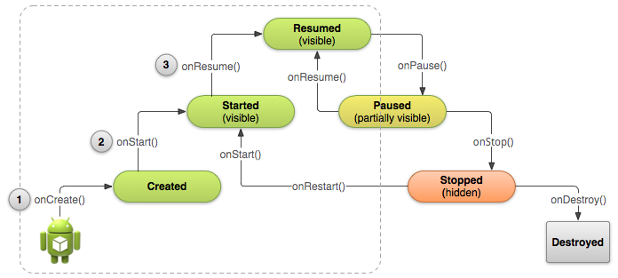

# 啟動與銷燬Activity

> 編寫:[kesenhoo](https://github.com/kesenhoo) - 原文:<http://developer.android.com/training/basics/activity-lifecycle/starting.html>

不同於其他編程範式（程序從`main()`方法開始啟動），Android系統根據生命週期的不同階段喚起對應的回調函數來執行代碼。系統存在啟動與銷燬一個activity的一套有序的回調函數。

本課介紹生命週期中最重要的回調函數，並演示如何處理啟動一個activity所涉及到的回調函數。

## 理解生命週期的回調

在一個activity的生命週期中，系統會像金字塔模型一樣去調用一系列的生命週期回調函數。Activity生命週期的每一個階段就像金字塔中的臺階。當系統創建了一個新的activity實例，每一個回調函數會向上一階移動activity狀態。處在金字塔頂端意味著當前activity處在前臺並處於用戶可與其進行交互的狀態。

<!-- more -->

當用戶退出這個activity時，為了回收該activity，系統會調用其它方法來向下一階移動activity狀態。在某些情況下，activity會隱藏在金字塔下等待(例如當用戶切換到其他app),此時activity可以重新回到頂端(如果用戶回到這個activity)並恢復用戶離開時的狀態。


**Figure 1.** 下面這張圖講解了activity的生命週期：*(這個金字塔模型要比之前Dev Guide裡面的生命週期圖更加容易理解，更加形象)*

根據activity的複雜度，也許不需要實現所有的生命週期方法。但瞭解每一個方法的回調時機並在其中填充相應功能，使得確保app能夠像用戶期望的那樣執行是很有必要的。如何實現一個符合用戶期待的app，我們需要注意下面幾點：

  * 使用app的時候，不會因為有來電通話或者切換到其他app而導致程序crash。
  * 用戶沒有激活某個組件時不會消耗寶貴的系統資源。
  * 離開app並且一段時間後返回，不會丟失用戶的使用進度。
  * 設備發生屏幕旋轉時不會crash或者丟失用戶的使用進度。

下面的課程會介紹上圖所示的幾個生命狀態。然而，其中只有三個狀態是靜態的，這三個狀態下activity可以存在一段比較長的時間。*(其它幾個狀態會很快就切換掉，停留的時間比較短暫)*

  * **Resumed**：該狀態下，activity處在前臺，用戶可以與它進行交互。(通常也被理解為"running" 狀態)
  * **Paused**：該狀態下，activity的部分被另外一個activity所遮蓋：另外的activity來到前臺，但是半透明的，不會覆蓋整個屏幕。被暫停的activity不再接受用戶的輸入且不再執行任何代碼。
  * **Stopped**：該狀態下, activity完全被隱藏，對用戶不可見。可以認為是在後臺。當stopped, activity實例與它的所有狀態信息（如成員變量等）都會被保留，但activity不能執行任何代碼。

其它狀態 (**Created**與**Started**)都是短暫的，系統快速的執行那些回調函數並通過執行下一階段的回調函數移動到下一個狀態。也就是說，在系統調用<a href="http://developer.android.com/reference/android/app/Activity.html#onCreate(android.os.Bundle)">onCreate()</a>, 之後會迅速調用<a href="http://developer.android.com/reference/android/app/Activity.html#onStart()">onStart()</a>, 之後再迅速執行<a href="http://developer.android.com/reference/android/app/Activity.html#onResume()">onResume()</a>。以上就是基本的activity生命週期。

## 指定程序首次啟動的Activity

當用戶從主界面點擊程序圖標時，系統會調用app中被聲明為"launcher" (or "main") activity中的onCreate()方法。這個Activity被用來當作程序的主要進入點。

我們可以在[AndroidManifest.xml](http://developer.android.com/guide/topics/manifest/manifest-intro.html)中定義作為主activity的activity。

這個main activity必須在manifest使用包括 `MAIN` action 與 `LAUNCHER` category 的[`<intent-filter>`](http://developer.android.com/guide/topics/manifest/intent-filter-element.html)標籤來聲明。例如：

```xml
<activity android:name=".MainActivity" android:label="@string/app_name">
    <intent-filter>
        <action android:name="android.intent.action.MAIN" />
        <category android:name="android.intent.category.LAUNCHER" />
    </intent-filter>
</activity>
```

> **Note**:當你使用Android SDK工具來創建Android工程時，工程中就包含了一個默認的聲明有這個filter的activity類。

如果程序中沒有聲明瞭[MAIN](http://developer.android.com/reference/android/content/Intent.html#ACTION_MAIN) action 或者[LAUNCHER](http://developer.android.com/reference/android/content/Intent.html#CATEGORY_LAUNCHER) category的activity，那麼在設備的主界面列表裡面不會呈現app圖標。

## 創建一個新的實例

大多數app包括多個activity，使用戶可以執行不同的動作。不論這個activity是當用戶點擊應用圖標創建的main activtiy還是為了響應用戶行為而創建的其他activity，系統都會調用新activity實例中的onCreate()方法。

我們必須實現onCreate()方法來執行程序啟動所需要的基本邏輯。例如可以在onCreate()方法中定義UI以及實例化類成員變量。

例如：下面的onCreate()方法演示了為了建立一個activity所需要的一些基礎操作。如聲明UI元素，定義成員變量，配置UI等。*(onCreate裡面儘量少做事情，避免程序啟動太久都看不到界面)*

```java
TextView mTextView; // Member variable for text view in the layout

@Override
public void onCreate(Bundle savedInstanceState) {
    super.onCreate(savedInstanceState);

    // Set the user interface layout for this Activity
    // The layout file is defined in the project res/layout/main_activity.xml file
    setContentView(R.layout.main_activity);

    // Initialize member TextView so we can manipulate it later
    mTextView = (TextView) findViewById(R.id.text_message);

    // Make sure we're running on Honeycomb or higher to use ActionBar APIs
    if (Build.VERSION.SDK_INT >= Build.VERSION_CODES.HONEYCOMB) {
        // For the main activity, make sure the app icon in the action bar
        // does not behave as a button
        ActionBar actionBar = getActionBar();
        actionBar.setHomeButtonEnabled(false);
    }
}
```

> **Caution**：用[SDK_INT](http://developer.android.com/reference/android/os/Build.VERSION.html#SDK_INT)來避免舊的系統調用了只在Android 2.0（API level 5）或者更新的系統可用的方法（上述if條件中的代碼）。舊的系統調用了這些方法會拋出一個運行時異常。

一旦onCreate 操作完成，系統會迅速調用onStart() 與onResume()方法。我們的activity不會在Created或者Started狀態停留。技術上來說, activity在onStart()被調用後開始被用戶可見，但是 onResume()會迅速被執行使得activity停留在Resumed狀態，直到一些因素髮生變化才會改變這個狀態。例如接收到一個來電，用戶切換到另外一個activity，或者是設備屏幕關閉。

在後面的課程中，我們將看到其他方法是如何使用的，onStart() 與 onResume()在用戶從Paused或Stopped狀態中恢復的時候非常有用。

> **Note:** onCreate() 方法包含了一個參數叫做savedInstanceState，這將會在後面的課程 - [重新創建activity](../../activity-lifecycle/recreating.html)涉及到。



**Figure 2.** 上圖顯示了onCreate(), onStart() 和 onResume()是如何執行的。當這三個順序執行的回調函數完成後，activity會到達Resumed狀態。

## 銷燬Activity

activity的第一個生命週期回調函數是 onCreate(),它最後一個回調是<a href="http://developer.android.com/reference/android/app/Activity.html#onDestroy()">onDestroy()</a>.當收到需要將該activity徹底移除的信號時，系統會調用這個方法。

大多數 app並不需要實現這個方法，因為局部類的references會隨著activity的銷燬而銷燬，並且我們的activity應該在onPause()與onStop()中執行清除activity資源的操作。然而，如果activity含有在onCreate調用時創建的後臺線程，或者是其他有可能導致內存洩漏的資源，則應該在OnDestroy()時進行資源清理，殺死後臺線程。

```java
@Override
public void onDestroy() {
    super.onDestroy();  // Always call the superclass

    // Stop method tracing that the activity started during onCreate()
    android.os.Debug.stopMethodTracing();
}
```

> **Note:** 除非程序在onCreate()方法裡面就調用了finish()方法，系統通常是在執行了onPause()與onStop() 之後再調用onDestroy() 。在某些情況下，例如我們的activity只是做了一個臨時的邏輯跳轉的功能，它只是用來決定跳轉到哪一個activity，這樣的話，需要在onCreate裡面調用finish方法，這樣系統會直接調用onDestory，跳過生命週期中的其他方法。
