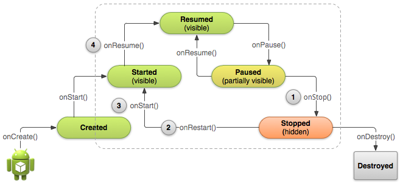

# 停止與重啟Activity

> 編寫:[kesenhoo](https://github.com/kesenhoo) - 原文: <http://developer.android.com/training/basics/activity-lifecycle/stopping.html>

恰當的停止與重啟我們的activity是很重要的，在activity生命週期中，他們能確保用戶感知到程序的存在並不會丟失他們的進度。在下面一些關鍵的場景中會涉及到停止與重啟：

* 用戶打開最近使用app的菜單並從我們的app切換到另外一個app，這個時候我們的app是被停止的。如果用戶通過手機主界面的啟動程序圖標或者最近使用程序的窗口回到我們的app，那麼我們的activity會重啟。
* 用戶在我們的app裡面執行啟動一個新activity的操作，當前activity會在第二個activity被創建後stop。如果用戶點擊back按鈕，第一個activtiy會被重啟。
* 用戶在使用我們的app時接收到一個來電通話.

[Activity](http://developer.android.com/reference/android/app/Activity.html)類提供了<a href="http://developer.android.com/reference/android/app/Activity.html#onStop()">onStop()</a>與<a href="http://developer.android.com/reference/android/app/Activity.html#onRestart()">onRestart()</a>方法來允許在activity停止與重啟時進行調用。不同於暫停狀態的部分阻塞UI，停止狀態是UI不再可見並且用戶的焦點轉移到另一個activity中.

> **Note:** 因為系統在activity停止時會在內存中保存Activity的實例，所以有時不需要實現onStop(),onRestart()甚至是onStart()方法. 因為大多數的activity相對比較簡單，activity會自己停止與重啟，我們只需要使用onPause()來停止正在運行的動作並斷開系統資源鏈接。

<!-- more -->



**Figure 1.** 上圖顯示：當用戶離開我們的activity時，系統會調用onStop()來停止activity (1). 這個時候如果用戶返回，系統會調用onRestart()(2), 之後會迅速調用onStart()(3)與onResume()(4). 請注意：無論什麼原因導致activity停止，系統總是會在onStop()之前調用onPause()方法。

## 停止activity

當activity調用onStop()方法, activity不再可見，並且應該釋放那些不再需要的所有資源。一旦activity停止了，系統會在需要內存空間時摧毀它的實例(*和棧結構有關，通常back操作會導致前一個activity被銷燬*)。極端情況下，系統會直接殺死我們的app進程，並不執行activity的<a href="http://developer.android.com/reference/android/app/Activity.html#onDestroy()">onDestroy()</a>回調方法, 因此我們需要使用onStop()來釋放資源，從而避免內存洩漏。*(這點需要注意)*

儘管onPause()方法是在onStop()之前調用，我們應該使用onStop()來執行那些CPU intensive的shut-down操作，例如往數據庫寫信息。

例如，下面是一個在onStop()的方法裡面保存筆記草稿到persistent storage的示例:

```java
@Override
protected void onStop() {
    super.onStop();  // Always call the superclass method first

    // Save the note's current draft, because the activity is stopping
    // and we want to be sure the current note progress isn't lost.
    ContentValues values = new ContentValues();
    values.put(NotePad.Notes.COLUMN_NAME_NOTE, getCurrentNoteText());
    values.put(NotePad.Notes.COLUMN_NAME_TITLE, getCurrentNoteTitle());

    getContentResolver().update(
            mUri,    // The URI for the note to update.
            values,  // The map of column names and new values to apply to them.
            null,    // No SELECT criteria are used.
            null     // No WHERE columns are used.
            );
}
```

activity已經停止後，[Activity](http://developer.android.com/reference/android/app/Activity.html)對象會保存在內存中，並在activity resume時被重新調用。我們不需要在恢復到Resumed state狀態前重新初始化那些被保存在內存中的組件。系統同樣保存了每一個在佈局中的視圖的當前狀態，如果用戶在EditText組件中輸入了text，它會被保存，因此不需要保存與恢復它。

> **Note:** 即使系統會在activity stop時停止這個activity，它仍然會保存[View](http://developer.android.com/reference/android/view/View.html)對象的狀態(比如[EditText](http://developer.android.com/reference/android/widget/EditText.html)中的文字) 到一個[Bundle](http://developer.android.com/reference/android/os/Bundle.html)中，並且在用戶返回這個activity時恢復它們(下一小節會介紹在activity銷燬與重新建立時如何使用[Bundle](http://developer.android.com/reference/android/os/Bundle.html)來保存其他數據的狀態).

## 啟動與重啟activity

當activity從Stopped狀態回到前臺時，它會調用onRestart().系統再調用onStart()方法，onStart()方法會在每次activity可見時都會被調用。onRestart()方法則是隻在activity從stopped狀態恢復時才會被調用，因此我們可以使用它來執行一些特殊的恢復(restoration)工作，請注意之前是被stopped而不是destrory。

使用onRestart()來恢復activity狀態是不太常見的，因此對於這個方法如何使用沒有任何的guidelines。然而，因為onStop()方法應該做清除所有activity資源的操作，我們需要在重啟activtiy時重新實例化那些被清除的資源，同樣, 我們也需要在activity第一次創建時實例化那些資源。介於上面的原因，應該使用onStart()作為onStop()所對應方法。因為系統會在創建activity與從停止狀態重啟activity時都會調用onStart()。也就是說，我們在onStop裡面做了哪些清除的操作，就該在onStart裡面重新把那些清除掉的資源重新創建出來。

例如：因為用戶很可能在回到這個activity之前已經過了很長一段時間，所以onStart()方法是一個比較好的地方來驗證某些必須的系統特性是否可用。

```java
@Override
protected void onStart() {
    super.onStart();  // Always call the superclass method first

    // The activity is either being restarted or started for the first time
    // so this is where we should make sure that GPS is enabled
    LocationManager locationManager =
            (LocationManager) getSystemService(Context.LOCATION_SERVICE);
    boolean gpsEnabled = locationManager.isProviderEnabled(LocationManager.GPS_PROVIDER);

    if (!gpsEnabled) {
        // Create a dialog here that requests the user to enable GPS, and use an intent
        // with the android.provider.Settings.ACTION_LOCATION_SOURCE_SETTINGS action
        // to take the user to the Settings screen to enable GPS when they click "OK"
    }
}

@Override
protected void onRestart() {
    super.onRestart();  // Always call the superclass method first

    // Activity being restarted from stopped state
}
```

當系統Destory我們的activity，它會為activity調用onDestroy()方法。因為我們會在onStop方法裡面做釋放資源的操作，那麼onDestory方法則是我們最後去清除那些可能導致內存洩漏的地方。因此需要確保那些線程都被destroyed並且所有的操作都被停止。
