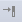

# 建立簡單的用戶界面

> 編寫:[yuanfentiank789](https://github.com/yuanfentiank789) - 原文:<http://developer.android.com/training/basics/firstapp/building-ui.html>

    在本小節裡，我們將學習如何用XML創建一個帶有文本輸入框和按鈕的界面，下一節課將學會使app對按鈕做出響應：按鈕被按下時，文本框裡的內容被髮送到另外一個Activity。


Android的圖形用戶界面是由多個[View](http://developer.android.com/reference/android/view/View.html)和[ViewGroup](http://developer.android.com/reference/android/view/ViewGroup.html)構建出來的。[View](http://developer.android.com/reference/android/view/View.html)是通用的UI窗體小組件，比如按鈕([Button](http://developer.android.com/guide/topics/ui/controls/button.html))或者文本框([text field](http://developer.android.com/guide/topics/ui/controls/text.html))，而[ViewGroup](http://developer.android.com/reference/android/view/ViewGroup.html)是不可見的，是用於定義子View佈局方式的容器，比如網格部件(grid)和垂直列表部件(list)。

Android提供了一個對應於[View](http://developer.android.com/reference/android/view/View.html)和[ViewGroup](http://developer.android.com/reference/android/view/ViewGroup.html)子類的一系列XMl標籤，我們可以在XML裡使用層級視圖元素創建自己的UI。

Layouts是ViewGroup的子類，接下來的練習將使用[LinearLayout](http://developer.android.com/reference/android/widget/LinearLayout.html)。


**Figure 1.** 關於viewgroup對象如何組織布局分支和包含其他view對象。


> 可選的佈局文件：在XML中定義界面佈局而不是在運行時去動態生成佈局是有多個原因的，其中最重要的一點是這樣可以使得你為不同大小的屏幕創建不同的佈局文件。例如，你可以創建2個版本的佈局文件，告訴系統在小的屏幕上使用其中一個佈局文件，在大的屏幕上使用另外一個佈局文件。更多信息，請參考[兼容不同的設備](../supporting-devices/index.html)

## 創建一個LinearLayout

1 在Android Studio中，從res/layout目錄打開activity_my.xml文件。上一節創建新項目時生成的BlankActivity，包含一個activity_my.xml文件，該文件根元素是一個包含TextView的RelativeLayout。

2 在**Preview**面板點擊關閉右側Preview面板，在Android Studio中，當打開佈局文件時，可以看到一個Preview面板，點擊這個面板中的標籤，可利用WYSIWYG（所見即所得）工具在Design面板看到對應的圖形化效果，但在本節直接操作XML文件即可。

3 刪除 TextView 標籤.

4 把 RelativeLayout 標籤改為 LinearLayout.

5 為< LinearLayout >添加 android:orientation 屬性並設置值為 "horizontal".

6 去掉android:padding 屬性和tools:context 屬性.


修改後結果如下：

res/layout/activity_my.xml

```xml
<LinearLayout xmlns:android="http://schemas.android.com/apk/res/android"
    xmlns:tools="http://schemas.android.com/tools"
    android:layout_width="match_parent"
    android:layout_height="match_parent"
    android:orientation="horizontal" >
</LinearLayout>
```

[LinearLayout](http://developer.android.com/reference/android/widget/LinearLayout.html)是[ViewGroup](http://developer.android.com/reference/android/view/ViewGroup.html)的一個子類，用於放置水平或者垂直方向的子視圖部件，放置方向由屬性`android:orientation`設定。LinearLayout裡的子佈局按照XML裡定義的順序顯示在屏幕上。

所有的Views都需要用到[android:layout_width](http://developer.android.com/reference/android/view/View.html#attr_android:layout_width)和[android:layout_height](http://developer.android.com/reference/android/view/View.html#attr_android:layout_height)這兩個屬性來設置自身的大小。

由於LinearLayout是整個視圖的根佈局，所以其寬和高都應充滿整個屏幕的，通過指定width 和 height屬性為`"match_parent"`。該值表示子View擴張自己width和height來匹配父控件的width和height。

更多關於[Layout](http://developer.android.com/guide/topics/ui/declaring-layout.html)屬性的信息，請參照XML佈局嚮導。

## 添加一個文本輸入框

與其它View一樣，我們需要設置XML裡的某些屬性來指定EditText的屬性值，以下是應該在線性佈局裡指定的一些屬性元素：

1 在activity\_my.xml文件的 < LinearLayout > 標籤內定義一個 < EditText > 標籤，並設置id屬性為@+id/edit_message.

2 設置layout_width和layout_height屬性為 wrap_content.

3 設置hint屬性為一個string 值的引用edit_message.

代碼如下：

res/layout/activity_my.xml

```xml
<EditText android:id="@+id/edit_message"
    android:layout_width="wrap_content"
    android:layout_height="wrap_content"
    android:hint="@string/edit_message" />
```

各屬性說明:

#### [android:id](http://developer.android.com/reference/android/view/View.html#attr_android:id)

這是定義View的唯一標識符。可以在程序代碼中通過該標識符對對象進行引用，例如對這個對象進行讀和修改的操作(在下一課裡將會用到)。

當想從XML裡引用資源對象的時候必須使用@符號。緊隨@之後的是資源的類型(這裡是`id`)，然後是資源的名字(這裡使用的是`edit_message`)。

+號只是當你第一次定義一個資源ID的時候需要。這裡是告訴SDK此資源ID需要被創建出來。在應用程序被編譯之後，SDK就可以直接使用ID值，edit_message是在項目`gen/R.java`文件中創建一個新的標識符，這個標識符就和[EditText](http://developer.android.com/reference/android/widget/EditText.html)關聯起來了。一旦資源ID被創建了，其他資源如果引用這個ID就不再需要+號了。這裡是唯一一個需要+號的屬性。

#### [android:layout_width](http://developer.android.com/reference/android/view/View.html#attr_android:layout_width) 和[android:layout_height](http://developer.android.com/reference/android/view/View.html#attr_android:layout_height)

對於寬和高不建議指定具體的大小，使用`wrap_content`指定之後，這個視圖將只佔據內容大小的空間。如果你使用了`match_parent`，這時[EditText](http://developer.android.com/reference/android/widget/EditText.html)將會佈滿整個屏幕，因為它將適應父佈局的大小。更多信息，請參考 [佈局嚮導](http://developer.android.com/guide/topics/ui/declaring-layout.html)。

#### [android:hint](http://developer.android.com/reference/android/widget/TextView.html#attr_android:hint)

當文本框為空的時候,會默認顯示這個字符串。對於字符串`@string/edit_message`的值所引用的資源應該是定義在單獨的文件裡，而不是直接使用字符串。因為使用的值是存在的資源，所以不需要使用+號。然而，由於你還沒有定義字符串的值，所以在添加`@string/edit_message`時候會出現編譯錯誤。下邊你可以定義字符串資源值來去除這個錯誤。

> **Note**: 該字符串資源與id使用了相同的名稱（edit_message）。然而，對於資源的引用是區分類型的（比如id和字符串），因此，使用相同的名稱不會引起衝突。

## 增加字符串資源


默認情況下，你的Android項目包含一個字符串資源文件，`res/values/string.xml`。打開這個文件，為`"edit_message"`增加一個供使用的字符串定義，設置值為"Enter a message."

1 在Android Studio裡，編輯 res/values 下的 strings.xml 文件.

2 添加一個string名為"edit_message" ,值為 "Enter a message".

3 再添加一個string名為 "button_send"，值為"Send".下面的內容將使用這個string來創建一個按鈕.

4 刪除 "hello world" string這一行.

下邊就是修改好的`res/values/strings.xml`：

```xml
<?xml version="1.0" encoding="utf-8"?>
<resources>
    <string name="app_name">My First App</string>
    <string name="edit_message">Enter a message</string>
    <string name="button_send">Send</string>
    <string name="action_settings">Settings</string>
    <string name="title_activity_main">MainActivity</string>
</resources>
```
當你在用戶界面定義一個文本的時候，你應該把每一個文本字符串列入資源文件。這樣做的好處是：對於所有字符串值，字符串資源能夠單獨的修改，在資源文件裡你可以很容易的找到並且做出相應的修改。通過選擇定義每個字符串，還允許您對不同語言本地化應用程序。


更多的於不同語言本字符串資源本地化的問題，請參考[兼容不同的設備(Supporting Different Devices)](../supporting-devices/index.html) 。

## 添加一個按鈕


1 在 Android Studio裡, 編輯 res/layout下的 activity_my.xml 文件.

2 在LinearLayout 內部, 在< EditText >標籤之後定義一個< Button >標籤.

3 設置Button的width 和 height 屬性值為 "wrap_content" 以便讓Button大小能完整顯示其上的文本.

4 定義button的文本使用android:text 屬性，設置其值為之前定義好的 button_send 字符串.

此時的 LinearLayout 看起來應該是這樣

res/layout/activity_my.xml

```xml
<LinearLayout xmlns:android="http://schemas.android.com/apk/res/android"
    xmlns:tools="http://schemas.android.com/tools"
    android:layout_width="match_parent"
    android:layout_height="match_parent"
    android:orientation="horizontal" >
      <EditText android:id="@+id/edit_message"
        android:layout_width="wrap_content"
        android:layout_height="wrap_content"
        android:hint="@string/edit_message" />
      <Button
        android:layout_width="wrap_content"
        android:layout_height="wrap_content"
        android:text="@string/button_send" />
</LinearLayout>
```

>**Note** 寬和高被設置為`"wrap_content"`，這時按鈕佔據的大小就是按鈕裡文本的大小。這個按鈕不需要指定[android:id](http://developer.android.com/reference/android/view/View.html#attr_android:id)的屬性，因為Activity代碼中不會引用該Button。

當前EditText和Button部件只是適應了他們各自內容的大小，如下圖所示：


這樣設置對按鈕來說很合適，但是對於文本框來說就不太好了，因為用戶可能輸入更長的文本內容。因此如果能夠佔滿整個屏幕寬度會更好。LinearLayout使用*權重*屬性來達到這個目的，你可以使用[android:layout_weight](http://developer.android.com/reference/android/widget/LinearLayout.LayoutParams.html#weight)屬性來設置。

權重的值指的是每個部件所佔剩餘空間的大小，該值與同級部件所佔空間大小有關。就類似於飲料的成分配方：“兩份伏特加酒，一份咖啡利口酒”，即該酒中伏特加酒佔三分之二。例如，我們設置一個View的權重是2，另一個View的權重是1，那麼總數就是3，這時第一個View佔據2/3的空間，第二個佔據1/3的空間。如果你再加入第三個View，權重設為1，那麼第一個View(權重為2的)會佔據1/2的空間，剩餘的另外兩個View各佔1/4。(請注意，使用權重的前提一般是給View的寬或者高的大小設置為0dp，然後系統根據上面的權重規則來計算View應該佔據的空間。但是很多情況下，如果給View設置了match_parent的屬性，那麼上面計算權重時則不是通常的正比，而是反比，也就是權重值大的反而佔據空間小)。

對於所有的View默認的權重是0，如果只設置了一個View的權重大於0，則該View將佔據除去別的View本身佔據的空間的所有剩餘空間。因此這裡設置EditText的權重為1，使其能夠佔據除了按鈕之外的所有空間。


## 讓輸入框充滿整個屏幕的寬度

為讓 EditText充滿剩餘空間，做如下操作：

1  在activity_my.xml文件裡，設置EditText的layout_weight屬性值為1 .

2  設置EditText的layout_width值為0dp.

res/layout/activity_my.xml

```xml
<EditText
    android:layout_weight="1"
    android:layout_width="0dp"
    ... />
```

為了提升佈局的效率，在設置權重的時候，應該把[EditText](http://developer.android.com/reference/android/widget/EditText.html)的寬度設為0dp。如果設置"wrap_content"作為寬度，系統需要自己去計算這個部件所佔有的寬度，而此時的因為設置了權重，所以系統自動會佔據剩餘空間，EditText的寬度最終成了不起作用的屬性。


設置權重後的效果圖


現在看一下完整的佈局文件內容：

res/layout/activity_my.xml

```xml
<?xml version="1.0" encoding="utf-8"?>
<LinearLayout xmlns:android="http://schemas.android.com/apk/res/android"
    xmlns:tools="http://schemas.android.com/tools"
    android:layout_width="match_parent"
    android:layout_height="match_parent"
    android:orientation="horizontal">
    <EditText android:id="@+id/edit_message"
        android:layout_weight="1"
        android:layout_width="0dp"
        android:layout_height="wrap_content"
        android:hint="@string/edit_message" />
    <Button
        android:layout_width="wrap_content"
        android:layout_height="wrap_content"
        android:text="@string/button_send" />
</LinearLayout>```
## 運行應用
整個佈局默認被應用於創建項目的時候SDK工具自動生成的Activity，運行看下效果:

+ 在Android Studio裡，點擊工具欄裡的Run按鈕

+ 或者使用命令行，進入你項目的根目錄直接執行

```
ant debug
adb install bin/MyFirstApp-debug.apk
```

下一小節將學習有關如何對按鈕做出相應，同時讀取文本中的內容，啟動另外一個Activity等。

[下一節：啟動另一個Activity](starting-activity.html)
