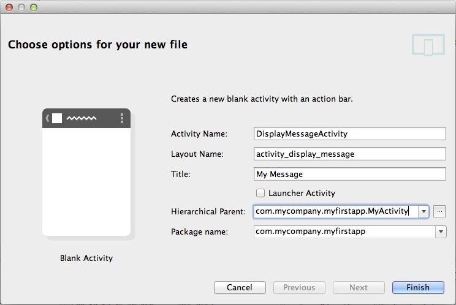
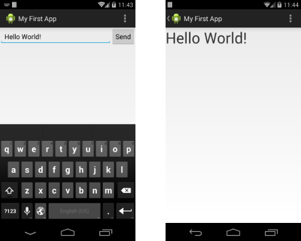

# 啟動另一個Activity

> 編寫:[yuanfentiank789](https://github.com/yuanfentiank789) - 原文:<http://developer.android.com/training/basics/firstapp/starting-activity.html>

在完成上一課(建立簡單的用戶界面)後，我們已經擁有了顯示一個activity（一個界面）的app（應用），該activity包含了一個文本字段和一個按鈕。在這節課中，我們將添加一些新的代碼到`MyActivity`中，當用戶點擊發送(Send)按鈕時啟動一個新的activity。

## 響應Send(發送)按鈕

1 在Android Studio中打開res/layout目錄下的activity_my.xml 文件.

2 為 Button 標籤添加[android:onclick](http://developer.android.com/reference/android/view/View.html#attr_android:onClick)屬性.

res/layout/activity_my.xml


```
<Button
    android:layout_width="wrap_content"
    android:layout_height="wrap_content"
    android:text="@string/button_send"
    android:onClick="sendMessage" />
```

`android:onclick`屬性的值`"sendMessage"`即為用戶點擊屏幕按鈕時觸發方法的名字。

3 打開java/com.mycompany.myfirstapp目錄下MyActivity.java 文件.

4 在MyActivity.java 中添加sendMessage() 函數：

java/com.mycompany.myfirstapp/MyActivity.java

```
/** Called when the user clicks the Send button */
public void sendMessage(View view) {
    // Do something in response to button
}

```

為使系統能夠將該方法（你剛在MyActivity.java中添加的sendMessage方法）與在`android:onClick`屬性中提供的方法名字匹配，它們的名字必須一致，特別需要注意的是，這個方法必須滿足以下條件：

* 是public函數
* 無返回值
* 參數唯一(為View類型,代表被點擊的視圖）

接下來，你可以在這個方法中編寫讀取文本內容，並將該內容傳到另一個Activity的代碼。

## 構建一個Intent

>[Intent](http://developer.android.com/reference/android/content/Intent.html)是在不同組件中(比如兩個Activity)提供運行時綁定的對象。`Intent`代表一個應用"想去做什麼事"，你可以用它做各種各樣的任務，不過大部分的時候他們被用來啟動另一個Activity。更詳細的內容可以參考[Intents and Intent Filters](http://developer.android.com/guide/components/intents-filters.html)。

1 在MyActivity.java的`sendMessage()`方法中創建一個`Intent`並啟動名為`DisplayMessageActivity`的Activity：

java/com.mycompany.myfirstapp/MyActivity.java

```
Intent intent = new Intent(this, DisplayMessageActivity.class);
```
>**Note**：如果使用的是類似Android Studio的IDE，這裡對`DisplayMessageActivity`的引用會報錯，因為這個類還不存在；暫時先忽略這個錯誤，我們很快就要去創建這個類了。

在這個Intent構造函數中有兩個參數：

* 第一個參數是[Context](http://developer.android.com/reference/android/content/Context.html)(之所以用`this`是因為當前[Activity](http://developer.android.com/reference/android/app/Activity.html)是`Context`的子類)

* 接受系統發送[Intent](http://developer.android.com/reference/android/content/Intent.html)的應用組件的[Class](http://developer.android.com/reference/java/lang/Class.html)（在這個案例中，指將要被啟動的activity）。

Android Studio會提示導入[Intent](http://developer.android.com/reference/android/content/Intent.html)類。

2 在文件開始處導入[Intent](http://developer.android.com/reference/android/content/Intent.html)類:

java/com.mycompany.myfirstapp/MyActivity.java

```
import android.content.Intent;
```

 >**Tip:**在Android Studio中，按Alt + Enter 可以導入缺失的類(在Mac中使用option + return)

3 在`sendMessage()`方法裡用<a href="http://developer.android.com/reference/android/app/Activity.html#findViewById(int)">findViewById()</a>方法得到[EditText](http://developer.android.com/reference/android/widget/EditText.html)元素.

java/com.mycompany.myfirstapp/MyActivity.java

```
public void sendMessage(View view) {
  Intent intent = new Intent(this, DisplayMessageActivity.class);
  EditText editText = (EditText) findViewById(R.id.edit_message);
}
```

4 在文件開始處導入EditText類.

在Android Studio中，按Alt + Enter 可以導入缺失的類(在Mac中使用option + return)

5 把EditText的文本內容關聯到一個本地 message 變量，並使用putExtra()方法把值傳給intent.

java/com.mycompany.myfirstapp/MyActivity.java

```
public void sendMessage(View view) {
  Intent intent = new Intent(this, DisplayMessageActivity.class);
  EditText editText = (EditText) findViewById(R.id.edit_message);
  String message = editText.getText().toString();
  intent.putExtra(EXTRA_MESSAGE, message);
}
```
[Intent](http://developer.android.com/reference/android/content/Intent.html)可以攜帶稱作 *extras* 的鍵-值對數據類型。 <a href="http://developer.android.com/reference/android/content/Intent.html#putExtra(java.lang.String, android.os.Bundle)">putExtra()</a>方法把鍵名作為第一個參數，把值作為第二個參數。

6 在MyActivity class,定義EXTRA_MESSAGE :

java/com.mycompany.myfirstapp/MyActivity.java

```
public class MyActivity extends ActionBarActivity {
    public final static String EXTRA_MESSAGE = "com.mycompany.myfirstapp.MESSAGE";
    ...
}
```
為讓新啟動的activity能查詢extra數據。定義key為一個public型的常量，通常使用應用程序包名作為前綴來定義鍵是很好的做法，這樣在應用程序與其他應用程序進行交互時仍可以確保鍵是唯一的。

7 在sendMessage()函數裡，調用startActivity()完成新activity的啟動，現在完整的代碼應該是下面這個樣子：

java/com.mycompany.myfirstapp/MyActivity.java

```
/** Called when the user clicks the Send button */
public void sendMessage(View view) {
    Intent intent = new Intent(this, DisplayMessageActivity.class);
    EditText editText = (EditText) findViewById(R.id.edit_message);
    String message = editText.getText().toString();
    intent.putExtra(EXTRA_MESSAGE, message);
    startActivity(intent);
}
```

運行這個方法，系統收到我們的請求後會實例化在`Intent`中指定的`Activity`，現在需要創建一個`DisplayMessageActivity`類使程序能夠執行起來。


## 創建第二個Activity


Activity所有子類都必須實現onCreate()方法。創建activity的實例時系統會調用該方式，此時必須用 setContentView()來定義Activity佈局，以對Activity進行初始化。


### 使用Android Studio創建新的Activity

使用Android Studio創建的activity會實現一個默認的onCreate()方法.


1. 在Android Studio的java 目錄, 選擇包名 **com.mycompany.myfirstapp**,右鍵選擇 **New > Activity > Blank Activity**.

2. 在**Choose options**窗口，配置activity：
<ul>
<li><strong>Activity Name</strong>: DisplayMessageActivity

<li><strong>Layout Name</strong>: activity_display_message

<li><strong>Title</strong>: My Message

<li><strong>Hierarchical Parent</strong>: com.mycompany.myfirstapp.MyActivity

Package name: com.mycompany.myfirstapp
</ul>
點擊 **Finish**.




3 打開DisplayMessageActivity.java文件，此類已經實現了onCreate()方法，稍後需要更新此方法。另外還有一個onOptionsItemSelected()方法，用來處理action bar的點擊行為。暫時保留這兩個方法不變。

4 由於這個應用程序並不需要onCreateOptionsMenu()，直接刪除這個方法。

如果使用 Android Studio開發，現在已經可以點擊Send按鈕啟動這個activity了，但顯示的仍然是模板提供的默認內容"Hello world"，稍後修改顯示自定義的文本內容。


### 使用命令行創建activity

如果使用命令行工具創建activity，按如下步驟操作：

1 在工程的src/目錄下，緊挨著MyActivity.java創建一個新文件DisplayMessageActivity.java.

2 寫入如下代碼：


```
public class DisplayMessageActivity extends ActionBarActivity {

    @Override
    protected void onCreate(Bundle savedInstanceState) {
        super.onCreate(savedInstanceState);
        setContentView(R.layout.activity_display_message);

        if (savedInstanceState == null) {
            getSupportFragmentManager().beginTransaction()
                .add(R.id.container, new PlaceholderFragment()).commit();
        }
    }

    @Override
    public boolean onOptionsItemSelected(MenuItem item) {
        // Handle action bar item clicks here. The action bar will
        // automatically handle clicks on the Home/Up button, so long
        // as you specify a parent activity in AndroidManifest.xml.
        int id = item.getItemId();
        if (id == R.id.action_settings) {
            return true;
        }
        return super.onOptionsItemSelected(item);
    }

    /**
     * A placeholder fragment containing a simple view.
     */
    public static class PlaceholderFragment extends Fragment {

        public PlaceholderFragment() { }

        @Override
        public View onCreateView(LayoutInflater inflater, ViewGroup container,
                  Bundle savedInstanceState) {
              View rootView = inflater.inflate(R.layout.fragment_display_message,
                      container, false);
              return rootView;
        }
    }
}
```


> **Note**:如果使用的IDE不是 Android Studio，工程中可能不會包含由`setContentView()`請求的`activity_display_message` layout，但這沒關係，因為等下會修改這個方法。

3 把新Activity的標題添加到strings.xml文件:

```
<resources>
    ...
    <string name="title_activity_display_message">My Message</string>
</resources>
```

4 在 AndroidManifest.xml的Application 標籤內為 DisplayMessageActivity添加 <activity\>標籤，如下:

```
<application ... >
    ...
    <activity
        android:name="com.mycompany.myfirstapp.DisplayMessageActivity"
        android:label="@string/title_activity_display_message"
        android:parentActivityName="com.mycompany.myfirstapp.MyActivity" >
        <meta-data
            android:name="android.support.PARENT_ACTIVITY"
            android:value="com.mycompany.myfirstapp.MyActivity" />
    </activity>
</application>
```

`android:parentActivityName`屬性聲明瞭在應用程序中該Activity邏輯層面的父類Activity的名稱。 系統使用此值來實現默認導航操作，比如在Android 4.1（API level 16）或者更高版本中的[Up navigation](http://developer.android.com/design/patterns/navigation.html)。 使用[Support Library](http://developer.android.com/tools/support-library/index.html)，如上所示的[`<meta-data>`](http://developer.android.com/guide/topics/manifest/meta-data-element.html)元素可以為安卓舊版本提供相同功能。

 >**Note**:我們的Android SDK應該已經包含了最新的Android Support Library，它包含在ADT插件中。但如果用的是別的IDE，則需要在[ Adding Platforms and Packages ](http://developer.android.com/sdk/installing/adding-packages.html)中安裝。當Android Studio中使用模板時，Support Library會自動加入我們的工程中(在Android Dependencies中你以看到相應的JAR文件)。如果不使用Android Studio，就需要手動將Support Library添加到我們的工程中，參考[setting up the Support Library](http://developer.android.com/tools/support-library/setup.html)。


## 接收Intent

不管用戶導航到哪，每個[Activity](http://developer.android.com/reference/android/app/Activity.html)都是通過[Intent](http://developer.android.com/reference/android/content/Intent.html)被調用的。我們可以通過調用<a href="http://developer.android.com/reference/android/app/Activity.html#getIntent()">getIntent()</a>來獲取啟動activity的[Intent](http://developer.android.com/reference/android/content/Intent.html)及其包含的數據。

1 編輯java/com.mycompany.myfirstapp目錄下的DisplayMessageActivity.java文件.

2 刪除onCreate()方法中下面一行:

```
  setContentView(R.layout.activity_display_message);
  ```

3 得到intent 並賦值給本地變量.

```
Intent intent = getIntent();
```
4 為Intent導入包.

在Android Studio中，按Alt + Enter 可以導入缺失的類(在Mac中使用option + return).

5 調用 getStringExtra()提取從 MyActivity 傳遞過來的消息.

```
String message = intent.getStringExtra(MyActivity.EXTRA_MESSAGE);
```


## 顯示文本

1 在onCreate() 方法中, 創建一個 TextView 對象.

```
TextView textView = new TextView(this);
```
2 設置文本字體大小和內容.

```
textView.setTextSize(40);
textView.setText(message);
```
3 通過調用activity的setContentView()把TextView作為activity佈局的根視圖.

```
setContentView(textView);
```

4 為TextView 導入包.

在Android Studio中，按Alt + Enter 可以導入缺失的類(在Mac中使用option + return).

DisplayMessageActivity的完整onCreate()方法應該如下：


```
@Override
public void onCreate(Bundle savedInstanceState) {
    super.onCreate(savedInstanceState);

    // Get the message from the intent
    Intent intent = getIntent();
    String message = intent.getStringExtra(MyActivity.EXTRA_MESSAGE);

    // Create the text view
    TextView textView = new TextView(this);
    textView.setTextSize(40);
    textView.setText(message);

    // Set the text view as the activity layout
    setContentView(textView);
}```

現在你可以運行app，在文本中輸入信息，點擊Send(發送)按鈕，ok，現在就可以在第二Activity上看到發送過來信息了。如圖：



到此為止，已經創建好我們的第一個Android應用了！
