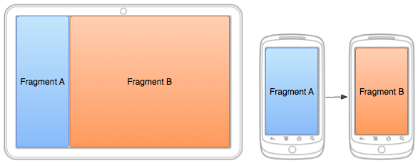

# 建立靈活動態的UI

> 編寫:[fastcome1985](https://github.com/fastcome1985) - 原文:<http://developer.android.com/training/basics/fragments/fragment-ui.html>

* 如果我們的APP設計成要支持範圍廣泛的屏幕尺寸時，在可利用的屏幕空間內，我們可以通過在不同的佈局配置中重用fragment來優化用戶體驗。

* 比如，一個手持設備可能適合一次只有一個fragment的單面板用戶交互。而在更大屏幕尺寸的平板電腦上，我們可能更想要兩個fragment並排在一起，用來向用戶展示更多信息。



**圖1：**兩個fragments，在同一個activity不同屏幕尺寸中用不同的配置來展示。在大屏幕上，兩個fragment被並排放置，在手持設備上，一次只放置一個fragment，所以在用戶導航中，兩個fragment必須進行替換。

* [FragmentManager](http://developer.android.com/reference/android/support/v4/app/FragmentManager.html)類為在activity運行時對fragment進行添加，移除，替換等操作提供了方法，來實現動態的用戶體驗。

## 在activity運行時添加fragment

* 比起用`<fragment>`標籤在activity的佈局文件中定義fragment,就像[上節課](creating.html)說的，我們還可以在activity運行時動態添加fragment，如果打算在activity的生命週期內替換fragment，這是必須的。

* 為了執行fragment的增加或者移除操作，必須通過 [FragmentManager](http://developer.android.com/reference/android/support/v4/app/FragmentManager.html) 創建一個[FragmentTransaction](http://developer.android.com/intl/zh-cn/reference/android/support/v4/app/FragmentTransaction.html)對象, FragmentTransaction提供了用來增加、移除、替換以及其它一些操作的APIs。

* 如果我們的activity允許fragment移除或者替換，我們應該在activity的<a href="http://developer.android.com/reference/android/app/Activity.html#onCreate(android.os.Bundle)">onCreate()</a>方法中添加初始化fragment(s).

* 運用fragment（尤其是那些在運行時添加的）的一個很重要的規則就是在佈局中必須有一個容器[View](http://developer.android.com/reference/android/view/View.html)，fragment的layout將會放在這個view裡面。

* 下面的這個佈局是[上節課](creating.html)的一次只顯示一個fragment的佈局的替代佈局。為了從一個佈局替	ctivity的佈局包含了一個空的 [FrameLayout](http://developer.android.com/reference/android/widget/FrameLayout.html)作為fragment的容器。

* 注意文件名與上節課的佈局一樣，但是文件目錄沒有`large`標識， 所以這一佈局將會在比large小的屏幕上被使用，因為該屏幕無法滿足同時放置兩個fragments

res/layout/news_articles.xml:
```xml
<FrameLayout xmlns:android="http://schemas.android.com/apk/res/android"
    android:id="@+id/fragment_container"
    android:layout_width="match_parent"
    android:layout_height="match_parent" />
```

* 在activity中，用Support Library APIs調用 [getSupportFragmentManager()](http://developer.android.com/intl/zh-cn/reference/android/support/v4/app/FragmentActivity.html#getSupportFragmentManager%28%29)方法獲取[FragmentManager](http://developer.android.com/reference/android/support/v4/app/FragmentManager.html) 對象，然後調用 <a href="http://developer.android.com/reference/android/support/v4/app/FragmentManager.html#beginTransaction()">beginTransaction()</a> 方法創建一個[FragmentTransaction](http://developer.android.com/reference/android/support/v4/app/FragmentTransaction.html)對象，然後調用<a href="http://developer.android.com/reference/android/support/v4/app/FragmentTransaction.html#add(android.support.v4.app.Fragment,%20java.lang.String)">add()</a>方法添加一個fragment.
* 可以使用同一個 [FragmentTransaction](http://developer.android.com/reference/android/support/v4/app/FragmentTransaction.html)進行多次fragment事務。完成這些變化操作，準備開始執行改變時，必須調用<a href="http://developer.android.com/reference/android/support/v4/app/FragmentTransaction.html#commit()">commit()</a>方法。

下例顯示瞭如何添加一個fragment到之前的layout中

```java
import android.os.Bundle;
import android.support.v4.app.FragmentActivity;

public class MainActivity extends FragmentActivity {
    @Override
    public void onCreate(Bundle savedInstanceState) {
        super.onCreate(savedInstanceState);
        setContentView(R.layout.news_articles);

        // Check that the activity is using the layout version with
        // the fragment_container FrameLayout
        if (findViewById(R.id.fragment_container) != null) {

            // However, if we're being restored from a previous state,
            // then we don't need to do anything and should return or else
            // we could end up with overlapping fragments.
            if (savedInstanceState != null) {
                return;
            }

            // Create a new Fragment to be placed in the activity layout
            HeadlinesFragment firstFragment = new HeadlinesFragment();

            // In case this activity was started with special instructions from an
            // Intent, pass the Intent's extras to the fragment as arguments
            firstFragment.setArguments(getIntent().getExtras());

            // Add the fragment to the 'fragment_container' FrameLayout
            getSupportFragmentManager().beginTransaction()
                    .add(R.id.fragment_container, firstFragment).commit();
        }
    }
}
```

* 因為fragment是在activity運行時被添加進來時（不是在XML佈局中用`<fragment>`定義的），activity 可以移除這個fragment或者用另外一個來替換它。

## 替換Fragment

* 替換fragment的過程類似於添加過程，只需要將<a href="http://developer.android.com/reference/android/support/v4/app/FragmentTransaction.html#add(android.support.v4.app.Fragment,%20java.lang.String)">add()</a>方法替換為 <a href="http://developer.android.com/reference/android/support/v4/app/FragmentTransaction.html#replace(int,%20android.support.v4.app.Fragment)">replace()</a>方法。
* 記住在執行fragment事務時，如移除或者替換，我們經常要適當地讓用戶可以向後導航與"撤銷"這次改變。為了讓用戶向後導航fragment事務，我們必須在[FragmentTransaction](http://developer.android.com/reference/android/support/v4/app/FragmentTransaction.html)提交前調用<a href="http://developer.android.com/reference/android/support/v4/app/FragmentTransaction.html#addToBackStack(java.lang.String)">addToBackStack()</a>方法。

> **Note：**當移除或者替換一個fragment並把它放入返回棧中時，被移除的fragment的生命週期是stopped(不是destoryed).當用戶返回重新恢復這個fragment,它的生命週期是restarts。如果沒有把fragment放入返回棧中，那麼當它被移除或者替換時，其生命週期是destoryed。

* 下面是一個fragment替換的例子

```java
// Create fragment and give it an argument specifying the article it should show
ArticleFragment newFragment = new ArticleFragment();
Bundle args = new Bundle();
args.putInt(ArticleFragment.ARG_POSITION, position);
newFragment.setArguments(args);

FragmentTransaction transaction = getSupportFragmentManager().beginTransaction();

// Replace whatever is in the fragment_container view with this fragment,
// and add the transaction to the back stack so the user can navigate back
transaction.replace(R.id.fragment_container, newFragment);
transaction.addToBackStack(null);

// Commit the transaction
transaction.commit();
```

* <a href="http://developer.android.com/reference/android/support/v4/app/FragmentTransaction.html#addToBackStack(java.lang.String)">addToBackStack()</a>方法提供了一個可選的String參數為事務指定了一個唯一的名字。除非打算用[FragmentManager.BackStackEntry](http://developer.android.com/reference/android/support/v4/app/FragmentManager.BackStackEntry.html) APIs來進行一些高級的fragments操作，這個名字不是必須的。
