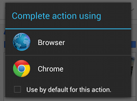

# Intent的發送

> 編寫:[kesenhoo](https://github.com/kesenhoo) - 原文:<http://developer.android.com/training/basics/intents/sending.html>

Android中最重要的特徵之一就是可以利用一個帶有`action`的`intent`使當前app能夠跳轉到其他app。例如：如果我們的app有一個地址想要顯示在地圖上，我們並不需要在app裡面創建一個activity用來顯示地圖，而是使用Intent來發出查看地址的請求。Android系統則會啟動能夠顯示地圖的程序來呈現該地址。

正如在1.1章節:[建立你的第一個App(Building Your First App)](../firstapp/index.html)中所說的，我們必須使用intent來在同一個app的兩個activity之間進行切換。通常是定義一個顯式（explicit）的intent，它指定了需要啟動組件的類名。然而，當想要喚起不同的app來執行某個動作（比如查看地圖），則必須使用隱式（implicit）的intent。

本課會介紹如何為特殊的動作創建一個implicit intent，並使用它來啟動另一個app去執行intent中的action。

## 建立隱式的Intent

Implicit intents並不聲明要啟動組件的具體類名，而是聲明一個需要執行的action。這個action指定了我們想做的事情，例如查看，編輯，發送或者是獲取一些東西。Intents通常會在發送action的同時附帶一些數據，例如你想要查看的地址或者是你想要發送的郵件信息。數據的具體類型取決於我們想要創建的Intent，比如[Uri](http://developer.android.com/reference/android/net/Uri.html)或其他規定的數據類型，或者甚至也可能根本不需要數據。

如果數據是一個Uri，會有一個簡單的<a href="http://developer.android.com/reference/android/content/Intent.html#Intent(java.lang.String, android.net.Uri)">Intent()</a> constructor 用於定義action與data。

例如，下面是一個帶有指定電話號碼的intent。

```java
Uri number = Uri.parse("tel:5551234");
Intent callIntent = new Intent(Intent.ACTION_DIAL, number);
```

當app通過執行<a href="http://developer.android.com/reference/android/app/Activity.html#startActivity(android.content.Intent)">startActivity()</a>啟動這個intent時，Phone app會使用之前的電話號碼來撥出這個電話。

下面是一些其他intent的例子：

* 查看地圖:

```java
// Map point based on address
Uri location = Uri.parse("geo:0,0?q=1600+Amphitheatre+Parkway,+Mountain+View,+California");
// Or map point based on latitude/longitude
// Uri location = Uri.parse("geo:37.422219,-122.08364?z=14"); // z param is zoom level
Intent mapIntent = new Intent(Intent.ACTION_VIEW, location);
```

* 查看網頁:

```java
Uri webpage = Uri.parse("http://www.android.com");
Intent webIntent = new Intent(Intent.ACTION_VIEW, webpage);
```

至於另外一些需要`extra`數據的implicit intent，我們可以使用 <a href="http://developer.android.com/reference/android/content/Intent.html#putExtra(java.lang.String, java.lang.String)">putExtra()</a> 方法來添加那些數據。
默認的，系統會根據Uri數據類型來決定需要哪些合適的`MIME type`。如果我們沒有在intent中包含一個Uri, 則通常需要使用 <a href="http://developer.android.com/reference/android/content/Intent.html#setType(java.lang.String)">setType()</a> 方法來指定intent附帶的數據類型。設置MIME type 是為了指定應該接受這個intent的activity。例如：

* 發送一個帶附件的email:

```java
Intent emailIntent = new Intent(Intent.ACTION_SEND);
// The intent does not have a URI, so declare the "text/plain" MIME type
emailIntent.setType(HTTP.PLAIN_TEXT_TYPE);
emailIntent.putExtra(Intent.EXTRA_EMAIL, new String[] {"jon@example.com"}); // recipients
emailIntent.putExtra(Intent.EXTRA_SUBJECT, "Email subject");
emailIntent.putExtra(Intent.EXTRA_TEXT, "Email message text");
emailIntent.putExtra(Intent.EXTRA_STREAM, Uri.parse("content://path/to/email/attachment"));
// You can also attach multiple items by passing an ArrayList of Uris
```

* 創建一個日曆事件:

```java
Intent calendarIntent = new Intent(Intent.ACTION_INSERT, Events.CONTENT_URI);
Calendar beginTime = Calendar.getInstance().set(2012, 0, 19, 7, 30);
Calendar endTime = Calendar.getInstance().set(2012, 0, 19, 10, 30);
calendarIntent.putExtra(CalendarContract.EXTRA_EVENT_BEGIN_TIME, beginTime.getTimeInMillis());
calendarIntent.putExtra(CalendarContract.EXTRA_EVENT_END_TIME, endTime.getTimeInMillis());
calendarIntent.putExtra(Events.TITLE, "Ninja class");
calendarIntent.putExtra(Events.EVENT_LOCATION, "Secret dojo");
```
> **Note:** 這個intent for Calendar的例子只使用於>=API Level 14。

> **Note:** 請儘可能的將Intent定義的更加確切。例如，如果想要使用ACTION_VIEW 的intent來顯示一張圖片，則還應該指定 MIME type 為`image/*`.這樣能夠阻止其他能夠 "查看" 其他數據類型的app（比如一個地圖app) 被這個intent叫起。

## 驗證是否有App去接收這個Intent

儘管Android系統會確保每一個確定的intent會被系統內置的app(such as the Phone, Email, or Calendar app)之一接收，但是我們還是應該在觸發一個intent之前做驗證是否有App接受這個intent的步驟。

> **Caution: 如果觸發了一個intent，而且沒有任何一個app會去接收這個intent，則app會crash。**

為了驗證是否有合適的activity會響應這個intent，需要執行<a href="http://developer.android.com/reference/android/content/pm/PackageManager.html#queryIntentActivities(android.content.Intent, int)">queryIntentActivities()</a> 來獲取到能夠接收這個intent的所有activity的list。若返回的[List](http://developer.android.com/reference/java/util/List.html)非空，那麼我們才可以安全的使用這個intent。例如：

```java
PackageManager packageManager = getPackageManager();
List<ResolveInfo> activities = packageManager.queryIntentActivities(intent, 0);
boolean isIntentSafe = activities.size() > 0;
```

如果`isIntentSafe`為`true`, 那麼至少有一個app可以響應這個intent。`false`則說明沒有app可以handle這個intent。

> **Note:**我們必須在第一次使用之前做這個檢查，若是不可行，則應該關閉這個功能。如果知道某個確切的app能夠handle這個intent，我們也可以向用戶提供下載該app的鏈接。([see how to link to your product on Google Play](http://developer.android.com/distribute/googleplay/promote/linking.html)).

## 使用Intent啟動Activity

當創建好了intent並且設置好了extra數據後，通過執行startActivity() 將intent發送到系統。若系統確定了多個activity可以handle這個intent,它會顯示出一個dialog，讓用戶選擇啟動哪個app。如果系統發現只有一個app可以handle這個intent，則系統將直接啟動該app。

```java
startActivity(intent);
```



下面是一個演示瞭如何創建一個intent來查看地圖的完整例子，首先驗證有app可以handle這個intent,然後啟動它。

```java
// Build the intent
Uri location = Uri.parse("geo:0,0?q=1600+Amphitheatre+Parkway,+Mountain+View,+California");
Intent mapIntent = new Intent(Intent.ACTION_VIEW, location);

// Verify it resolves
PackageManager packageManager = getPackageManager();
List<ResolveInfo> activities = packageManager.queryIntentActivities(mapIntent, 0);
boolean isIntentSafe = activities.size() > 0;

// Start an activity if it's safe
if (isIntentSafe) {
    startActivity(mapIntent);
}
```

## 顯示分享App的選擇界面
請注意，當以startActivity()的形式傳遞一個intent，並且有多個app可以handle時，用戶可以在彈出dialog的時候選擇默認啟動的app（通過勾選dialog下面的選擇框，如上圖所示）。該功能對於用戶有特殊偏好的時候非常有用（例如用戶總是喜歡啟動某個app來查看網頁，總是喜歡啟動某個camera來拍照）。

然而，如果用戶希望每次都彈出選擇界面，而且每次都不確定會選擇哪個app啟動，例如分享功能，用戶選擇分享到哪個app都是不確定的，這個時候，需要強制彈出選擇的對話框。（這種情況下用戶不能選擇默認啟動的app）。

 to ensure that the user is always shown a list of apps that respond to your intent.")

為了顯示chooser, 需要使用<a href="http://developer.android.com/reference/android/content/Intent.html#createChooser(android.content.Intent, java.lang.CharSequence)">createChooser()</a>來創建Intent

```java
Intent intent = new Intent(Intent.ACTION_SEND);
...

// Always use string resources for UI text. This says something like "Share this photo with"
String title = getResources().getText(R.string.chooser_title);
// Create and start the chooser
Intent chooser = Intent.createChooser(intent, title);
startActivity(chooser);
```

這樣就列出了可以響應`createChooser()`中Intent的app，並且指定了標題。
