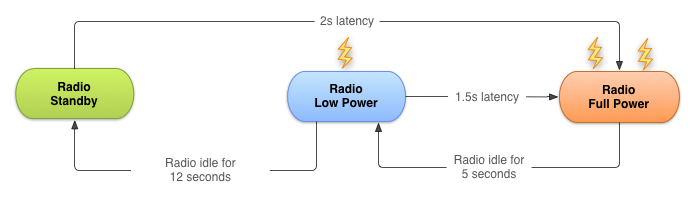
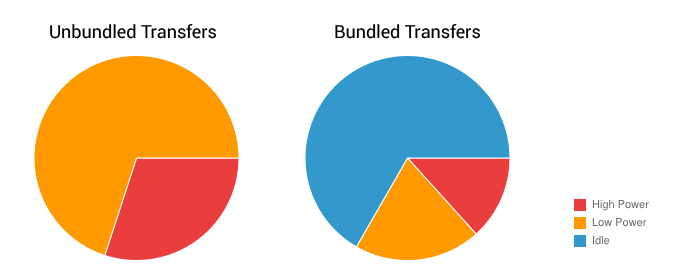

# 優化下載以高效地訪問網絡

> 編寫:[kesenhoo](https://github.com/kesenhoo) - 原文:<http://developer.android.com/training/efficient-downloads/efficient-network-access.html>

使用無線電波（wireless radio）進行傳輸數據很可能是我們 app 最耗電的來源之一。為了最小化網絡連接對電量的消耗，懂得連接模式（connectivity model）會如何影響底層的無線電硬件設備是至關重要的。

這節課介紹了無線電波狀態機（wireless radio state machine），並解釋了 app 的連接模式是如何與狀態機進行交互的。然後會提出建議的方法來最小化我們的數據連接，使用預取（prefetching）與捆綁（bundle）的方式進行數據的傳輸，這些操作都是為了最小化電量的消耗。

## 無線電波狀態機

一個處於完全工作狀態的無線電會大量消耗電量，因此需要學習如何在不同能量狀態下進行過渡，當無線電沒有工作時，節省電量，當需要時嘗試最小化與無線電波供電有關的延遲。

典型的 3G 無線電網絡有三種能量狀態：

1. **Full power**：當無線連接被激活的時候，允許設備以最大的傳輸速率進行操作。
2. **Low power**：一種中間狀態，對電量的消耗差不多是 Full power 狀態下的50%。
3. **Standby**：最小的能量狀態，沒有被激活或者需求的網絡連接。

在低功耗和空閒的狀態下，電量消耗會顯著減少。這裡也會介紹重要的網絡請求延遲。從 low power 能量狀態返回到 full power 大概需要花費1.5秒，從空閒能量狀態返回到 full power 狀態需要花費2秒。

為了最小化延遲，狀態機使用了一種後滯過渡到更低能量狀態的機制。下圖是一個典型的 3G 無線電波狀態機的圖示（AT&T電信的一種制式）。



**Figure 1.** 典型的 3G 無線電狀態機

在每一臺設備上的無線狀態機，特別是相關的傳輸延遲（“拖尾時間”）和啟動延遲，都會根據無線電波的制式（2G、3G、LTE等）不同而改變，並且由設備正在所使用的網絡進行定義與配置。

這一課描述了一種典型的 3G 無線電波狀態機，[數據來源於 AT&T](http://www.research.att.com/articles/featured_stories/2011_03/201102_Energy_efficient?fbid=SYuI20FzBum)。無論如何，這些原理和最佳實踐結果是具有通用性的，在其他的無線電波上同樣適用。

這種方法在典型的網頁瀏覽操作上是特別有效的，因為它可以阻止用戶在瀏覽網頁時的一些不受歡迎的延遲。相對較短的拖尾時間也保證了當一個網頁瀏覽會話結束的時候，無線電波可以轉移到相對較低的能量狀態。

不幸的是，這個方法會導致在現代的智能機系統例如 Android 上的 app 效率低下。因為  Android 上的 app 不僅僅可以在前臺運行（重點關注延遲），也可以在後臺運行（優先處理耗電量）。(無線電波的狀態改變會影響到本來的設計，有些想在前臺運行的可能會因為切換到低能量狀態而影響程序效率。坊間說手機在電量低的狀態下無線電波的強度會增大好幾倍來保證信號，可能與這個有關。)

## App 如何影響無線電波狀態機

每次創建一個新的網絡連接，無線電波就切換到 full power 狀態。在上面典型的 3G 無線電波狀態機情況下，無線電波會在傳輸數據時保持在 full power 的狀態，加上一個附加的5秒拖尾時間，再之後會經過12秒進入到 low power 能量狀態。因此對於典型的 3G 設備，每一次數據傳輸的會話都會導致無線電波消耗大概20秒時間來提取電能。

實際上，這意味著一個每18秒傳輸1秒非捆綁數據（unbundled data）的 app，會一直保持激活狀態（18 = 1秒的傳輸數據 + 5秒過渡時間回到 low power + 12秒過渡時間回到standby）。因此，每分鐘會消耗18秒 high power 的電量，42秒 low power 的電量。

通過比較，同一個 app，每分鐘傳輸持續3秒的捆綁數據（bundle data），會使得無線電波持續在 high power 狀態僅僅8秒，在 low power 狀態僅僅12秒鐘。

上面第二種傳輸捆綁數據（bundle data）的例子，可以看到減少了大量的電量消耗。圖示如下：



**Figure 2.** 無線電波使用捆綁數據 vs 無線電波使用非捆綁數據

<a name="PrefetchData"></a>
## 預取數據

預取數據是一種減少獨立數據傳輸會話數量的有效方法。預取技術指的是在一定時間內，單次連接操作，以最大的下載能力來下載所有用戶可能需要的數據。

通過前面的傳輸數據的技術，減少了大量下載數據所需的無線電波激活時間。這樣不僅節省了電量，也改善了延遲，降低了帶寬，減少了下載時間。

預取技術通過減少應用裡由於在執行一個動作或者查看數據之前等待下載完成造成的延遲，來提高用戶體驗。

然而，過於頻繁地使用預取技術，不僅僅會導致電量消耗快速增長，還有可能預取到一些並不需要的數據，導致增加帶寬的使用和下載配額。另外，需要確保預取不會因為 app 等待預取全部完成而延遲應用的啟動。從實踐的角度，那意味著需要逐步處理數據，或者按照優先級順序開始進行持續的數據傳遞，這樣會首先下載和處理應用啟動時需要的數據。

根據正在下載的數據大小與可能被用到的數據量來決定預取的頻率。作一個粗略的估計，根據上面介紹的狀態機，對於有50%的機會被當前的用戶會話用到的數據，我們可以預取大約6秒(大約1-2Mb)，這大概使得潛在可能要用的數據量與可能已經下載好的數據量相一致。

通常來說，預取1-5Mb會比較好，這種情況下，我們僅僅只需要每隔2-5分鐘開始另一段下載。

根據這個原理，大數據的下載，比如視頻文件，應該每隔2-5分鐘開始另一段下載，這樣能有效的預取到下面幾分鐘內的數據進行預覽。

值得注意的是，更進一步的下載應該是是捆綁的（bundled），下一小節將會講到，[批量處理傳送和連接](##BatchTransfers)，而且上面那些大概的數據與時間可能會根據網絡連接的類型與速度有所變化，這將在[根據網絡連接類型來調整下載模式](connectivity_patterns.html)講到。

讓我們來看一些例子：

**一個音樂播放器**

我們可以選擇預取整個專輯，然而這樣在第一首歌曲之後用戶會停止聽歌，那麼就浪費了大量的帶寬和電量。

一個比較好的方法是維護正在播放的那首歌曲的緩衝區。對於流媒體音樂，不應該去維護一段連續的數據流，因為這樣會使得無線電波一直保持激活狀態，而應該考慮用 HTTP 流直播來集中傳輸音頻流，就像上面描述的預取技術一樣（下載好2Mb，然後開始一次取出，再去下載下面的2Mb）。

**一個新聞閱讀器**

許多新聞 app 嘗試通過只下載新聞標題來減少帶寬，完整的文章僅在用戶想要讀取的時候再去讀取，而且文章也會因為太長而剛開始只顯示部分信息，等用戶下滑時再去讀取完整信息。

使用這個方法，無線電波僅僅會在用戶點擊更多信息的時候才會被激活。但是，在切換文章分類預閱讀文章的時候仍然會造成大量潛在的消耗。

一個比較好的方法是在啟動的時候預取一個合理數量的數據，比如在啟動的時候預取第一條新聞的標題與縮略圖信息，確保較短的啟動時間。之後繼續獲取剩餘新聞的標題和縮略圖信息。同時獲取至少在主要標題列表中可用的每篇文章的文本。

另一個方法是預取所有的標題，縮略信息，文章文字，甚至是所有文章的圖片——根據既設的後臺程序進行逐一獲取。這樣做的風險是花費了大量的帶寬與電量去下載一些不會閱讀到的內容，因此應該謹慎使用這種方法。

其中的一個解決方案是，僅當在連接至Wi-Fi或者設備正在充電時，調度到 Full power 狀態進行下載。關於這個細節的實現，我們將在後面的[根據網絡連接類型來調整下載模式](connectivity-patterns.html)課程中介紹。

<a name="BatchTransfers"></a>
## 批量處理傳送和連接

每次發起一個連接——不論相關傳送數據的大小——當使用典型的 3G 無線網絡時，可能會導致無線電波消耗大約20秒的電量。

一個 app 每20秒 ping 一次服務器，僅僅是為了確認 app 正在運行和對用戶可見，那麼無線電波會無限期地處於開啟狀態，導致即使在沒有實際數據傳輸的情況下，仍會消耗大量電量。

因此，對傳送的數據進行捆綁操作和創建一個等待傳輸隊列就顯得非常重要。操作正確的話，可以使得大量的數據集中進行發送，這樣使得無線電波的激活時間儘可能的少，同時減少大部分電量的花費。

這樣做的潛在好處是儘可能在每次傳輸數據的會話中儘可能多的傳輸數據而且減少了會話的次數。

那就意味著我們應該通過隊列延遲容忍傳送來批量處理我們的傳輸數據，和搶佔調度更新和預取，使得當要求時間敏感傳輸時，數據會被全部執行。同樣地，我們的計劃更新和定期的預取應該開啟等待傳輸隊列的執行工作。

[預取數據](#PrefetchData)部分有一個實際的例子。

以上述使用定期預取的新聞應用為例。新聞閱讀器收集分析用戶的信息來了解用戶的閱讀模式，並按照新聞報道的受歡迎程度對新聞進行排序。為了保證新聞最新，應用每個小時會檢查更新一次。為了節省帶寬，預取縮略圖信息和當用戶選擇某個新聞時下載全部圖片，而不去下載每篇文章的所有圖片。

在這個例子中，所有在 app 中收集到的分析信息應該捆綁在一起並放入下載隊列，而不是一收集到信息就傳輸。當下載完一張全尺寸的圖片或者執行每小時一次更新時，應該傳輸捆綁好的數據。

任何時間敏感或者按需的傳輸——例如下載全尺寸圖片——應該搶佔定期更新。計劃好的更新應該與按需傳送在同一時間執行。這個方法減小了執行一個定期更新的開銷，該定期更新通過下載必要的時間敏感圖片的揹負式傳輸實現。

## 減少連接

通常來說，重用已經存在的網絡連接比起重新建立一個新的連接更有效率。重用網絡連接同樣可以使得在擁擠不堪的網絡環境中進行更加智能地作出反應。

當可以捆綁所有請求在一個 GET 裡面的時候，不要同時創建多個網絡連接或者把多個 GET 請求進行串聯。

例如，可以一起請求所有文章的情況下，不要根據多個新聞會話進行多次請求。為傳輸與服務端和客戶端 timeout 相關的終止 / 終止確認數據包，無線電波會保持激活狀態，所以如果不需要使用連接時，請立即關閉，而不是等待他們 timeout。

之前說道，如果過早對一個連接執行關閉操作，會導致需要額外的開銷來建立一個新的連接。一個有用的妥協是不要立即關閉連接，而是在固定期間的 timeout 之前關閉（即稍微晚點卻又不至於到 timeout）。

## 使用 DDMS Network Traffic Tool 來確定問題的區域

Android [DDMS (Dalvik Debug Monitor Server)](http://developer.android.com/guide/developing/debugging/ddms.html) 包含了一個查看網絡使用詳情的欄目來允許跟蹤 app 的網絡請求。使用這個工具，可以監測 app 是在何時，如何傳輸數據的，從而進行代碼的優化。

Figure 3 顯示了傳輸少量數據的網絡模型，可以看到每次差不多相隔15秒，這意味著可以通過預取技術或者批量上傳來大幅提高效率。


**Figure 3.** 使用 DDMS 檢測網絡使用情況

通過監測數據傳輸的頻率與每次傳輸的數據量，可以查看出哪些位置應該進行優化。通常的，我們會尋找類似短穗狀的地方，這些位置可以延遲，或者應該導致一個後來的傳輸被搶佔。

為了更好的檢測出問題所在，**Traffic Status API** 允許我們使用 `TrafficStats.setThreadStatsTag()` 方法標記數據傳輸發生在某個Thread裡面，然後可以手動地使用 `tagSocket()` 進行標記或者使用 untagSocket()` 來取消標記，例如：

```java
TrafficStats.setThreadStatsTag(0xF00D);
TrafficStats.tagSocket(outputSocket);
// Transfer data using socket
TrafficStats.untagSocket(outputSocket);
```

Apache 的 `HttpClient` 與 `URLConnection` 庫可以根據當前的 `getThreadStatusTag()` 值自動給 sockets 加上標記。那些庫在通過 keep-alive pools 循環的時候也會為 sockets 加上或者取消標籤。

```java
TrafficStats.setThreadStatsTag(0xF00D);
try {
  // Make network request using HttpClient.execute()
} finally {
  TrafficStats.clearThreadStatsTag();
}
```

給 Socket 加上標籤（Socket tagging）是在 Android 4.0 上才被支持的, 但是實際情況是僅僅會在運行Android 4.0.3 或者更高版本的設備上才會顯示。
