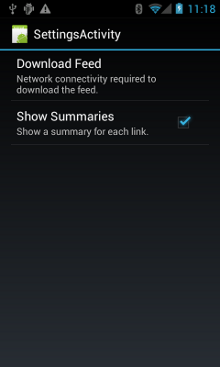
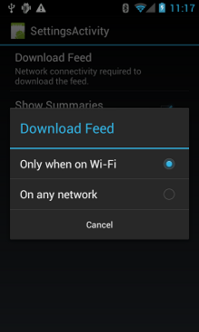

# 管理網絡的使用情況

> 編寫:[kesenhoo](https://github.com/kesenhoo) - 原文:<http://developer.android.com/training/basics/network-ops/managing.html>

這一課會介紹如何細化管理使用的網絡資源。如果我們的程序需要執行大量網絡操作，那麼應該提供用戶設置選項，來允許用戶控制程序的數據偏好。例如，同步數據的頻率，是否只在連接到 WiFi 才進行下載與上傳操作，是否在漫遊時使用套餐數據流量等等。這樣用戶才不大可能在快到達流量上限時，禁止我們的程序獲取後臺數據，因為他們可以精確控制我們的 app 使用多少數據流量。

關於如何編寫一個最小化下載與網絡操作對電量影響的程序，請參考：[優化電池壽命](performance/monitor-device-state/index.html)和[高效下載](connectivity/efficient-downloads/index.html)。

**示例**：[NetworkUsage.zip](http://developer.android.com/shareables/training/NetworkUsage.zip)

## 檢查設備的網絡連接

設備可以有許多種網絡連接。這節課主要關注使用 Wi-Fi 或移動網絡連接的情況。關於所有可能的網絡連接類型，請看 [ConnectivityManager](http://developer.android.com/reference/android/net/ConnectivityManager.html)。

通常 Wi-Fi 是比較快的。移動數據通常都是需要按流量計費，會比較貴。通常我們會選擇讓 app 在連接到 WiFi 時去獲取大量的數據。

在執行網絡操作之前，檢查設備當前連接的網絡連接信息是個好習慣。這樣可以防止我們的程序在無意間連接使用了非意向的網絡頻道。如果網絡連接不可用，那麼我們的應用應該優雅地做出響應。為了檢測網絡連接，我們需要使用到下面兩個類：

* [ConnectivityManager](http://developer.android.com/reference/android/net/ConnectivityManager.html)：它會回答關於網絡連接的查詢結果，並在網絡連接改變時通知應用程序。
* [NetworkInfo](http://developer.android.com/reference/android/net/NetworkInfo.html)：描述一個給定類型（就本節而言是移動網絡或 Wi-Fi）的網絡接口狀態。

這段代碼檢查了 Wi-Fi 與移動網絡的網絡連接。它檢查了這些網絡接口是否可用（也就是說網絡是通的）及是否已連接（也就是說網絡連接存在，並且可以建立 socket 來傳輸數據）：

```java
private static final String DEBUG_TAG = "NetworkStatusExample";
...
ConnectivityManager connMgr = (ConnectivityManager)
        getSystemService(Context.CONNECTIVITY_SERVICE);
NetworkInfo networkInfo = connMgr.getNetworkInfo(ConnectivityManager.TYPE_WIFI);
boolean isWifiConn = networkInfo.isConnected();
networkInfo = connMgr.getNetworkInfo(ConnectivityManager.TYPE_MOBILE);
boolean isMobileConn = networkInfo.isConnected();
Log.d(DEBUG_TAG, "Wifi connected: " + isWifiConn);
Log.d(DEBUG_TAG, "Mobile connected: " + isMobileConn);
```

請注意我們不應該僅僅靠網絡是否可用來做出決策。由於 <a href="http://developer.android.com/reference/android/net/NetworkInfo.html#isConnected()">isConnected()</a> 能夠處理片狀移動網絡（flaky mobile networks），飛行模式和受限制的後臺數據等情況，所以我們應該總是在執行網絡操作前檢查 <a href="http://developer.android.com/reference/android/net/NetworkInfo.html#isConnected()">isConnected()</a>。

一個更簡潔的檢查網絡是否可用的示例如下。<a href="http://developer.android.com/reference/android/net/ConnectivityManager.html#getActiveNetworkInfo()">getActiveNetworkInfo()</a> 方法返回一個 [NetworkInfo](http://developer.android.com/reference/android/net/NetworkInfo.html) 實例，它表示可以找到的第一個已連接的網絡接口，如果返回 null，則表示沒有已連接的網絡接口(意味著網絡連接不可用)：

```java
public boolean isOnline() {
    ConnectivityManager connMgr = (ConnectivityManager)
            getSystemService(Context.CONNECTIVITY_SERVICE);
    NetworkInfo networkInfo = connMgr.getActiveNetworkInfo();
    return (networkInfo != null && networkInfo.isConnected());
}
```

我們可以使用 [NetworkInfo.DetailedState](http://developer.android.com/reference/android/net/NetworkInfo.DetailedState.html)，來獲取更加詳細的網絡信息，但很少有這樣的必要。

## 管理網絡的使用情況

我們可以實現一個偏好設置的 activity ，使用戶能直接設置程序對網絡資源的使用情況。例如:

* 可以允許用戶僅在連接到 Wi-Fi 時上傳視頻。
* 可以根據諸如網絡可用，時間間隔等條件來選擇是否做同步的操作。

寫一個支持連接網絡和管理網絡使用的 app，manifest 裡需要有正確的權限和 intent filter。

* manifest 文件裡包括下面的權限：

	* [android.permission.INTERNET](http://developer.android.com/reference/android/Manifest.permission.html#INTERNET)——允許應用程序打開網絡套接字。

	* [android.permission.ACCESS_NETWORK_STATE](http://developer.android.com/reference/android/Manifest.permission.html#ACCESS_NETWORK_STATE)——允許應用程序訪問網絡連接信息。

* 我們可以為 [ACTION_MANAGE_NETWORK_USAGE](http://developer.android.com/reference/android/content/Intent.html#ACTION_MANAGE_NETWORK_USAGE) action（Android 4.0中引入）聲明 intent filter，表示我們的應用定義了一個提供控制數據使用情況選項的 activity。[ACTION_MANAGE_NETWORK_USAGE](http://developer.android.com/reference/android/content/Intent.html#ACTION_MANAGE_NETWORK_USAGE) 顯示管理指定應用程序網絡數據使用情況的設置。當我們的 app 有一個允許用戶控制網絡使用情況的設置 activity 時，我們應該為 activity 聲明這個 intent filter。在章節概覽提供的示例應用中，這個 action 被 `SettingsActivity` 類處理，它提供了偏好設置 UI 來讓用戶決定何時進行下載。

```xml
<?xml version="1.0" encoding="utf-8"?>
<manifest xmlns:android="http://schemas.android.com/apk/res/android"
    package="com.example.android.networkusage"
    ...>

    <uses-sdk android:minSdkVersion="4"
           android:targetSdkVersion="14" />

    <uses-permission android:name="android.permission.INTERNET" />
    <uses-permission android:name="android.permission.ACCESS_NETWORK_STATE" />

    <application
        ...>
        ...
        <activity android:label="SettingsActivity" android:name=".SettingsActivity">
             <intent-filter>
                <action android:name="android.intent.action.MANAGE_NETWORK_USAGE" />
                <category android:name="android.intent.category.DEFAULT" />
          </intent-filter>
        </activity>
    </application>
</manifest>
```

## 實現一個首選項 Activity

正如上面 manifest 片段中看到的那樣，`SettingsActivity` 有一個 [ACTION_MANAGE_NETWORK_USAGE](http://developer.android.com/reference/android/content/Intent.html#ACTION_MANAGE_NETWORK_USAGE) action 的 intent filter。`SettingsActivity` 是 [PreferenceActivity](http://developer.android.com/reference/android/preference/PreferenceActivity.html) 的子類，它展示一個偏好設置頁面（如下兩張圖）讓用戶指定以下內容:

* 是否顯示每個 XML 提要條目的總結，或者只是每個條目的一個鏈接。
* 是否在網絡連接可用時下載 XML 提要，或者僅僅在 Wi-Fi 下下載。




**Figure 1.** 首選項 activity

下面是 `SettingsActivity`。請注意它實現了 [OnSharedPreferenceChangeListener](http://developer.android.com/reference/android/content/SharedPreferences.OnSharedPreferenceChangeListener.html)。當用戶改變了他的偏好，就會觸發 <a href="http://developer.android.com/reference/android/content/SharedPreferences.OnSharedPreferenceChangeListener.html#onSharedPreferenceChanged(android.content.SharedPreferences, java.lang.String)">onSharedPreferenceChanged()</a>，這個方法會設置 `refreshDisplay` 為 true（這裡的變量存在於自己定義的 activity，見下一部分的代碼示例）。這會使得當用戶返回到 main activity 的時候進行刷新：

（請注意，代碼中的註釋，不得不說，Googler 寫的 Code 看起來就是舒服）

```java
public class SettingsActivity extends PreferenceActivity implements OnSharedPreferenceChangeListener {

    @Override
    protected void onCreate(Bundle savedInstanceState) {
        super.onCreate(savedInstanceState);

        // Loads the XML preferences file
        addPreferencesFromResource(R.xml.preferences);
    }

    @Override
    protected void onResume() {
        super.onResume();

        // Registers a listener whenever a key changes
        getPreferenceScreen().getSharedPreferences().registerOnSharedPreferenceChangeListener(this);
    }

    @Override
    protected void onPause() {
        super.onPause();

       // Unregisters the listener set in onResume().
       // It's best practice to unregister listeners when your app isn't using them to cut down on
       // unnecessary system overhead. You do this in onPause().
       getPreferenceScreen().getSharedPreferences().unregisterOnSharedPreferenceChangeListener(this);
    }

    // When the user changes the preferences selection,
    // onSharedPreferenceChanged() restarts the main activity as a new
    // task. Sets the the refreshDisplay flag to "true" to indicate that
    // the main activity should update its display.
    // The main activity queries the PreferenceManager to get the latest settings.

    @Override
    public void onSharedPreferenceChanged(SharedPreferences sharedPreferences, String key) {
        // Sets refreshDisplay to true so that when the user returns to the main
        // activity, the display refreshes to reflect the new settings.
        NetworkActivity.refreshDisplay = true;
    }
}
```

## 響應偏好設置的改變

當用戶在設置界面改變了偏好，它通常都會對 app 的行為產生影響。在下面的代碼示例中，app 會在 `onStart()` 方法中檢查偏好設置。如果設置的類型與當前設備的網絡連接類型相一致，那麼程序就會下載數據並刷新顯示。（例如, 如果設置是"Wi-Fi" 並且設備連接了 Wi-Fi）。

（這是一個很好的代碼示例，如何選擇合適的網絡類型進行下載操作）

```java
public class NetworkActivity extends Activity {
    public static final String WIFI = "Wi-Fi";
    public static final String ANY = "Any";
    private static final String URL = "http://stackoverflow.com/feeds/tag?tagnames=android&sort=newest";

    // Whether there is a Wi-Fi connection.
    private static boolean wifiConnected = false;
    // Whether there is a mobile connection.
    private static boolean mobileConnected = false;
    // Whether the display should be refreshed.
    public static boolean refreshDisplay = true;

    // The user's current network preference setting.
    public static String sPref = null;

    // The BroadcastReceiver that tracks network connectivity changes.
    private NetworkReceiver receiver = new NetworkReceiver();

    @Override
    public void onCreate(Bundle savedInstanceState) {
        super.onCreate(savedInstanceState);

        // Registers BroadcastReceiver to track network connection changes.
        IntentFilter filter = new IntentFilter(ConnectivityManager.CONNECTIVITY_ACTION);
        receiver = new NetworkReceiver();
        this.registerReceiver(receiver, filter);
    }

    @Override
    public void onDestroy() {
        super.onDestroy();
        // Unregisters BroadcastReceiver when app is destroyed.
        if (receiver != null) {
            this.unregisterReceiver(receiver);
        }
    }

    // Refreshes the display if the network connection and the
    // pref settings allow it.

    @Override
    public void onStart () {
        super.onStart();

        // Gets the user's network preference settings
        SharedPreferences sharedPrefs = PreferenceManager.getDefaultSharedPreferences(this);

        // Retrieves a string value for the preferences. The second parameter
        // is the default value to use if a preference value is not found.
        sPref = sharedPrefs.getString("listPref", "Wi-Fi");

        updateConnectedFlags();

        if(refreshDisplay){
            loadPage();
        }
    }

    // Checks the network connection and sets the wifiConnected and mobileConnected
    // variables accordingly.
    public void updateConnectedFlags() {
        ConnectivityManager connMgr = (ConnectivityManager)
                getSystemService(Context.CONNECTIVITY_SERVICE);

        NetworkInfo activeInfo = connMgr.getActiveNetworkInfo();
        if (activeInfo != null && activeInfo.isConnected()) {
            wifiConnected = activeInfo.getType() == ConnectivityManager.TYPE_WIFI;
            mobileConnected = activeInfo.getType() == ConnectivityManager.TYPE_MOBILE;
        } else {
            wifiConnected = false;
            mobileConnected = false;
        }
    }

    // Uses AsyncTask subclass to download the XML feed from stackoverflow.com.
    public void loadPage() {
        if (((sPref.equals(ANY)) && (wifiConnected || mobileConnected))
                || ((sPref.equals(WIFI)) && (wifiConnected))) {
            // AsyncTask subclass
            new DownloadXmlTask().execute(URL);
        } else {
            showErrorPage();
        }
    }
...

}
```

## 檢測網絡連接變化

最後一部分是關於 [BroadcastReceiver](http://developer.android.com/reference/android/content/BroadcastReceiver.html) 的子類：`NetworkReceiver`。 當設備網絡連接改變時，`NetworkReceiver` 會監聽到  [CONNECTIVITY_ACTION](http://developer.android.com/reference/android/net/ConnectivityManager.html#CONNECTIVITY_ACTION)，這時需要判斷當前網絡連接類型並相應的設置好 `wifiConnected` 與 `mobileConnected`。這樣做的結果是下次用戶回到 app 時，app 只會下載最新返回的結果。如果 `NetworkActivity.refreshDisplay` 被設置為 `true`，app 會更新顯示。

我們需要控制好 [BroadcastReceiver](http://developer.android.com/reference/android/content/BroadcastReceiver.html) 的使用，不必要的聲明註冊會浪費系統資源。示例應用在 `onCreate()` 中註冊 `BroadcastReceiver` `NetworkReceiver`，在 `onDestroy()` 中銷燬它。這樣做會比在 manifest 裡面聲明 `<receiver>` 更輕巧。當我們在 manifest 裡面聲明一個 `<receiver>`，我們的程序可以在任何時候被喚醒，即使我們已經好幾個星期沒有運行這個程序了。而通過前面的辦法註冊`NetworkReceiver `，可以確保用戶離開我們的應用之後，應用不會被喚起。如果我們確實要在 manifest 中聲明 `<receiver>`，且確保知道何時需要使用到它，那麼可以在合適的地方使用  <a href="http://developer.android.com/reference/android/content/pm/PackageManager.html#setComponentEnabledSetting(android.content.ComponentName, int, int)">setComponentEnabledSetting()</a> 來開啟或者關閉它。

下面是 `NetworkReceiver` 的代碼:

```java
public class NetworkReceiver extends BroadcastReceiver {   
      
@Override
public void onReceive(Context context, Intent intent) {
    ConnectivityManager conn =  (ConnectivityManager)
        context.getSystemService(Context.CONNECTIVITY_SERVICE);
    NetworkInfo networkInfo = conn.getActiveNetworkInfo();
       
    // Checks the user prefs and the network connection. Based on the result, decides whether
    // to refresh the display or keep the current display.
    // If the userpref is Wi-Fi only, checks to see if the device has a Wi-Fi connection.
    if (WIFI.equals(sPref) && networkInfo != null && networkInfo.getType() == ConnectivityManager.TYPE_WIFI) {
        // If device has its Wi-Fi connection, sets refreshDisplay
        // to true. This causes the display to be refreshed when the user
        // returns to the app.
        refreshDisplay = true;
        Toast.makeText(context, R.string.wifi_connected, Toast.LENGTH_SHORT).show();

    // If the setting is ANY network and there is a network connection
    // (which by process of elimination would be mobile), sets refreshDisplay to true.
    } else if (ANY.equals(sPref) && networkInfo != null) {
        refreshDisplay = true;
                 
    // Otherwise, the app can't download content--either because there is no network
    // connection (mobile or Wi-Fi), or because the pref setting is WIFI, and there 
    // is no Wi-Fi connection.
    // Sets refreshDisplay to false.
    } else {
        refreshDisplay = false;
        Toast.makeText(context, R.string.lost_connection, Toast.LENGTH_SHORT).show();
    }
}
```
