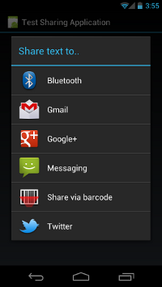

# 給其他App發送簡單的數據

> 編寫:[kesenhoo](https://github.com/kesenhoo) - 原文:<http://developer.android.com/training/sharing/send.html>

在構建一個intent時，必須指定這個intent需要觸發的actions。Android定義了一些actions，比如ACTION_SEND，該action表明該intent用於從一個activity發送數據到另外一個activity的，甚至可以是跨進程之間的數據發送。

為了發送數據到另外一個activity，我們只需要指定數據與數據的類型，系統會自動識別出能夠兼容接受的這些數據的activity。如果這些選擇有多個，則把這些activity顯示給用戶進行選擇；如果只有一個，則立即啟動該Activity。同樣的，我們可以在manifest文件的Activity描述中添加接受的數據類型。

在不同的程序之間使用intent收發數據是在社交分享內容時最常用的方法。Intent使用戶能夠通過最常用的程序進行快速簡單的分享信息。

**注意:**為ActionBar添加分享功能的最佳方法是使用[ShareActionProvider](https://developer.android.com/reference/android/widget/ShareActionProvider.html)，其運行與API level 14以上的系統。ShareActionProvider將在第3課中進行詳細介紹。

## 分享文本內容(Send Text Content)

ACTION_SEND最直接常用的地方是從一個Activity發送文本內容到另外一個Activity。例如，Android內置的瀏覽器可以將當前顯示頁面的URL作為文本內容分享到其他程序。這一功能對於通過郵件或者社交網絡來分享文章或者網址給好友而言是非常有用的。下面是一段Sample Code:

```java
Intent sendIntent = new Intent();
sendIntent.setAction(Intent.ACTION_SEND);
sendIntent.putExtra(Intent.EXTRA_TEXT, "This is my text to send.");
sendIntent.setType("text/plain");
startActivity(sendIntent);
```

如果設備上安裝有某個能夠匹配ACTION_SEND且MIME類型為text/plain的程序，則Android系統會立即執行它。若有多個匹配的程序，則系統會把他們都給篩選出來，並呈現Dialog給用戶進行選擇。

如果為intent調用了Intent.createChooser()，那麼Android總是會顯示可供選擇。這樣有一些好處：

* 即使用戶之前為這個intent設置了默認的action，選擇界面還是會被顯示。
* 如果沒有匹配的程序，Android會顯示系統信息。
* 我們可以指定選擇界面的標題。

下面是更新後的代碼：

```java
Intent sendIntent = new Intent();
sendIntent.setAction(Intent.ACTION_SEND);
sendIntent.putExtra(Intent.EXTRA_TEXT, "This is my text to send.");
sendIntent.setType("text/plain");
startActivity(Intent.createChooser(sendIntent, getResources().getText(R.string.send_to));
```

效果圖如下：



另外,我們可以為intent設置一些標準的附加值，例如：EXTRA_EMAIL, EXTRA_CC, EXTRA_BCC, EXTRA_SUBJECT等。然而，如果接收程序沒有針對那些做特殊的處理，則不會有對應的反應。

**注意:**一些e-mail程序，例如Gmail,對應接收的是EXTRA_EMAIL與EXTRA_CC，他們都是String類型的，可以使用putExtra(string,string[])方法來添加至intent中。

## 分享二進制內容(Send Binary Content)

分享二進制的數據需要結合設置特定的MIME類型`，需要在`EXTRA_STREAM`裡面放置數據的URI,下面有個分享圖片的例子，該例子也可以修改用於分享任何類型的二進制數據：

```java
Intent shareIntent = new Intent();
shareIntent.setAction(Intent.ACTION_SEND);
shareIntent.putExtra(Intent.EXTRA_STREAM, uriToImage);
shareIntent.setType("image/jpeg");
startActivity(Intent.createChooser(shareIntent, getResources().getText(R.string.send_to)));
```

**請注意以下內容：**

* 我們可以使用`*/*`這樣的方式來指定MIME類型，但是這僅僅會match到那些能夠處理一般數據類型的Activity(即一般的Activity無法詳盡所有的MIME類型)
* 接收的程序需要有訪問URI資源的權限。下面有一些方法來處理這個問題：
	* 
	將數據存儲在ContentProvider中，確保其他程序有訪問provider的權限。較好的提供訪問權限的方法是使用 per-URI permissions，其對接收程序而言是隻是暫時擁有該許可權限。類似於這樣創建ContentProvider的一種簡單的方法是使用FileProvider helper類。
	* 
	使用MediaStore系統。MediaStore系統主要用於音視頻及圖片的MIME類型。但在Android3.0之後，其也可以用於存儲非多媒體類型。

## 發送多塊內容(Send Multiple Pieces of Content)

為了同時分享多種不同類型的內容，需要使用`ACTION_SEND_MULTIPLE`與指定到那些數據的URIs列表。MIME類型會根據分享的混合內容而不同。例如，如果分享3張JPEG的圖片，那麼MIME類型仍然是`image/jpeg`。如果是不同圖片格式的話，應該是用`image/*`來匹配那些可以接收任何圖片類型的activity。如果需要分享多種不同類型的數據，可以使用`*/*`來表示MIME。像前面描述的那樣，這取決於那些接收的程序解析並處理我們的數據。下面是一個例子：

```java
ArrayList<Uri> imageUris = new ArrayList<Uri>();
imageUris.add(imageUri1); // Add your image URIs here
imageUris.add(imageUri2);

Intent shareIntent = new Intent();
shareIntent.setAction(Intent.ACTION_SEND_MULTIPLE);
shareIntent.putParcelableArrayListExtra(Intent.EXTRA_STREAM, imageUris);
shareIntent.setType("image/*");
startActivity(Intent.createChooser(shareIntent, "Share images to.."));
```

當然，請確保指定到數據的URIs能夠被接收程序所訪問(添加訪問權限)。
