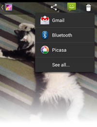

# 添加一個簡便的分享功能

> 編寫:[kesenhoo](https://github.com/kesenhoo) - 原文:<http://developer.android.com/training/sharing/shareaction.html>

Android4.0之後系統中ActionProvider的引入使在ActionBar中添加分享功能變得更為簡單。它會handle出現share功能的appearance與behavior。在ShareActionProvider的例子裡面，我們只需要提供一個share intent，剩下的就交給[ShareActionProvider](https://developer.android.com/reference/android/widget/ShareActionProvider.html)來做。



<!-- more -->

## 更新菜單聲明(Update Menu Declarations)

使用ShareActionProvider的第一步，在menu resources對應item中定義`android:actionProviderClass`屬性。

```xml
<menu xmlns:android="http://schemas.android.com/apk/res/android">
    <item android:id="@+id/menu_item_share"
        android:showAsAction="ifRoom"
        android:title="Share"
        android:actionProviderClass="android.widget.ShareActionProvider" />
    ...
</menu>
```

這表明了該item的appearance與function需要與ShareActionProvider匹配。此外，你還需要告訴provider想分享的內容。

## Set the Share Intent(設置分享的intent)

為了實現ShareActionProvider的功能，我們必須為它提供一個intent。該share intent應該像第一課講的那樣，帶有`ACTION_SEND`和附加數據(例如`EXTRA_TEXT`與 `EXTRA_STREAM`)的。使用ShareActionProvider的例子如下：

```java
private ShareActionProvider mShareActionProvider;
...

@Override
public boolean onCreateOptionsMenu(Menu menu) {
    // Inflate menu resource file.
    getMenuInflater().inflate(R.menu.share_menu, menu);

    // Locate MenuItem with ShareActionProvider
    MenuItem item = menu.findItem(R.id.menu_item_share);

    // Fetch and store ShareActionProvider
    mShareActionProvider = (ShareActionProvider) item.getActionProvider();

    // Return true to display menu
    return true;
}

// Call to update the share intent
private void setShareIntent(Intent shareIntent) {
    if (mShareActionProvider != null) {
        mShareActionProvider.setShareIntent(shareIntent);
    }
}
```

也許在創建菜單的時候僅僅需要設置一次share intent就滿足需求了，或者說我們可能想先設置share intent，然後根據UI的變化來對intent進行更新。例如，當在Gallery裡面全圖查看照片的時候，share intent會在切換圖片時候進行改變。
更多關於ShareActionProvider的內容，請查看[Action Bar](https://developer.android.com/guide/topics/ui/actionbar.html#ActionProvider) 。
