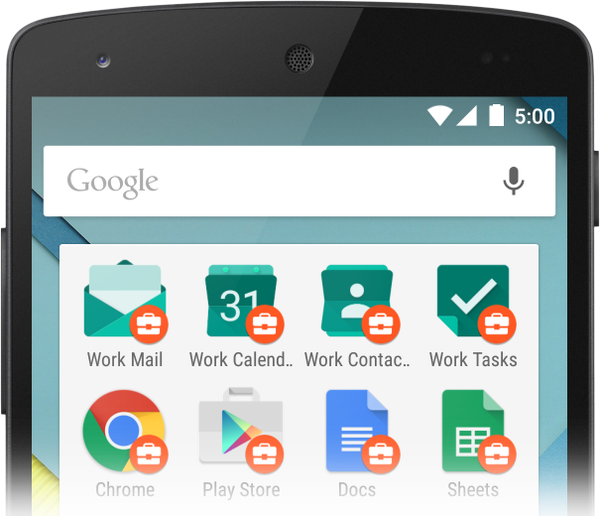

# 創建企業級應用

> 編寫:[craftsmanBai](https://github.com/craftsmanBai) - <http://z1ng.net> - 原文:<http://developer.android.com/training/enterprise/index.html>

Android框架提供安全支持、數據分離、企業環境管理的功能。作為應用開發者，通過適當地處理企業安全和功能限制，你可以讓你的應用程序吸引更多的企業客戶。也可以修改你的應用使技術管理員可遠程配置使用企業資源。

為了幫助企業將安卓設備和應用程序進入工作場所，Google通過Android for Work為設備的分配和管理提供了一套API和服務。通過這項計劃，企業可以連接到企業移動性管理（EMM）供應商，將Android整合到工作中。

通過下面的鏈接獲取，可以瞭解更多關於如何更新您的Android應用程序來支持企業環境或建立企業解決方案的信息。

## 企業級應用開發

瞭解在企業環境中如何使您的應用程序運行順暢，限制設備的功能和數據訪問。通過加入限制進一步支持企業使用你的app，讓管理員可以遠程配置使用你的應用程序：

確保與管理兼容：

[http://developer.android.com/training/enterprise/app-compatibility.html](http://developer.android.com/training/enterprise/app-compatibility.html
)

加入應用限制：

[http://developer.android.com/training/enterprise/app-restrictions.html](http://developer.android.com/training/enterprise/app-restrictions.html)

應用限制計劃：

[http://developer.android.com/samples/AppRestrictionSchema/index.html](http://developer.android.com/samples/AppRestrictionSchema/index.html)

應用限制執行者：

[http://developer.android.com/samples/AppRestrictionEnforcer/index.html](http://developer.android.com/samples/AppRestrictionEnforcer/index.html)

## 設備與應用管理

學習如何為應用程序建立策略控制器，使企業的技術管理人員來管理設備，管理企業應用程序，並提供訪問公司資源的權限：

建立工作策略控制：

[http://developer.android.com/training/enterprise/work-policy-ctrl.html](http://developer.android.com/training/enterprise/work-policy-ctrl.html)

基本管理模型：

[http://developer.android.com/samples/BasicManagedProfile/index.html](http://developer.android.com/samples/BasicManagedProfile/index.html)
