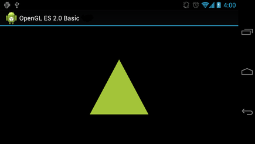

# 運用投影與相機視角

> 編寫:[jdneo](https://github.com/jdneo) - 原文:<http://developer.android.com/training/graphics/opengl/projection.html>

在OpenGL ES環境中，利用投影和相機視角可以讓顯示的繪圖對象更加酷似於我們用肉眼看到的真實物體。該物理視角的仿真是對繪製對象座標的進行數學變換實現的：
* **投影（Projection）：**這個變換會基於顯示它們的[GLSurfaceView](http://developer.android.com/reference/android/opengl/GLSurfaceView.html)的長和寬，來調整繪圖對象的座標。如果沒有該計算，那麼用OpenGL ES繪製的對象會由於其長寬比例和View窗口比例的不一致而發生形變。一個投影變換一般僅當OpenGL View的比例在渲染器的<a href="http://developer.android.com/reference/android/opengl/GLSurfaceView.Renderer.html#onSurfaceChanged(javax.microedition.khronos.opengles.GL10, int, int)">onSurfaceChanged()</a>方法中建立或發生變化時才被計算。關於更多OpenGL ES投影和座標映射的知識，可以閱讀[Mapping Coordinates for Drawn Objects](http://developer.android.com/guide/topics/graphics/opengl.html#coordinate-mapping)。
* **相機視角（Camera View）：**這個變換會基於一個虛擬相機位置改變繪圖對象的座標。注意到OpenGL ES並沒有定義一個實際的相機對象，取而代之的，它提供了一些輔助方法，通過對繪圖對象的變換來模擬相機視角。一個相機視角變換可能僅在建立你的[GLSurfaceView](http://developer.android.com/reference/android/opengl/GLSurfaceView.html)時計算一次，也可能根據用戶的行為或者你的應用的功能進行動態調整。

這節課將解釋如何創建一個投影和一個相機視角，並應用它們到[GLSurfaceView](http://developer.android.com/reference/android/opengl/GLSurfaceView.html)中的繪製圖像上。

## 定義一個投影

投影變換的數據會在[GLSurfaceView.Renderer](http://developer.android.com/reference/android/opengl/GLSurfaceView.Renderer.html)類的<a href="http://developer.android.com/reference/android/opengl/GLSurfaceView.Renderer.html#onSurfaceChanged(javax.microedition.khronos.opengles.GL10, int, int)">onSurfaceChanged()</a>方法中被計算。下面的代碼首先接收[GLSurfaceView](http://developer.android.com/reference/android/opengl/GLSurfaceView.html)的高和寬，然後利用它並使用<a href="http://developer.android.com/reference/android/opengl/Matrix.html#frustumM(float[], int, float, float, float, float, float, float)">Matrix.frustumM()</a>方法來填充一個投影變換矩陣（Projection Transformation [Matrix](http://developer.android.com/reference/android/opengl/Matrix.html)）：

```java
// mMVPMatrix is an abbreviation for "Model View Projection Matrix"
private final float[] mMVPMatrix = new float[16];
private final float[] mProjectionMatrix = new float[16];
private final float[] mViewMatrix = new float[16];

@Override
public void onSurfaceChanged(GL10 unused, int width, int height) {
    GLES20.glViewport(0, 0, width, height);

    float ratio = (float) width / height;

    // this projection matrix is applied to object coordinates
    // in the onDrawFrame() method
    Matrix.frustumM(mProjectionMatrix, 0, -ratio, ratio, -1, 1, 3, 7);
}
```

該代碼填充了一個投影矩陣：mProjectionMatrix，在下一節中，我們可以在<a href="http://developer.android.com/reference/android/opengl/GLSurfaceView.Renderer.html#onDrawFrame(javax.microedition.khronos.opengles.GL10)">onDrawFrame()</a>方法中將它和一個相機視角變換結合起來。

> **Note：**在繪圖對象上只應用一個投影變換會導致顯示效果看上去很空曠。一般而言，我們還要實現一個相機視角，使得所有對象出現在屏幕上。

## 定義一個相機視角

在渲染器中添加一個相機視角變換作為繪圖過程的一部分，以此完成我們的繪圖對象所需變換的所有步驟。在下面的代碼中，使用<a href="http://developer.android.com/reference/android/opengl/Matrix.html#setLookAtM(float[], int, float, float, float, float, float, float, float, float, float)">Matrix.setLookAtM()</a>方法來計算相機視角變換，然後與之前計算的投影矩陣結合起來，結合後的變換矩陣傳遞給繪製圖像：

```java
@Override
public void onDrawFrame(GL10 unused) {
    ...
    // Set the camera position (View matrix)
    Matrix.setLookAtM(mViewMatrix, 0, 0, 0, -3, 0f, 0f, 0f, 0f, 1.0f, 0.0f);

    // Calculate the projection and view transformation
    Matrix.multiplyMM(mMVPMatrix, 0, mProjectionMatrix, 0, mViewMatrix, 0);

    // Draw shape
    mTriangle.draw(mMVPMatrix);
}
```

## 應用投影和相機變換

為了使用在之前章節中結合了的相機視角變換和投影變換，我們首先為之前在Triangle類中定義的頂點著色器添加一個Matrix變量：

```java
public class Triangle {

    private final String vertexShaderCode =
        // This matrix member variable provides a hook to manipulate
        // the coordinates of the objects that use this vertex shader
        "uniform mat4 uMVPMatrix;" +
        "attribute vec4 vPosition;" +
        "void main() {" +
        // the matrix must be included as a modifier of gl_Position
        // Note that the uMVPMatrix factor *must be first* in order
        // for the matrix multiplication product to be correct.
        "  gl_Position = uMVPMatrix * vPosition;" +
        "}";

    // Use to access and set the view transformation
    private int mMVPMatrixHandle;

    ...
}
```

之後，修改圖形對象的`draw()`方法，使得它接收組合後的變換矩陣，並將它應用到圖形上：

```java
public void draw(float[] mvpMatrix) { // pass in the calculated transformation matrix
    ...

    // get handle to shape's transformation matrix
    mMVPMatrixHandle = GLES20.glGetUniformLocation(mProgram, "uMVPMatrix");

    // Pass the projection and view transformation to the shader
    GLES20.glUniformMatrix4fv(mMVPMatrixHandle, 1, false, mvpMatrix, 0);

    // Draw the triangle
    GLES20.glDrawArrays(GLES20.GL_TRIANGLES, 0, vertexCount);

    // Disable vertex array
    GLES20.glDisableVertexAttribArray(mPositionHandle);
}
```

一旦我們正確地計算並應用了投影變換和相機視角變換，我們的圖形就會以正確的比例繪製出來，它看上去會像是這樣:



現在，應用已經可以通過正確的比例顯示圖形了，下面就為圖形添加一些動畫效果吧！
