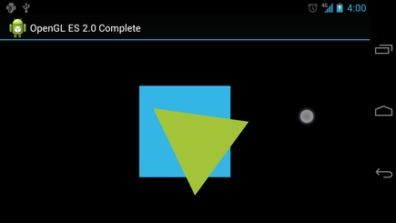

# 響應觸摸事件

> 編寫:[jdneo](https://github.com/jdneo) - 原文:<http://developer.android.com/training/graphics/opengl/touch.html>

讓對象根據預設的程序運動（如讓一個三角形旋轉），可以有效地引起用戶的注意，但是如果希望讓OpenGL ES的圖形對象與用戶交互呢？讓我們的OpenGL ES應用可以支持觸控交互的關鍵點在於，拓展[GLSurfaceView](http://developer.android.com/reference/android/opengl/GLSurfaceView.html)的實現，重寫<a href="http://developer.android.com/reference/android/view/View.html#onTouchEvent(android.view.MotionEvent)">onTouchEvent()</a>方法來監聽觸摸事件。

這節課將會向你展示如何監聽觸控事件，讓用戶旋轉一個OpenGL ES對象。

## 配置觸摸監聽器

為了讓我們的OpenGL ES應用響應觸控事件，我們必須實現[GLSurfaceView](http://developer.android.com/reference/android/opengl/GLSurfaceView.html)類中的<a href="http://developer.android.com/reference/android/view/View.html#onTouchEvent(android.view.MotionEvent)">onTouchEvent()</a>方法。下面的例子展示瞭如何監聽[MotionEvent.ACTION_MOVE](http://developer.android.com/reference/android/view/MotionEvent.html#ACTION_MOVE)事件，並將事件轉換為形狀旋轉的角度：

```java
private final float TOUCH_SCALE_FACTOR = 180.0f / 320;
private float mPreviousX;
private float mPreviousY;

@Override
public boolean onTouchEvent(MotionEvent e) {
    // MotionEvent reports input details from the touch screen
    // and other input controls. In this case, you are only
    // interested in events where the touch position changed.

    float x = e.getX();
    float y = e.getY();

    switch (e.getAction()) {
        case MotionEvent.ACTION_MOVE:

            float dx = x - mPreviousX;
            float dy = y - mPreviousY;

            // reverse direction of rotation above the mid-line
            if (y > getHeight() / 2) {
              dx = dx * -1 ;
            }

            // reverse direction of rotation to left of the mid-line
            if (x < getWidth() / 2) {
              dy = dy * -1 ;
            }

            mRenderer.setAngle(
                    mRenderer.getAngle() +
                    ((dx + dy) * TOUCH_SCALE_FACTOR));
            requestRender();
    }

    mPreviousX = x;
    mPreviousY = y;
    return true;
}
```

注意在計算旋轉角度後，該方法會調用<a href="http://developer.android.com/reference/android/opengl/GLSurfaceView.html#requestRender()">requestRender()</a>來告訴渲染器現在可以進行渲染了。這種辦法對於這個例子來說是最有效的，因為圖形並不需要重新繪製，除非有一個旋轉角度的變化。當然，為了能夠真正實現執行效率的提高，記得使用<a href="http://developer.android.com/reference/android/opengl/GLSurfaceView.html#setRenderMode(int)">setRenderMode()</a>方法以保證渲染器僅在數據發生變化時才會重新繪製圖形，所以請確保這一行代碼沒有被註釋掉：

```java
public MyGLSurfaceView(Context context) {
    ...
    // Render the view only when there is a change in the drawing data
    setRenderMode(GLSurfaceView.RENDERMODE_WHEN_DIRTY);
}
```

## 公開旋轉角度

上述樣例代碼需要我們公開旋轉的角度，具體來說，是在渲染器中添加一個`public`成員變量。由於渲染器代碼運行在一個獨立的線程中（非主UI線程），我們必須同時將該變量聲明為volatile。注意下面聲明該變量的代碼，另外對應的get和set方法也被聲明為了`public`成員函數：

```java
public class MyGLRenderer implements GLSurfaceView.Renderer {
    ...

    public volatile float mAngle;

    public float getAngle() {
        return mAngle;
    }

    public void setAngle(float angle) {
        mAngle = angle;
    }
}
```

## 應用旋轉

為了應用觸控輸入所生成的旋轉，註釋掉創建旋轉角度的代碼，然後添加`mAngle`，該變量包含了觸控輸入所生成的角度：

```java
public void onDrawFrame(GL10 gl) {
    ...
    float[] scratch = new float[16];

    // Create a rotation for the triangle
    // long time = SystemClock.uptimeMillis() % 4000L;
    // float angle = 0.090f * ((int) time);
    Matrix.setRotateM(mRotationMatrix, 0, mAngle, 0, 0, -1.0f);

    // Combine the rotation matrix with the projection and camera view
    // Note that the mMVPMatrix factor *must be first* in order
    // for the matrix multiplication product to be correct.
    Matrix.multiplyMM(scratch, 0, mMVPMatrix, 0, mRotationMatrix, 0);

    // Draw triangle
    mTriangle.draw(scratch);
}
```

當完成了上述步驟，我們就可以運行這個程序，並通過手指在屏幕上的滑動旋轉三角形了：


