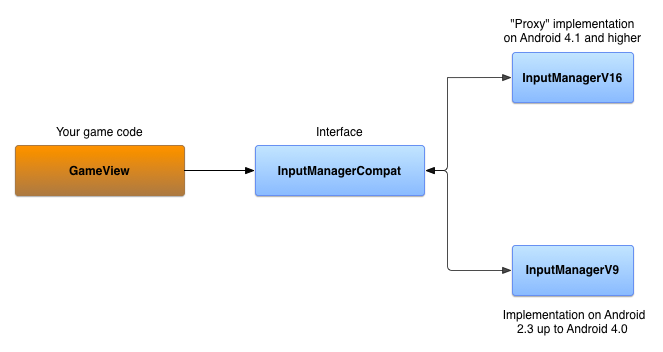

# 在不同的 Android 系統版本支持控制器

> 編寫:[heray1990](https://github.com/heray1990) - 原文:<http://developer.android.com/training/game-controllers/compatibility.html>

如果我們正為遊戲提供遊戲控制器的支持，那麼我們需要確保我們的遊戲對於運行著不同 Android 版本的設備對控制器都有一致的響應。這會使得我們的遊戲擴大用戶群體，同時，我們的玩家可以享受即使他們切換或者升級 Android 設備的時候，都可以使用他們的控制器無縫對接的遊戲體驗。

這節課展示瞭如何用向下兼容的方式使用 Android 4.1 或者更高版本中可用的 API，使我們的遊戲運行在 Android 2.3 或者更高的設備上時，支持下面的功能：

* 遊戲可以檢測是否有一個新的遊戲控制器接入、變更或者移除。
* 遊戲可以查詢遊戲控制器的兼容性。
* 遊戲可以識別從遊戲控制器傳入的動作事件。

這節課的例子是基於 [`ControllerSample.zip`](http://developer.android.com/shareables/training/ControllerSample.zip) 提供的參考實現。這個示例介紹瞭如何實現 `InputManagerCompat` 接口來支持不同的 Android 版本。我們必須使用 Android 4.1（API level 16）或者更高的版本來編譯這個示例代碼。一旦編譯完成，生成的示例 app 可以在任何運行著 Android 2.3（API level 9）或者更高版本的設備上運行。

## 準備支持遊戲控制器的抽象 API

假設我們想確定在運行著 Android 2.3（API level 9）的設備上，遊戲控制器的連接狀態是否發生改變。無論如何，API 只在 Android 4.1（API level 16）或者更高的版本上可用，所以我們需要提供一個支持 Android 4.1（API level 16）或者更高版本的實現方法的同時，提供一個支持從 Android 2.3 到 Android 4.0 的回退機制。

為了幫助我們確定哪個功能需要這樣的回退機制，table 1 列出了 Android 2.3（API level 9）、3.1（API level 12）和 4.1（API level 16）之間，對於支持遊戲控制器的不同之處。

**Table 1.** API 在不同 Android 版本間對遊戲控制器支持的不同點

<table>
   <tr>
      <td>Controller Information</td>
      <td>Controller API</td>
      <td>API level 9</td>
      <td>API level 12</td>
      <td>API level 16</td>
   </tr>
   <tr>
      <td rowspan="5">Device Identification</td>
      <td><a href="http://developer.android.com/reference/android/hardware/input/InputManager.html#getInputDeviceIds()">getInputDeviceIds()</a></td>
      <td></td>
      <td></td>
      <td>*</td>
   </tr>
   <tr>
      <td><a href="http://developer.android.com/reference/android/hardware/input/InputManager.html#getInputDevice(int)">getInputDevice()</a></td>
      <td></td>
      <td></td>
      <td>*</td>
   </tr>
   <tr>
      <td><a href="http://developer.android.com/reference/android/view/InputDevice.html#getVibrator()">getVibrator()</a></td>
      <td></td>
      <td></td>
      <td>*</td>
   </tr>
   <tr>
      <td><a href="http://developer.android.com/reference/android/view/InputDevice.html#SOURCE_JOYSTICK">SOURCE_JOYSTICK</a></td>
      <td></td>
      <td>*</td>
      <td>*</td>
   </tr>
   <tr>
      <td><a href="http://developer.android.com/reference/android/view/InputDevice.html#SOURCE_GAMEPAD">SOURCE_GAMEPAD</a></td>
      <td></td>
      <td>*</td>
      <td>*</td>
   </tr>
   <tr>
      <td rowspan="3">Connection Status</td>
      <td><a href="http://developer.android.com/reference/android/hardware/input/InputManager.InputDeviceListener.html#onInputDeviceAdded(int)">onInputDeviceAdded()</a></td>
      <td></td>
      <td></td>
      <td>*</td>
   </tr>
   <tr>
      <td><a href="http://developer.android.com/reference/android/hardware/input/InputManager.InputDeviceListener.html#onInputDeviceChanged(int)">onInputDeviceChanged()</a></td>
      <td></td>
      <td></td>
      <td>*</td>
   </tr>
   <tr>
      <td><a href="http://developer.android.com/reference/android/hardware/input/InputManager.InputDeviceListener.html#onInputDeviceRemoved(int)">onInputDeviceRemoved()</a></td>
      <td></td>
      <td></td>
      <td>*</td>
   </tr>
   <tr>
      <td rowspan="4">Input Event Identification</td>
      <td>D-pad press ( <a href="http://developer.android.com/reference/android/view/KeyEvent.html#KEYCODE_DPAD_UP">KEYCODE_DPAD_UP</a>, <a href="http://developer.android.com/reference/android/view/KeyEvent.html#KEYCODE_DPAD_DOWN">KEYCODE_DPAD_DOWN</a>, <a href="http://developer.android.com/reference/android/view/KeyEvent.html#KEYCODE_DPAD_LEFT">KEYCODE_DPAD_LEFT</a>, <a href="http://developer.android.com/reference/android/view/KeyEvent.html#KEYCODE_DPAD_RIGHT">KEYCODE_DPAD_RIGHT</a>, <a href="http://developer.android.com/reference/android/view/KeyEvent.html#KEYCODE_DPAD_CENTER">KEYCODE_DPAD_CENTER</a>)</td>
      <td>*</td>
      <td>*</td>
      <td>*</td>
   </tr>
   <tr>
      <td>Gamepad button press ( <a href="http://developer.android.com/reference/android/view/KeyEvent.html#KEYCODE_BUTTON_A">BUTTON_A</a>, <a href="http://developer.android.com/reference/android/view/KeyEvent.html#KEYCODE_BUTTON_B">BUTTON_B</a>, <a href="http://developer.android.com/reference/android/view/KeyEvent.html#KEYCODE_BUTTON_THUMBL">BUTTON_THUMBL</a>, <a href="http://developer.android.com/reference/android/view/KeyEvent.html#KEYCODE_BUTTON_THUMBR">BUTTON_THUMBR</a>, <a href="http://developer.android.com/reference/android/view/KeyEvent.html#KEYCODE_BUTTON_SELECT">BUTTON_SELECT</a>, <a href="http://developer.android.com/reference/android/view/KeyEvent.html#KEYCODE_BUTTON_START">BUTTON_START</a>, <a href="http://developer.android.com/reference/android/view/KeyEvent.html#KEYCODE_BUTTON_R1">BUTTON_R1</a>, <a href="http://developer.android.com/reference/android/view/KeyEvent.html#KEYCODE_BUTTON_L1">BUTTON_L1</a>, <a href="http://developer.android.com/reference/android/view/KeyEvent.html#KEYCODE_BUTTON_R2">BUTTON_R2</a>, <a href="http://developer.android.com/reference/android/view/KeyEvent.html#KEYCODE_BUTTON_L2">BUTTON_L2</a>)</td>
      <td></td>
      <td>*</td>
      <td>*</td>
   </tr>
   <tr>
      <td>Joystick and hat switch movement ( <a href="http://developer.android.com/reference/android/view/MotionEvent.html#AXIS_X">AXIS_X</a>, <a href="http://developer.android.com/reference/android/view/MotionEvent.html#AXIS_Y">AXIS_Y</a>, <a href="http://developer.android.com/reference/android/view/MotionEvent.html#AXIS_Z">AXIS_Z</a>, <a href="http://developer.android.com/reference/android/view/MotionEvent.html#AXIS_RZ">AXIS_RZ</a>, <a href="http://developer.android.com/reference/android/view/MotionEvent.html#AXIS_HAT_X">AXIS_HAT_X</a>, <a href="http://developer.android.com/reference/android/view/MotionEvent.html#AXIS_HAT_Y">AXIS_HAT_Y</a>)</td>
      <td></td>
      <td>*</td>
      <td>*</td>
   </tr>
   <tr>
      <td>Analog trigger press ( <a href="http://developer.android.com/reference/android/view/MotionEvent.html#AXIS_LTRIGGER">AXIS_LTRIGGER</a>, <a href="http://developer.android.com/reference/android/view/MotionEvent.html#AXIS_RTRIGGER">AXIS_RTRIGGER</a>)</td>
      <td></td>
      <td>*</td>
      <td>*</td>
   </tr>
</table>

我們可以使用抽象化概念來建立能夠工作在不同平臺的版本識別的遊戲控制器支持。這種方法包括下面幾個步驟：

1. 定義一箇中間 Java 接口來抽象化我們遊戲需要的遊戲控制器功能的實現。

2. 創建一個使用 Android 4.1 和更高版本 API 的接口的代理實現。

3. 創建一個使用 Android 2.3 到 Android 4.0 之間可用的 API 的接口的自定義實現。

4. 創建在運行時，在這上述這些實現之間切換的邏輯，並且開始使用我們遊戲中的接口。

有關如何使用抽象化概念來保證應用可以在不同版本的 Android 之間，以向後兼容的方式工作的概述，請見[創建向後兼容的 UI](http://hukai.me/android-training-course-in-chinese/ui/backward-compatible-ui/index.html)。

## 添加向後兼容的接口

對於向後兼容，我們可以創建一個自定義接口，然後添加特定版本的實現。這種方法的一個優點是它可以讓我們借鑑 Android 4.1（API level 16）上支持遊戲控制器的公共接口。

```java
// The InputManagerCompat interface is a reference example.
// The full code is provided in the ControllerSample.zip sample.
public interface InputManagerCompat {
    ...
    public InputDevice getInputDevice(int id);
    public int[] getInputDeviceIds();

    public void registerInputDeviceListener(
            InputManagerCompat.InputDeviceListener listener,
            Handler handler);
    public void unregisterInputDeviceListener(
            InputManagerCompat.InputDeviceListener listener);

    public void onGenericMotionEvent(MotionEvent event);

    public void onPause();
    public void onResume();

    public interface InputDeviceListener {
        void onInputDeviceAdded(int deviceId);
        void onInputDeviceChanged(int deviceId);
        void onInputDeviceRemoved(int deviceId);
    }
    ...
}
```

`InputManagerCompat` 接口提供了下面的方法：

`getInputDevice()`

  借鑑 <a href="http://developer.android.com/reference/android/hardware/input/InputManager.html#getInputDevice(int)">getInputDevice()</a>。包括代表一個遊戲控制器兼容性的 [InputDevice](http://developer.android.com/reference/android/view/InputDevice.html) 對象。

`getInputDeviceIds()`

  借鑑<a href="http://developer.android.com/reference/android/hardware/input/InputManager.html#getInputDeviceIds()">getInputDeviceIds()</a>。返回一個整型數組，每一個數組成員表示一個不同輸入設備的 ID。這對於想要構建一個支持多玩家和檢測連接了多少個控制器的遊戲是很有用的。

`registerInputDeviceListener()`

  借鑑<a href="http://developer.android.com/reference/android/hardware/input/InputManager.html#registerInputDeviceListener(android.hardware.input.InputManager.InputDeviceListener, android.os.Handler)">registerInputDeviceListener()</a>。註冊一個監聽器，當一個新的設備添加、改變或者移除的時候，我們會收到通知。

`unregisterInputDeviceListener()`

  借鑑<a href="http://developer.android.com/reference/android/hardware/input/InputManager.html#unregisterInputDeviceListener(android.hardware.input.InputManager.InputDeviceListener)">unregisterInputDeviceListener()</a>。註銷一個輸入設備監聽器。

`onGenericMotionEvent()`

  借鑑<a href="http://developer.android.com/reference/android/view/View.html#onGenericMotionEvent(android.view.MotionEvent)">onGenericMotionEvent()</a>。讓我們的遊戲截取和處理 [MotionEvent](http://developer.android.com/reference/android/view/MotionEvent.html) 對象和代表類似移動搖桿和按下模擬觸發器等事件的座標值。

`onPause()`

  當主 activity 暫停或者當遊戲不再聚焦時，停止輪詢遊戲控制器事件。

`onResume()`

  當主 activity 恢復或者當遊戲開始和在前臺運行時，啟動輪詢遊戲控制器事件。

`InputDeviceListener`

  借鑑 [InputManager.InputDeviceListener](http://developer.android.com/reference/android/hardware/input/InputManager.InputDeviceListener.html) 接口。當添加、改變或者移除遊戲控制器時，會通知我們的遊戲。

下一步，創建 `InputManagerCompat` 的實現，使得可以在不同平臺版本間工作。如果我們的遊戲運行在 Android 4.1 或者更高版本，調用 `InputManagerCompat` 方法，代理實現調用在 [InputManager](http://developer.android.com/reference/android/hardware/input/InputManager.html) 中等效的方法。然而，如果我們的遊戲運行在 Andoird 2.3 到 Android 4.0，自定義的實現過程通過使用不晚於 Android 2.3 引進的 API 來調用 `InputManagerCompat` 方法。不管在運行時使用哪種特定版本的實現，實現會透明地將回調結果傳給遊戲。



**Figure 1.** 接口和特定版本實現的類圖。

## 實現 Android 4.1 和更高版本的接口

`InputManagerCompatV16` 是 `InputManagerCompat` 接口的實現，該接口代理方法調用一個 [InputManager](http://developer.android.com/reference/android/hardware/input/InputManager.html) 和 [InputManager.InputDeviceListener](http://developer.android.com/reference/android/hardware/input/InputManager.InputDeviceListener.html)。[InputManager](http://developer.android.com/reference/android/hardware/input/InputManager.html)是從系統 [Context](http://developer.android.com/reference/android/content/Context.html) 得到。

```java
// The InputManagerCompatV16 class is a reference implementation.
// The full code is provided in the ControllerSample.zip sample.
public class InputManagerV16 implements InputManagerCompat {

    private final InputManager mInputManager;
    private final Map mListeners;

    public InputManagerV16(Context context) {
        mInputManager = (InputManager)
                context.getSystemService(Context.INPUT_SERVICE);
        mListeners = new HashMap();
    }

    @Override
    public InputDevice getInputDevice(int id) {
        return mInputManager.getInputDevice(id);
    }

    @Override
    public int[] getInputDeviceIds() {
        return mInputManager.getInputDeviceIds();
    }

    static class V16InputDeviceListener implements
            InputManager.InputDeviceListener {
        final InputManagerCompat.InputDeviceListener mIDL;

        public V16InputDeviceListener(InputDeviceListener idl) {
            mIDL = idl;
        }

        @Override
        public void onInputDeviceAdded(int deviceId) {
            mIDL.onInputDeviceAdded(deviceId);
        }

        // Do the same for device change and removal
        ...
    }

    @Override
    public void registerInputDeviceListener(InputDeviceListener listener,
            Handler handler) {
        V16InputDeviceListener v16Listener = new
                V16InputDeviceListener(listener);
        mInputManager.registerInputDeviceListener(v16Listener, handler);
        mListeners.put(listener, v16Listener);
    }

    // Do the same for unregistering an input device listener
    ...

    @Override
    public void onGenericMotionEvent(MotionEvent event) {
        // unused in V16
    }

    @Override
    public void onPause() {
        // unused in V16
    }

    @Override
    public void onResume() {
        // unused in V16
    }

}
```

## 實現 Android 2.3 到 Android 4.0 的接口

`InputManagerV9` 實現使用了不晚於 Android 2.3 引進的 API。為了創建一個支持 Android 2.3 到 Android 4.0 的 `InputManagerCompat` 實現，我們可以使用下面的對象：

* 設備 ID 的 [`SparseArray`](http://developer.android.com/reference/android/util/SparseArray.html) 跟蹤已連接到設備的遊戲控制器。
* 一個 [`Handler`](http://developer.android.com/reference/android/os/Handler.html) 來處理設備事件。當一個 app 啟動或者恢復時，[`Handler`](http://developer.android.com/reference/android/os/Handler.html) 接收一個消息來開始輪詢遊戲控制器的斷開。[`Handler`](http://developer.android.com/reference/android/os/Handler.html) 將啟動一個循環來檢查每個已知連接的遊戲控制器並且查看是否返回一個設備 ID。返回　`null` 表示遊戲控制器斷開。當 app 暫停時，[`Handler`](http://developer.android.com/reference/android/os/Handler.html) 停止輪詢。
* 一個 `InputManagerCompat.InputDeviceListener` 的 [`Map`](http://developer.android.com/reference/java/util/Map.html) 對象。我們會使用這個 listener 來更新跟蹤遊戲遙控器的連接狀態。

```java
// The InputManagerCompatV9 class is a reference implementation.
// The full code is provided in the ControllerSample.zip sample.
public class InputManagerV9 implements InputManagerCompat {
    private final SparseArray mDevices;
    private final Map mListeners;
    private final Handler mDefaultHandler;
    …

    public InputManagerV9() {
        mDevices = new SparseArray();
        mListeners = new HashMap();
        mDefaultHandler = new PollingMessageHandler(this);
    }
}
```

實現繼承 [`Handler`](http://developer.android.com/reference/android/os/Handler.html) 的 `PollingMessageHandler`，並重寫 <a href="http://developer.android.com/reference/android/os/Handler.html#handleMessage(android.os.Message)">`handleMessage()`</a> 方法。這個方法檢查已連接的遊戲控制器是否已經斷開並且通知已註冊的 listener。

```java
private static class PollingMessageHandler extends Handler {
    private final WeakReference mInputManager;

    PollingMessageHandler(InputManagerV9 im) {
        mInputManager = new WeakReference(im);
    }

    @Override
    public void handleMessage(Message msg) {
        super.handleMessage(msg);
        switch (msg.what) {
            case MESSAGE_TEST_FOR_DISCONNECT:
                InputManagerV9 imv = mInputManager.get();
                if (null != imv) {
                    long time = SystemClock.elapsedRealtime();
                    int size = imv.mDevices.size();
                    for (int i = 0; i < size; i++) {
                        long[] lastContact = imv.mDevices.valueAt(i);
                        if (null != lastContact) {
                            if (time - lastContact[0] > CHECK_ELAPSED_TIME) {
                                // check to see if the device has been
                                // disconnected
                                int id = imv.mDevices.keyAt(i);
                                if (null == InputDevice.getDevice(id)) {
                                    // Notify the registered listeners
                                    // that the game controller is disconnected
                                    ...
                                    imv.mDevices.remove(id);
                                } else {
                                    lastContact[0] = time;
                                }
                            }
                        }
                    }
                    sendEmptyMessageDelayed(MESSAGE_TEST_FOR_DISCONNECT,
                            CHECK_ELAPSED_TIME);
                }
                break;
        }
    }
}
```

至於啟動和停止輪詢遊戲控制器的斷開，重寫這些方法：

```java
private static final int MESSAGE_TEST_FOR_DISCONNECT = 101;
private static final long CHECK_ELAPSED_TIME = 3000L;

@Override
public void onPause() {
    mDefaultHandler.removeMessages(MESSAGE_TEST_FOR_DISCONNECT);
}

@Override
public void onResume() {
    mDefaultHandler.sendEmptyMessageDelayed(MESSAGE_TEST_FOR_DISCONNECT,
            CHECK_ELAPSED_TIME);
}
```

重寫 `onGenericMotionEvent()` 方法檢測輸入設備是否已添加。當系統通知一個動作事件時，檢查這個事件是否從已經跟蹤過的還是新的設備 ID 中發出。如果是新的設備 ID，通知已註冊的 listener。

```java
@Override
public void onGenericMotionEvent(MotionEvent event) {
    // detect new devices
    int id = event.getDeviceId();
    long[] timeArray = mDevices.get(id);
    if (null == timeArray) {
        // Notify the registered listeners that a game controller is added
        ...
        timeArray = new long[1];
        mDevices.put(id, timeArray);
    }
    long time = SystemClock.elapsedRealtime();
    timeArray[0] = time;
}
```

listener 的通知通過使用 [`Handler`](http://developer.android.com/reference/android/os/Handler.html) 對象發送一個 `DeviceEvent` [`Runnable`](http://developer.android.com/reference/java/lang/Runnable.html) 對象到消息隊列來實現。`DeviceEvent` 包含了一個 `InputManagerCompat.InputDeviceListener` 的引用。當 `DeviceEvent` 運行時，適當的 listener 回調方法會被調用，標誌遊戲控制器是否被添加、改變或者移除。

```java
@Override
public void registerInputDeviceListener(InputDeviceListener listener,
        Handler handler) {
    mListeners.remove(listener);
    if (handler == null) {
        handler = mDefaultHandler;
    }
    mListeners.put(listener, handler);
}

@Override
public void unregisterInputDeviceListener(InputDeviceListener listener) {
    mListeners.remove(listener);
}

private void notifyListeners(int why, int deviceId) {
    // the state of some device has changed
    if (!mListeners.isEmpty()) {
        for (InputDeviceListener listener : mListeners.keySet()) {
            Handler handler = mListeners.get(listener);
            DeviceEvent odc = DeviceEvent.getDeviceEvent(why, deviceId,
                    listener);
            handler.post(odc);
        }
    }
}

private static class DeviceEvent implements Runnable {
    private int mMessageType;
    private int mId;
    private InputDeviceListener mListener;
    private static Queue sObjectQueue =
            new ArrayDeque();
    ...

    static DeviceEvent getDeviceEvent(int messageType, int id,
            InputDeviceListener listener) {
        DeviceEvent curChanged = sObjectQueue.poll();
        if (null == curChanged) {
            curChanged = new DeviceEvent();
        }
        curChanged.mMessageType = messageType;
        curChanged.mId = id;
        curChanged.mListener = listener;
        return curChanged;
    }

    @Override
    public void run() {
        switch (mMessageType) {
            case ON_DEVICE_ADDED:
                mListener.onInputDeviceAdded(mId);
                break;
            case ON_DEVICE_CHANGED:
                mListener.onInputDeviceChanged(mId);
                break;
            case ON_DEVICE_REMOVED:
                mListener.onInputDeviceRemoved(mId);
                break;
            default:
                // Handle unknown message type
                ...
                break;
        }
        // Put this runnable back in the queue
        sObjectQueue.offer(this);
    }
}
```

我們現在已經有兩個 `InputManagerCompat` 的實現：一個可以在運行 Android 4.1 或者更高版本的設備上工作，另一個可以在運行 Android 2.3 到　Android 4.0 的設備上工作。

## 使用特定版本的實現

特定版本切換的邏輯是在一個充當 <a href="https://en.wikipedia.org/wiki/Factory_(object-oriented_programming)">factory</a> 的類中實現。

```java
public static class Factory {
    public static InputManagerCompat getInputManager(Context context) {
        if (Build.VERSION.SDK_INT >= Build.VERSION_CODES.JELLY_BEAN) {
            return new InputManagerV16(context);
        } else {
            return new InputManagerV9();
        }
    }
}
```

現在我們可以簡單地實例化一個 `InputManagerCompat` 對象，並且在主 [`View`](http://developer.android.com/reference/android/view/View.html) 中註冊 `InputManagerCompat.InputDeviceListener`。由於我們建立的版本切換邏輯，我們的遊戲會自動為設備上運行的 Android 版本使用適當的實現。

```java
public class GameView extends View implements InputDeviceListener {
    private InputManagerCompat mInputManager;
    ...

    public GameView(Context context, AttributeSet attrs) {
        mInputManager =
                InputManagerCompat.Factory.getInputManager(this.getContext());
        mInputManager.registerInputDeviceListener(this, null);
        ...
    }
}
```

下一步，重寫主 View 的 <a href="http://developer.android.com/reference/android/view/View.html#onGenericMotionEvent(android.view.MotionEvent)">`onGenericMotionEvent()`</a> 方法，詳見[處理從遊戲控制器傳來的 MotionEvent](controller-inputs.html)。我們的遊戲現在應該可以一致地處理運行著 Android 2.3（API level 9）和更高版本設備上的遊戲控制器事件。

```java
@Override
public boolean onGenericMotionEvent(MotionEvent event) {
    mInputManager.onGenericMotionEvent(event);

    // Handle analog input from the controller as normal
    ...
    return super.onGenericMotionEvent(event);
}
```

我們可以在上述的 `ControllerSample.zip` 示例的 `GameView` 類中找到這個兼容性的完整的代碼。