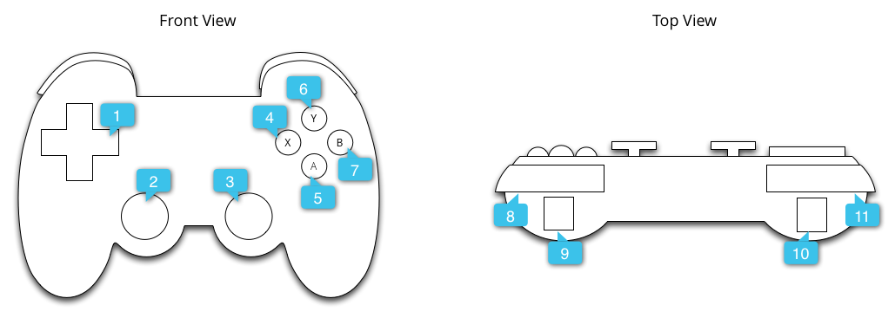

# 處理控制器輸入動作

> 編寫:[heray1990](https://github.com/heray1990) - 原文:<http://developer.android.com/training/game-controllers/controller-input.html>

在系統層面上，Android 會以 Android 按鍵碼值和座標值的形式來報告來自遊戲控制器的輸入事件。在我們的遊戲應用裡，我們可以接收這些碼值和座標值，並將它們轉化成特定的遊戲行為。

當玩家將一個遊戲控制器通過有線連接或者無線配對到 Android 設備時，系統會自動檢測控制器，將它設置成輸入設備並且開始報告它的輸入事件。我們的遊戲應用可以通過在活動的 [Activity](http://developer.android.com/reference/android/app/Activity.html) 或者被選中的 [View](http://developer.android.com/reference/android/view/View.html) 裡調用下面這些回調方法，來接收上述輸入事件（要麼在 [Activity](http://developer.android.com/reference/android/app/Activity.html)，要麼在 [View](http://developer.android.com/reference/android/view/View.html) 中實現實現這些回調方法，不要兩個地方都實現回調）。

* 在 [Activity](http://developer.android.com/reference/android/app/Activity.html) 中：
	* <a href="http://developer.android.com/reference/android/app/Activity.html#dispatchGenericMotionEvent(android.view.MotionEvent)">dispatchGenericMotionEvent(android.view.MotionEvent)</a>
		* 處理一般的運動事件，如搖動搖桿
	* <a href="http://developer.android.com/reference/android/app/Activity.html#dispatchKeyEvent(android.view.KeyEvent)">dispatchKeyEvent(android.view.KeyEvent)</a>
		* 處理按鍵事件，如按下或者釋放遊戲鍵盤的按鍵或者 D-pad 按鈕。
* 在 [View](http://developer.android.com/reference/android/view/View.html) 中：
	* <a href="http://developer.android.com/reference/android/view/View.html#onGenericMotionEvent(android.view.MotionEvent)">onGenericMotionEvent(android.view.MotionEvent)</a>
		* 處理一般的運動事件，如搖動搖桿
	* <a href="http://developer.android.com/reference/android/view/View.html#onKeyDown(int, android.view.KeyEvent)">onKeyDown(int, android.view.KeyEvent)</a>
		* 處理按下一個按鍵的事件，如按下游戲鍵盤的按鍵或者 D-pad 按鈕。
	* <a href="http://developer.android.com/reference/android/view/View.html#onKeyUp(int, android.view.KeyEvent)">onKeyUp(int, android.view.KeyEvent)</a>
		* 處理釋放一個按鍵的事件，如釋放遊戲鍵盤的按鍵或者 D-pad 按鈕。

建議的方法是從與用戶交互的 [View](http://developer.android.com/reference/android/view/View.html) 對象捕獲事件。請查看下面回調函數的對象，來獲取關於接收到輸入事件的類型：

[KeyEvent](http://developer.android.com/reference/android/view/KeyEvent.html)：描述方向按鍵（D-pad）和遊戲按鍵事件的對象。按鍵事件伴隨著一個表示特定按鍵觸發的*按鍵碼值(key code)*，如 [DPAD_DOWN](http://developer.android.com/reference/android/view/KeyEvent.html#KEYCODE_DPAD_DOWN) 或者 [BUTTON_A](http://developer.android.com/reference/android/view/KeyEvent.html#KEYCODE_BUTTON_A)。我們可以通過調用 <a href="http://developer.android.com/reference/android/view/KeyEvent.html#getKeyCode()">getKeyCode()</a> 或者從按鍵事件回調方法（如 <a href="http://developer.android.com/reference/android/view/View.html#onKeyDown(int, android.view.KeyEvent)">onKeyDown()</a>）來獲得按鍵碼值。

[MotionEvent](http://developer.android.com/reference/android/view/MotionEvent.html)：描述搖桿和肩鍵運動的輸入。動作事件伴隨著一個動作碼（action code）和一系列*座標值*（*axis values*）。動作碼錶示出現變化的狀態，例如搖動一個搖桿。座標值描述了特定物理操控的位置和其它運動屬性，例如 [AXIS_X](http://developer.android.com/reference/android/view/MotionEvent.html#AXIS_X) 或者 [AXIS_RTRIGGER](http://developer.android.com/reference/android/view/MotionEvent.html#AXIS_RTRIGGER)。我們可以通過調用 <a href="http://developer.android.com/reference/android/view/MotionEvent.html#getAction()">getAction()</a> 來獲得動作碼，通過調用 <a href="http://developer.android.com/reference/android/view/MotionEvent.html#getAxisValue(int)">getAxisValue()</a> 來獲得座標值。

這節課主要介紹如何通過實現上述的 [View](http://developer.android.com/reference/android/view/View.html) 回調方法與處理 [KeyEvent](http://developer.android.com/reference/android/view/KeyEvent.html) 和 [MotionEvent](http://developer.android.com/reference/android/view/MotionEvent.html) 對象，來處理常用控制器（遊戲鍵盤按鍵、方向按鍵和搖桿）的輸入。

<a name="input=></a>
## 驗證遊戲控制器是否已連接

在報告輸入事件的時候，Android 不會區分遊戲控制器事件與非遊戲控制器事件。例如，一個觸屏動作會產生一個表示觸摸表面上 X 座標的 [AXIS_X](http://developer.android.com/reference/android/view/MotionEvent.html#AXIS_X)，但是一個搖桿動作產生的 [AXIS_X](http://developer.android.com/reference/android/view/MotionEvent.html#AXIS_X) 則表示搖桿水平移動的位置。如果我們的遊戲關注遊戲控制器的輸入，那麼我們應該首先檢測相應的事件來源類型。

通過調用 <a href="http://developer.android.com/reference/android/view/InputDevice.html#getSources()">getSources()</a> 來獲得設備上支持的輸入類型的位字段，來判斷一個已連接的輸入設備是不是一個遊戲控制器。我們可以通過測試以查看下面的字段是否被設置：

* [SOURCE_GAMEPAD](http://developer.android.com/reference/android/view/InputDevice.html#SOURCE_GAMEPAD) 源類型表示輸入設備有遊戲手柄按鍵（如，[BUTTON_A](http://developer.android.com/reference/android/view/KeyEvent.html#KEYCODE_BUTTON_A)）。注意雖然一般的遊戲手柄都會有方向控制鍵，但是這個源類型並不代表遊戲控制器具有 D-pad 按鈕。
* [SOURCE_DPAD](http://developer.android.com/reference/android/view/InputDevice.html#SOURCE_DPAD) 源類型表示輸入設備有 D-pad 按鈕（如，[DPAD_UP](http://developer.android.com/reference/android/view/KeyEvent.html#KEYCODE_DPAD_UP)）。
* [SOURCE_JOYSTICK](http://developer.android.com/reference/android/view/InputDevice.html#SOURCE_JOYSTICK) 源類型表示輸入設備有遙控杆（如，會通過 [AXIS_X](http://developer.android.com/reference/android/view/MotionEvent.html#AXIS_X) 和 [AXIS_Y](http://developer.android.com/reference/android/view/MotionEvent.html#AXIS_Y) 記錄動作的搖桿）。

下面的一小段代碼介紹了一個 helper 方法，它的作用是讓我們檢驗已接入的輸入設備是否是遊戲控制器。如果檢測到是遊戲控制器，那麼這個方法會獲得遊戲控制器的設備 ID。然後，我們應該將每個設備 ID 與遊戲中的玩家關聯起來，並且單獨處理每個已接入的玩家的遊戲操作。想更詳細地瞭解關於在一臺Android設備中同時支持多個遊戲控制器的方法，請見[支持多個遊戲控制器](multi-controller.html)。

```java
public ArrayList getGameControllerIds() {
    ArrayList gameControllerDeviceIds = new ArrayList();
    int[] deviceIds = InputDevice.getDeviceIds();
    for (int deviceId : deviceIds) {
        InputDevice dev = InputDevice.getDevice(deviceId);
        int sources = dev.getSources();

        // Verify that the device has gamepad buttons, control sticks, or both.
        if (((sources & InputDevice.SOURCE_GAMEPAD) == InputDevice.SOURCE_GAMEPAD)
                || ((sources & InputDevice.SOURCE_JOYSTICK)
                == InputDevice.SOURCE_JOYSTICK)) {
            // This device is a game controller. Store its device ID.
            if (!gameControllerDeviceIds.contains(deviceId)) {
                gameControllerDeviceIds.add(deviceId);
            }
        }
    }
    return gameControllerDeviceIds;
}
```

另外，我們可能想去檢查已接入的單個遊戲控制器的輸入性能。這種檢查在某些場合會很有用，例如，我們希望遊戲只用到兼容的物理操控。

用下面這些方法檢測一個遊戲控制器是否支持一個特定的按鍵碼或者座標碼：

* 在Android 4.4（API level 19）或者更高的系統中，調用 <a href="http://developer.android.com/reference/android/view/InputDevice.html#hasKeys(int...)">hasKeys(int)</a> 來確定遊戲控制器是否支持某個按鍵碼。
* 在Android 3.1（API level 12）或者更高的系統中，首先調用 <a href="http://developer.android.com/reference/android/view/InputDevice.html#getMotionRanges()">getMotionRanges()</a>，然後在每個返回的 [InputDevice.MotionRange](http://developer.android.com/reference/android/view/InputDevice.MotionRange.html) 對象中調用 <a href="http://developer.android.com/reference/android/view/InputDevice.MotionRange.html#getAxis()">getAxis()</a> 來獲得座標 ID。這樣就可以得到遊戲控制器支持的所有可用座標軸。

## 處理遊戲手柄按鍵

Figure 1介紹了 Android 如何將按鍵碼和座標值映射到實際的遊戲手柄上。



**Figure 1.** 一個常用的遊戲手柄的外形

上圖的標註對應下面的內容：

1. <a href="http://developer.android.com/reference/android/view/MotionEvent.html#AXIS_HAT_X">AXIS\_HAT\_X</a>, <a href="http://developer.android.com/reference/android/view/MotionEvent.html#AXIS_HAT_Y">AXIS\_HAT\_Y</a>, [DPAD_UP](http://developer.android.com/reference/android/view/KeyEvent.html#KEYCODE_DPAD_UP), [DPAD_DOWN](http://developer.android.com/reference/android/view/KeyEvent.html#KEYCODE_DPAD_DOWN), [DPAD_LEFT](http://developer.android.com/reference/android/view/KeyEvent.html#KEYCODE_DPAD_LEFT), [DPAD_RIGHT](http://developer.android.com/reference/android/view/KeyEvent.html#KEYCODE_DPAD_RIGHT)
2. [AXIS_X](http://developer.android.com/reference/android/view/MotionEvent.html#AXIS_X), [AXIS_Y](http://developer.android.com/reference/android/view/MotionEvent.html#AXIS_Y), [BUTTON_THUMBL](http://developer.android.com/reference/android/view/KeyEvent.html#KEYCODE_BUTTON_THUMBL)
3. [AXIS_Z](http://developer.android.com/reference/android/view/MotionEvent.html#AXIS_Z), [AXIS_RZ](http://developer.android.com/reference/android/view/MotionEvent.html#AXIS_RZ), [BUTTON_THUMBR](http://developer.android.com/reference/android/view/KeyEvent.html#KEYCODE_BUTTON_THUMBR)
4. [BUTTON_X](http://developer.android.com/reference/android/view/KeyEvent.html#KEYCODE_BUTTON_X)
5. [BUTTON_A](http://developer.android.com/reference/android/view/KeyEvent.html#KEYCODE_BUTTON_A)
6. [BUTTON_Y](http://developer.android.com/reference/android/view/KeyEvent.html#KEYCODE_BUTTON_Y)
7. [BUTTON_B](http://developer.android.com/reference/android/view/KeyEvent.html#KEYCODE_BUTTON_B)
8. [BUTTON_R1](http://developer.android.com/reference/android/view/KeyEvent.html#KEYCODE_BUTTON_R1)
9. [AXIS_RTRIGGER](http://developer.android.com/reference/android/view/MotionEvent.html#AXIS_RTRIGGER), [AXIS_THROTTLE](http://developer.android.com/reference/android/view/MotionEvent.html#AXIS_THROTTLE)
10. [AXIS_LTRIGGER](http://developer.android.com/reference/android/view/MotionEvent.html#AXIS_LTRIGGER), [AXIS_BRAKE](http://developer.android.com/reference/android/view/MotionEvent.html#AXIS_BRAKE)
11. [BUTTON_L1](http://developer.android.com/reference/android/view/KeyEvent.html#KEYCODE_BUTTON_L1)

遊戲手柄產生的通用的按鍵碼包括 [BUTTON_A](http://developer.android.com/reference/android/view/KeyEvent.html#KEYCODE_BUTTON_A)、[BUTTON_B](http://developer.android.com/reference/android/view/KeyEvent.html#KEYCODE_BUTTON_B)、[BUTTON_SELECT](http://developer.android.com/reference/android/view/KeyEvent.html#KEYCODE_BUTTON_SELECT) 和 [BUTTON_START](http://developer.android.com/reference/android/view/KeyEvent.html#KEYCODE_BUTTON_START)。當按下 D-pad 中間的交叉按鍵時，一些遊戲控制器會觸發 [DPAD_CENTER](http://developer.android.com/reference/android/view/KeyEvent.html#KEYCODE_DPAD_CENTER) 按鍵碼。我們的遊戲可以通過調用 <a href="http://developer.android.com/reference/android/view/KeyEvent.html#getKeyCode()">getKeyCode()</a> 或者從按鍵事件回調（如<a href="http://developer.android.com/reference/android/view/View.html#onKeyDown(int, android.view.KeyEvent)">onKeyDown()</a>）得到按鍵碼。如果一個事件與我們的遊戲相關，那麼將其處理成一個遊戲動作。Table 1列出供大多數通用遊戲手柄按鈕使用的推薦遊戲動作。

**Table 1.** 供遊戲手柄使用的推薦遊戲動作

<table>
   <tr>
      <td>遊戲動作</td>
      <td>按鍵碼</td>
   </tr>
   <tr>
      <td>在主菜單中啟動遊戲，或者在遊戲過程中暫停/取消暫停</td>
      <td><a href="http://developer.android.com/reference/android/view/KeyEvent.html#KEYCODE_BUTTON_START">BUTTON_START</a></td>
   </tr>
   <tr>
      <td>顯示菜單</td>
      <td><a href="http://developer.android.com/reference/android/view/KeyEvent.html#KEYCODE_BUTTON_SELECT">BUTTON_SELECT</a> 和 <a href="http://developer.android.com/reference/android/view/KeyEvent.html#KEYCODE_MENU">KEYCODE_MENU</a></td>
   </tr>
   <tr>
      <td>跟Android導航設計指導中的Back導航行為一樣</td>
      <td><a href="http://developer.android.com/reference/android/view/KeyEvent.html#KEYCODE_BACK">KEYCODE_BACK</a></td>
   </tr>
   <tr>
      <td>返回到菜單中上一項</td>
      <td><a href="http://developer.android.com/reference/android/view/KeyEvent.html#KEYCODE_BUTTON_B">BUTTON_B</a></td>
   </tr>
   <tr>
      <td>確認選擇，或者執行主要的遊戲動作</td>
      <td><a href="http://developer.android.com/reference/android/view/KeyEvent.html#KEYCODE_BUTTON_A">BUTTON_A</a> 和 <a href="http://developer.android.com/reference/android/view/KeyEvent.html#KEYCODE_DPAD_CENTER">DPAD_CENTER</a></td>
   </tr>
</table>

\* *我們的遊戲不應該依賴於Start、Select或者Menu按鍵的存在。*

> **Tip:** 可以考慮在遊戲中提供一個配置界面，使得用戶可以個性化遊戲控制器與遊戲動作的映射。

下面的代碼介紹瞭如何重寫 <a href="http://developer.android.com/reference/android/view/View.html#onKeyDown(int, android.view.KeyEvent)">onKeyDown()</a> 來將 [BUTTON_A](http://developer.android.com/reference/android/view/KeyEvent.html#KEYCODE_BUTTON_A) 和 [DPAD_CENTER](http://developer.android.com/reference/android/view/KeyEvent.html#KEYCODE_DPAD_CENTER) 按鈕結合到一個遊戲動作。

```java
public class GameView extends View {
    ...

    @Override
    public boolean onKeyDown(int keyCode, KeyEvent event) {
        boolean handled = false;
        if ((event.getSource() & InputDevice.SOURCE_GAMEPAD)
                == InputDevice.SOURCE_GAMEPAD) {
            if (event.getRepeatCount() == 0) {
                switch (keyCode) {
                    // Handle gamepad and D-pad button presses to
                    // navigate the ship
                    ...

                    default:
                         if (isFireKey(keyCode)) {
                             // Update the ship object to fire lasers
                             ...
                             handled = true;
                         }
                     break;
                }
            }
            if (handled) {
                return true;
            }
        }
        return super.onKeyDown(keyCode, event);
    }

    private static boolean isFireKey(int keyCode) {
        // Here we treat Button_A and DPAD_CENTER as the primary action
        // keys for the game.
        return keyCode == KeyEvent.KEYCODE_DPAD_CENTER
                || keyCode == KeyEvent.KEYCODE_BUTTON_A;
    }
}
```

> **Note:** 在 Android 4.2（API level 17）和更低版本的系統中，系統默認會把 [BUTTON_A](http://developer.android.com/reference/android/view/KeyEvent.html#KEYCODE_BUTTON_A) 當作 Android *Back*（*返回*）鍵。如果我們的應用支持這些 Android 版本，請確保將 [BUTTON_A](http://developer.android.com/reference/android/view/KeyEvent.html#KEYCODE_BUTTON_A) 轉換成主要的遊戲動作。引用 [Build.VERSION.SDK_INT](http://developer.android.com/reference/android/os/Build.VERSION.html#SDK_INT) 值來決定設備上當前的 Android SDK 版本。

## 處理 D-pad 輸入

四方向的方向鍵（D-pad）在很多遊戲控制器中是一種很常見的物理控制。Android 將 D-pad 的上和下按鍵按壓報告成 [AXIS_HAT_Y](http://developer.android.com/reference/android/view/MotionEvent.html#AXIS_HAT_Y) 事件（範圍從-1.0（上）到1.0（下）），將 D-pad 的左或者右按鍵按壓報告成 [AXIS_HAT_X](http://developer.android.com/reference/android/view/MotionEvent.html#AXIS_HAT_X) 事件（範圍從-1.0（左）到1.0（右））。

一些遊戲控制器會將 D-pad 按壓報告成一個按鍵碼。如果我們的遊戲有檢測 D-pad 的按壓，那麼我們應該將座標值事件和 D-pad 按鍵碼當成一樣的輸入事件，如 table 2 介紹的一樣。

**Table 2.** D-pad 按鍵碼和座標值的推薦默認遊戲動作。

<table>
   <tr>
      <td>遊戲動作</td>
      <td>D-pad 按鍵碼</td>
      <td>座標值</td>
   </tr>
   <tr>
      <td>向上</td>
      <td><a href="http://developer.android.com/reference/android/view/KeyEvent.html#KEYCODE_DPAD_UP">KEYCODE_DPAD_UP</a></td>
      <td><a href="http://developer.android.com/reference/android/view/MotionEvent.html#AXIS_HAT_Y">AXIS_HAT_Y</a> （從 0 到 -1.0）</td>
   </tr>
   <tr>
      <td>向下</td>
      <td><a href="http://developer.android.com/reference/android/view/KeyEvent.html#KEYCODE_DPAD_DOWN">KEYCODE_DPAD_DOWN</a></td>
      <td><a href="http://developer.android.com/reference/android/view/MotionEvent.html#AXIS_HAT_Y">AXIS_HAT_Y</a> （從 0 到 1.0）</td>
   </tr>
   <tr>
      <td>向左</td>
      <td><a href="http://developer.android.com/reference/android/view/KeyEvent.html#KEYCODE_DPAD_LEFT">KEYCODE_DPAD_LEFT</a></td>
      <td><a href="http://developer.android.com/reference/android/view/MotionEvent.html#AXIS_HAT_X">AXIS_HAT_X</a> （從 0 到 -1.0）</td>
   </tr>
   <tr>
      <td>向右</td>
      <td><a href="http://developer.android.com/reference/android/view/KeyEvent.html#KEYCODE_DPAD_RIGHT">KEYCODE_DPAD_RIGHT</a></td>
      <td><a href="http://developer.android.com/reference/android/view/MotionEvent.html#AXIS_HAT_X">AXIS_HAT_X</a> （從 0 到 1.0）</td>
   </tr>
</table>

下面的代碼介紹了通過一個 helper 類，來檢查從一個輸入事件來決定 D-pad 方向的座標值和按鍵碼。

```java
public class Dpad {
    final static int UP       = 0;
    final static int LEFT     = 1;
    final static int RIGHT    = 2;
    final static int DOWN     = 3;
    final static int CENTER   = 4;

    int directionPressed = -1; // initialized to -1

    public int getDirectionPressed(InputEvent event) {
        if (!isDpadDevice(event)) {
           return -1;
        }

        // If the input event is a MotionEvent, check its hat axis values.
        if (event instanceof MotionEvent) {

            // Use the hat axis value to find the D-pad direction
            MotionEvent motionEvent = (MotionEvent) event;
            float xaxis = motionEvent.getAxisValue(MotionEvent.AXIS_HAT_X);
            float yaxis = motionEvent.getAxisValue(MotionEvent.AXIS_HAT_Y);

            // Check if the AXIS_HAT_X value is -1 or 1, and set the D-pad
            // LEFT and RIGHT direction accordingly.
            if (Float.compare(xaxis, -1.0f) == 0) {
                directionPressed =  Dpad.LEFT;
            } else if (Float.compare(xaxis, 1.0f) == 0) {
                directionPressed =  Dpad.RIGHT;
            }
            // Check if the AXIS_HAT_Y value is -1 or 1, and set the D-pad
            // UP and DOWN direction accordingly.
            else if (Float.compare(yaxis, -1.0f) == 0) {
                directionPressed =  Dpad.UP;
            } else if (Float.compare(yaxis, 1.0f) == 0) {
                directionPressed =  Dpad.DOWN;
            }
        }

        // If the input event is a KeyEvent, check its key code.
        else if (event instanceof KeyEvent) {

           // Use the key code to find the D-pad direction.
            KeyEvent keyEvent = (KeyEvent) event;
            if (keyEvent.getKeyCode() == KeyEvent.KEYCODE_DPAD_LEFT) {
                directionPressed = Dpad.LEFT;
            } else if (keyEvent.getKeyCode() == KeyEvent.KEYCODE_DPAD_RIGHT) {
                directionPressed = Dpad.RIGHT;
            } else if (keyEvent.getKeyCode() == KeyEvent.KEYCODE_DPAD_UP) {
                directionPressed = Dpad.UP;
            } else if (keyEvent.getKeyCode() == KeyEvent.KEYCODE_DPAD_DOWN) {
                directionPressed = Dpad.DOWN;
            } else if (keyEvent.getKeyCode() == KeyEvent.KEYCODE_DPAD_CENTER) {
                directionPressed = Dpad.CENTER;
            }
        }
        return directionPressed;
    }

    public static boolean isDpadDevice(InputEvent event) {
        // Check that input comes from a device with directional pads.
        if ((event.getSource() & InputDevice.SOURCE_DPAD)
             != InputDevice.SOURCE_DPAD) {
             return true;
         } else {
             return false;
         }
     }
}
```

我們可以在任意想要處理 D-pad 輸入（例如，在 <a href="http://developer.android.com/reference/android/view/View.html#onGenericMotionEvent(android.view.MotionEvent)">onGenericMotionEvent()</a> 或者 <a href="http://developer.android.com/reference/android/view/View.html#onKeyDown(int, android.view.KeyEvent)">onKeyDown()</a> 回調函數）的地方使用這個 helper 類。

例如：

```java
Dpad mDpad = new Dpad();
...
@Override
public boolean onGenericMotionEvent(MotionEvent event) {

    // Check if this event if from a D-pad and process accordingly.
    if (Dpad.isDpadDevice(event)) {

       int press = mDpad.getDirectionPressed(event);
       switch (press) {
            case LEFT:
                // Do something for LEFT direction press
                ...
                return true;
            case RIGHT:
                // Do something for RIGHT direction press
                ...
                return true;
            case UP:
                // Do something for UP direction press
                ...
                return true;
            ...
        }
    }

    // Check if this event is from a joystick movement and process accordingly.
    ...
}
```

## 處理搖桿動作

當玩家移動遊戲控制器上的搖桿時，Android 會報告一個包含 [ACTION_MOVE](http://developer.android.com/reference/android/view/MotionEvent.html#ACTION_MOVE) 動作碼和更新搖桿在座標軸的位置的 [MotionEvent](http://developer.android.com/reference/android/view/MotionEvent.html)。我們的遊戲可以使用 [MotionEvent](http://developer.android.com/reference/android/view/MotionEvent.html) 提供的數據來確定是否發生搖桿的動作。

注意到搖桿移動會在單個對象中批處理多個移動示例。[MotionEvent](http://developer.android.com/reference/android/view/MotionEvent.html) 對象包含每個搖桿座標當前的位置和每個座標軸上的多個歷史位置。當用 [ACTION_MOVE](http://developer.android.com/reference/android/view/MotionEvent.html#ACTION_MOVE) 動作碼（例如搖桿移動）來報告移動事件時，Android 會高效地批處理座標值。由座標值組成的不同的歷史值比當前的座標值要舊，比之前報告的任意移動事件要新。詳情見 [MotionEvent](http://developer.android.com/reference/android/view/MotionEvent.html)  參考文檔。

我們可以使用歷史信息，根據搖桿輸入更精確地表達遊戲對象的活動。調用 <a href="http://developer.android.com/reference/android/view/MotionEvent.html#getAxisValue(int)">getAxisValue()</a> 或者 <a href="http://developer.android.com/reference/android/view/MotionEvent.html#getHistoricalAxisValue(int, int)">getHistoricalAxisValue()</a> 來獲取現在和歷史的值。我們也可以通過調用 <a href="http://developer.android.com/reference/android/view/MotionEvent.html#getHistorySize()">getHistorySize()</a> 來找到搖桿事件的歷史點號碼。

下面的代碼介紹瞭如何重寫 <a href="http://developer.android.com/reference/android/view/View.html#onGenericMotionEvent(android.view.MotionEvent)">onGenericMotionEvent()</a> 回調函數來處理搖桿輸入。我們應該首先處理歷史座標值，然後處理當前值。

```java
public class GameView extends View {

    @Override
    public boolean onGenericMotionEvent(MotionEvent event) {

        // Check that the event came from a game controller
        if ((event.getSource() & InputDevice.SOURCE_JOYSTICK) ==
                InputDevice.SOURCE_JOYSTICK &&
                event.getAction() == MotionEvent.ACTION_MOVE) {

            // Process all historical movement samples in the batch
            final int historySize = event.getHistorySize();

            // Process the movements starting from the
            // earliest historical position in the batch
            for (int i = 0; i < historySize; i++) {
                // Process the event at historical position i
                processJoystickInput(event, i);
            }

            // Process the current movement sample in the batch (position -1)
            processJoystickInput(event, -1);
            return true;
        }
        return super.onGenericMotionEvent(event);
    }
}
```

在使用搖桿輸入之前，我們需要確定搖桿是否居中，然後計算相應的座標移動距離。一般搖桿會有一個平面區，即在座標 (0, 0) 附近一個值範圍內的座標點都被當作是中點。如果 Android 系統報告座標值掉落在平面區內，那麼我們應該認為控制器處於靜止（即沿著 x、y 兩個座標軸都是靜止的）。

下面的代碼介紹了一個用於計算沿著每個座標軸的移動距離的 helper 方法。我們將在後面討論的 `processJoystickInput()` 方法中調用這個 helper 方法。

```java
private static float getCenteredAxis(MotionEvent event,
        InputDevice device, int axis, int historyPos) {
    final InputDevice.MotionRange range =
            device.getMotionRange(axis, event.getSource());

    // A joystick at rest does not always report an absolute position of
    // (0,0). Use the getFlat() method to determine the range of values
    // bounding the joystick axis center.
    if (range != null) {
        final float flat = range.getFlat();
        final float value =
                historyPos < 0 ? event.getAxisValue(axis):
                event.getHistoricalAxisValue(axis, historyPos);

        // Ignore axis values that are within the 'flat' region of the
        // joystick axis center.
        if (Math.abs(value) > flat) {
            return value;
        }
    }
    return 0;
}
```

將它們都放在一起，下面是我們如何在遊戲中處理搖桿移動：

```java
private void processJoystickInput(MotionEvent event,
        int historyPos) {

    InputDevice mInputDevice = event.getDevice();

    // Calculate the horizontal distance to move by
    // using the input value from one of these physical controls:
    // the left control stick, hat axis, or the right control stick.
    float x = getCenteredAxis(event, mInputDevice,
            MotionEvent.AXIS_X, historyPos);
    if (x == 0) {
        x = getCenteredAxis(event, mInputDevice,
                MotionEvent.AXIS_HAT_X, historyPos);
    }
    if (x == 0) {
        x = getCenteredAxis(event, mInputDevice,
                MotionEvent.AXIS_Z, historyPos);
    }

    // Calculate the vertical distance to move by
    // using the input value from one of these physical controls:
    // the left control stick, hat switch, or the right control stick.
    float y = getCenteredAxis(event, mInputDevice,
            MotionEvent.AXIS_Y, historyPos);
    if (y == 0) {
        y = getCenteredAxis(event, mInputDevice,
                MotionEvent.AXIS_HAT_Y, historyPos);
    }
    if (y == 0) {
        y = getCenteredAxis(event, mInputDevice,
                MotionEvent.AXIS_RZ, historyPos);
    }

    // Update the ship object based on the new x and y values
}
```

為了支持除了單個搖桿之外更多複雜的功能，按照下面的做法：

* **處理兩個控制器搖桿。**很多遊戲控制器左右兩邊都有搖桿。對於左搖桿，Android 會報告水平方向的移動為 [AXIS_X](http://developer.android.com/reference/android/view/MotionEvent.html#AXIS_X) 事件，垂直方向的移動為 [AXIS_Y](http://developer.android.com/reference/android/view/MotionEvent.html#AXIS_Y) 事件。對於右搖桿，Android 會報告水平方向的移動為 [AXIS_Z](http://developer.android.com/reference/android/view/MotionEvent.html#AXIS_Z) 事件，垂直方向的移動為 [AXIS_RZ](http://developer.android.com/reference/android/view/MotionEvent.html#AXIS_RZ) 事件。確保在代碼中處理兩個搖桿。

* **處理肩鍵按壓（但需要提供另一種輸入方法）。**一些控制器會有左右肩鍵。如果存在這些按鍵，那麼 Android 報告左肩鍵按壓為一個 [AXIS_LTRIGGER](http://developer.android.com/reference/android/view/MotionEvent.html#AXIS_LTRIGGER) 事件，右肩鍵按壓為一個 [AXIS_RTRIGGER](http://developer.android.com/reference/android/view/MotionEvent.html#AXIS_RTRIGGER) 事件。在 Android 4.3（API level 18）中，一個產生了 [AXIS_LTRIGGER](http://developer.android.com/reference/android/view/MotionEvent.html#AXIS_LTRIGGER) 事件的控制器也會報告一個完全一樣的 [AXIS_BRAKE](http://developer.android.com/reference/android/view/MotionEvent.html#AXIS_BRAKE) 座標值。同樣，[AXIS_RTRIGGER](http://developer.android.com/reference/android/view/MotionEvent.html#AXIS_RTRIGGER) 對應 [AXIS_GAS](http://developer.android.com/reference/android/view/MotionEvent.html#AXIS_GAS)。Android 會報告模擬按鍵按壓為從 0.0（釋放）到 1.0（按下）的標準值。並不是所有的控制器都有肩鍵，所以需要允許玩家用其它按鈕來執行那些遊戲動作。