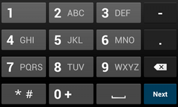
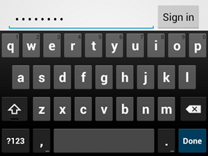
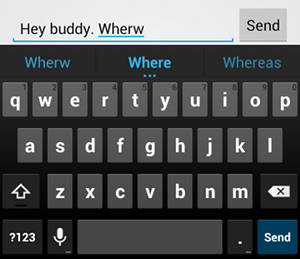

# 指定輸入法類型

> 編寫:[zhaochunqi](https://github.com/zhaochunqi) - 原文:<http://developer.android.com/training/keyboard-input/style.html>

每個文本框都對應特定類型的文本輸入，如Email地址，電話號碼，或者純文本。為應用中的每一個文本框指定輸入類型是很重要的，這樣做可以讓系統展示更為合適的軟輸入法（比如虛擬鍵盤）。

除了輸入法可用的按鈕類型之外，我們還應該指定一些行為，例如，輸入法是否提供拼寫建議，新的句子首字母大寫，和將回車按鈕替換成動作按鈕（如 **Done** 或者 **Next**）。這節課介紹瞭如何添加這些屬性。

## 指定鍵盤類型

通過將 [android:inputType](http://developer.android.com/reference/android/widget/TextView.html#attr_android:inputType) 屬性添加到 [&lt;EditText&gt;](http://developer.android.com/reference/android/widget/EditText.html) 節點中，我們可以為文本框聲明輸入法。

舉例來說，如果我們想要一個用於輸入電話號碼的輸入法，那麼使用 `"phone"` 值：

```xml
<EditText
    android:id="@+id/phone"
    android:layout_width="fill_parent"
    android:layout_height="wrap_content"
    android:hint="@string/phone_hint"
    android:inputType="phone" />
```



**Figure 1.** `phone` 輸入類型

或者如果文本框用於輸入密碼，那麼使用 `"textPassword"` 值來隱藏用戶的輸入：

```xml
<EditText
    android:id="@+id/password"
    android:hint="@string/password_hint"
    android:inputType="textPassword"
    ... />
```



**Figure 2.** `textPassword` 輸入類型

有幾種可供選擇的值在 `android:inputType` 記錄在屬性中，一些值可以組合起來實現特定的輸入法外觀和附加的行為。

## 開啟拼寫建議和其它行為

[android:inputType](http://developer.android.com/reference/android/widget/TextView.html#attr_android:inputType) 屬性允許我們為輸入法指定不同的行為。最為重要的是，如果文本框用於基本的文本輸入（如短信息），那麼我們應該使用 `"textAutoCorrect"` 值來開啟自動拼寫修正。



**Figure 3.** 添加 `textAutoCorrect` 為拼寫錯誤提供自動修正

我們可以將不同的行為和輸入法形式組合到 [android:inputType](http://developer.android.com/reference/android/widget/TextView.html#attr_android:inputType) 這個屬性。如：如何創建一個文本框，裡面的句子首字母大寫並開啟拼寫修正：

```xml
<EditText
    android:id="@+id/message"
    android:layout_width="wrap_content"
    android:layout_height="wrap_content"
    android:inputType=
        "textCapSentences|textAutoCorrect"
    ... />
```

## 指定輸入法的行為

多數的軟鍵盤會在底部角落裡為用戶提供一個合適的動作按鈕來觸發當前文本框的操作。默認情況下，系統使用 **Next** 或者 **Done**，除非我們的文本框允許多行文本（如`android:inputType="textMultiLine"`），這種情況下，動作按鈕就是回車換行。然而，我們可以指定一些更適合我們文本框的額外動作，比如 **Send** 和 **Go**。


**Figure 4.** 當我們聲明瞭 `android:imeOptions="actionSend"`，會出現 Send 按鈕。

使用[android:imeOptions](http://developer.android.com/reference/android/widget/TextView.html#attr_android:imeOptions) 屬性，並設置一個動作值（如 `"actionSend"` 或 `"actionSearch"`），來指定鍵盤的動作按鈕。如：

```xml
<EditText
    android:id="@+id/search"
    android:layout_width="fill_parent"
    android:layout_height="wrap_content"
    android:hint="@string/search_hint"
    android:inputType="text"
    android:imeOptions="actionSend" />
```

然後，我們可以通過為 [EditText](http://developer.android.com/reference/android/widget/EditText.html) 節點定義 [TextView.OnEditorActionListener](http://developer.android.com/reference/android/widget/TextView.OnEditorActionListener.html) 來監聽動作按鈕的按壓。在監聽器中，響應 [EditorInfo](http://developer.android.com/reference/android/view/inputmethod/EditorInfo.html) 類中定義的適合的 IME action ID，如 [IME_ACTION_SEND](http://developer.android.com/reference/android/view/inputmethod/EditorInfo.html#IME_ACTION_SEND) 。例如:

```java
EditText editText = (EditText) findViewById(R.id.search);
editText.setOnEditorActionListener(new OnEditorActionListener() {
    @Override
    public boolean onEditorAction(TextView v, int actionId, KeyEvent event) {
        boolean handled = false;
        if (actionId == EditorInfo.IME_ACTION_SEND) {
            sendMessage();
            handled = true;
        }
        return handled;
    }
});
```
