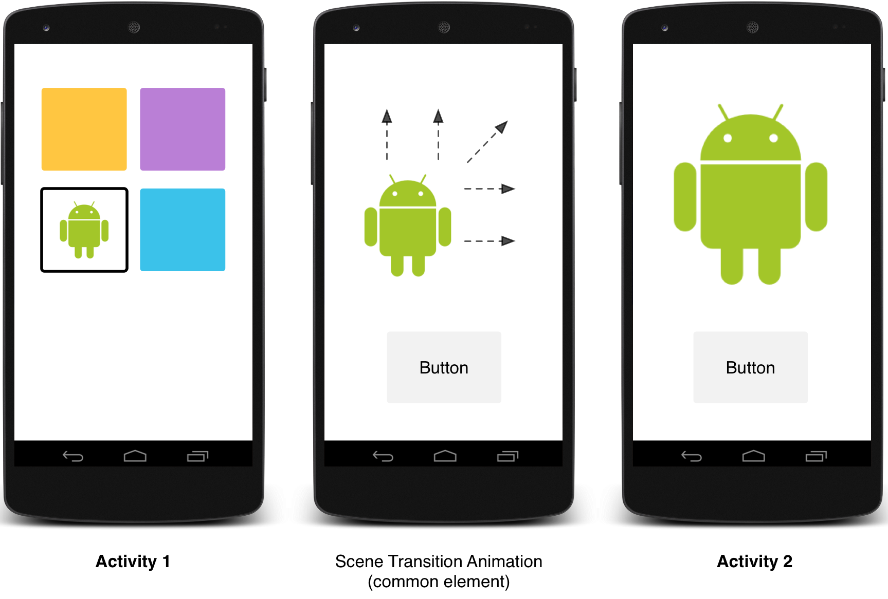

# 自定義動畫

> 編寫: [allenlsy](https://github.com/allenlsy) - 原文: <https://developer.android.com/training/material/animations.html>

Material Design中的動畫對用戶的動作進行反饋，並提供在整個交互過程中的視覺連續性。Material 主題為按鈕和Activity切換提供一些默認的動畫，Android 5.0 (API level 21) 及以上版本支持自定義這些動畫並創建新動畫：

* 觸摸反饋
* 圓形填充
* Activity 切換動畫
* 曲線形動作
* 視圖狀態變換

## 自定義觸摸反饋

Material Design中的觸摸反饋，是在用戶與UI元素交互時，提供視覺上的即時確認。按鈕的默認觸摸反饋動畫使用了新的`RippleDrawable`類，它在按鈕狀態變換時產生波紋效果。

大多數情況下，你需要在你的 XML 文件中設定視圖的背景來實現這個功能：

* `?android:attr/selectableItemBackground` 用於有界Ripple動畫
* `?android:attr/selectableItemBackgroundBorderless` 用於越出視圖邊界的動畫。它會被繪製在最近的且不是全屏的父視圖上。

> **Note：**`selectableItemBackgroundBorderless` 是 API level 21 新加入的屬性

另外，你可以使用`ripple`元素在XML資源文件中定義一個 `RippleDrawable`。

你可以給`RippleDrawable`賦予一個顏色。要改變默認的觸摸反饋顏色，使用主題的`android:colorControlHighlight` 屬性。

更多信息，參見`RippleDrawable`類的API文檔。

## 使用填充效果（Reveal Effect）

填充效果在UI元素出現或隱藏時，為用戶提供視覺連續性。`ViewAnimationUtils.createCircularReveal()`方法可以使用一個附著在視圖上的圓形，顯示或隱藏這個視圖。

要用此效果顯示一個原本不可見的視圖：

```java
// previously invisible view
View myView = findViewById(R.id.my_view);

// get the center for the clipping circle
int cx = (myView.getLeft() + myView.getRight()) / 2;
int cy = (myView.getTop() + myView.getBottom()) / 2;

// get the final radius for the clipping circle
int finalRadius = myView.getWidth();

// create and start the animator for this view
// (the start radius is zero)
Animator anim =
    ViewAnimationUtils.createCircularReveal(myView, cx, cy, 0, finalRadius);
anim.start();
```

要用此效果隱藏一個原本可見的視圖：

```java
// previously visible view
final View myView = findViewById(R.id.my_view);

// get the center for the clipping circle
int cx = (myView.getLeft() + myView.getRight()) / 2;
int cy = (myView.getTop() + myView.getBottom()) / 2;

// get the initial radius for the clipping circle
int initialRadius = myView.getWidth();

// create the animation (the final radius is zero)
Animator anim =
    ViewAnimationUtils.createCircularReveal(myView, cx, cy, initialRadius, 0);

// make the view invisible when the animation is done
anim.addListener(new AnimatorListenerAdapter() {
    @Override
    public void onAnimationEnd(Animator animation) {
        super.onAnimationEnd(animation);
        myView.setVisibility(View.INVISIBLE);
    }
});

// start the animation
anim.start();
```

## 自定義Activity切換效果


Material Design中的Activity切換，當不同Activity之間擁有共有元素，則可以通過不同狀態之間的動畫和形變提供視覺上的連續性。你可以為共有元素設定進入和退出Activity時的自定義動畫。

* **入場變換**決定視圖如何入場。比如，在*爆炸式入場*變換中，視圖從場外飛到屏幕中央。
* **出場變換**決定視圖如何退出。比如，在*爆炸式出場*變換中，視圖從屏幕中央飛出場外。
* **共有元素的變換**決定一個共有視圖在兩個Activity之間如何變換。比如，如果兩個activity有同一張圖片，但是放在不同位置，以及擁有不同大小，*變更圖片* 變換會流暢的把圖片移到相應位置，同時縮放圖片大小。

Android 5.0 (API level 21) 支持這些入場和退出變換：

* 爆炸 - 把視圖移入或移出場景的中間
* 滑動 - 把視圖從場景邊緣移入或移出
* 淡入淡出 - 通過改變透明度添加或移除元素

任何繼承於 [`Visibility`](http://developer.android.com/reference/android/transition/Visibility.html) 類的變換，都支持被用於入場或退出變換。更多信息，請參見 [`Transition`](http://developer.android.com/reference/android/transition/Transition.html) 類的API文檔。

Android 5.0 (API level 21) 還支持這些共有元素變換效果：

* **changeBounds** - 對目標視圖的外邊界進行動畫
* **chagneClipBounds** - 對目標視圖的附著物的外邊界進行動畫
* **changeTransform** - 對目標視圖進行縮放和旋轉
* **changeImageTransform** - 對目標圖片進行縮放

當你在應用中進行activity 變換時，默認的淡入淡出效果會被用在進入和退出activity的過程中。



### 自定義切換

首先，當你繼承Material主題的style時，要通過`android:windowContentTransitions`屬性來開啟窗口內容變換功能。你也可以在style定義中聲明進入、退出和共有元素切換：

```xml
<style name="BaseAppTheme" parent="android:Theme.Material">
  <!-- enable window content transitions -->
  <item name="android:windowContentTransitions">true</item>

  <!-- specify enter and exit transitions -->
  <item name="android:windowEnterTransition">@transition/explode</item>
  <item name="android:windowExitTransition">@transition/explode</item>

  <!-- specify shared element transitions -->
  <item name="android:windowSharedElementEnterTransition">
    @transition/change_image_transform</item>
  <item name="android:windowSharedElementExitTransition">
    @transition/change_image_transform</item>
</style>
```

例子中的`change_image_transform` 切換定義如下：

```xml
<!-- res/transition/change_image_transform.xml -->
<!-- (see also Shared Transitions below) -->
<transitionSet xmlns:android="http://schemas.android.com/apk/res/android">
  <changeImageTransform/>
</transitionSet>
```

`changeImageTransform` 元素對應 `ChangeImageTransform` 類。更多信息，請參見 `Transition`類的API文檔。

要在代碼中啟用窗口內容切換，調用`Window.requestFeature()`函數：

```java
// inside your activity (if you did not enable transitions in your theme)
getWindow().requestFeature(Window.FEATURE_CONTENT_TRANSITIONS);

// set an exit transition
getWindow().setExitTransition(new Explode());
```

要聲明變換類型，就要在`Transition`對象上調用以下函數：

* `Window.setEnterTransition()`
* `Window.setExitTransition()`
* `Window.setSharedElementEnterTransition()`
* `Window.setSharedElementExitTransition()`

`setExitTransition()` 和 `setSharedElementExitTransition()` 函數為activity定義了退出變換效果。`setEnterTransition()` 和 `setSharedElementEnterTransition()` 函數定義了進入activity的變換效果。

要獲得切換的全部效果，你必須在出入的兩個activity中都開啟窗口內容切換。否則，調用的activity會使用退出效果，但是接著你會看到一個傳統的窗口切換（比如縮放或淡入淡出）。

要儘早開始入場切換，可以在被調用的Activity上使用`Window.setAllowEnterTransitionOverlap()` 。它可以使你擁有更戲劇性的入場切換。

### 使用切換啟動一個Activity

如果你開啟Activity入場和退出效果，那麼當你在用如下方法開始Activity時，切換效果會被應用：

```java
startActivity(intent,
              ActivityOptions.makeSceneTransitionAnimation(this).toBundle());
```

如果你為第二個Activity設定了入場變換，變換也會在activity開始時被啟用。要在開始另一個acitivity時禁用變換，可以給bundle的選項提供一個`null`對象：

### 啟動一個擁有共用元素的Activity

要在兩個擁有共用元素的activity間進行切換動畫：

1. 在主題中開啟窗口內容切換
2. 在style中定義共有元素切換
3. 將切換定義為一個XML 資源文件
4. 使用`android:transitionName`屬性在兩個layout文件中給共有元素賦予同一個名字
5. 使用`ActivityOptions.makeSceneTransitionAnimation()`方法

```java
// get the element that receives the click event
final View imgContainerView = findViewById(R.id.img_container);

// get the common element for the transition in this activity
final View androidRobotView = findViewById(R.id.image_small);

// define a click listener
imgContainerView.setOnClickListener(new View.OnClickListener() {
    @Override
    public void onClick(View view) {
        Intent intent = new Intent(this, Activity2.class);
        // create the transition animation - the images in the layouts
        // of both activities are defined with android:transitionName="robot"
        ActivityOptions options = ActivityOptions
            .makeSceneTransitionAnimation(this, androidRobotView, "robot");
        // start the new activity
        startActivity(intent, options.toBundle());
    }
});
```

對於用代碼編寫的共有動態視圖，使用`View.setTransitionName()`方法來在兩個activity中定義共有元素。

要在第二個activity結束時進行逆向的場景切換動畫，調用`Activity.finishAfterTransition()`方法，而不是`Activity.finish()`。

### 開始一個擁有多個共有元素的Activity

要在擁有多個共有元素的activity之間使用變換動畫，就要用`android:transitionName`屬性在兩個layout中定義這個共有元素（或在兩個Activity中使用`View.setTransitionName()`方法），再創建`ActivityOptions`對象：

```java
ActivityOptions options = ActivityOptions.makeSceneTransitionAnimation(this,
        Pair.create(view1, "agreedName1"),
        Pair.create(view2, "agreedName2"));
```

## 使用曲線動畫

Material Design中的動畫可以表示為基於時間插值和空間移動模式的曲線。在Android 5.0 (API level 21)以上版本中，你可以為動畫定義時間曲線和曲線動畫模式。

`PathInterpolator`類是一個基於貝澤爾曲線或`Path`對象的新的插值方法。**插值方法** 是一個定義在 1x1 正方形中的曲線函數圖像，其始末兩點分別在(0,0)和（1,1)，一個用構造函數定義的控制點。你也可以使用XML資源文件定義一個插值方法：

```xml
<pathInterpolator xmlns:android="http://schemas.android.com/apk/res/android"
    android:controlX1="0.4"
    android:controlY1="0"
    android:controlX2="1"
    android:controlY2="1"/>
```

Material Design標準中，系統提供了三種基本的曲線：

* `@interpolator/fast_out_linear_in.xml`
* `@interpolator/fast_out_slow_in.xml`
* `@interpolator/linear_out_slow_in.xml`

你可以將一個`PathInterpolator`對象傳給`Animator.setInterpolator()`方法。

`ObjectAnimator`類有一個新的構造函數，使你可以沿一條路徑使用多個屬性來在座標系中進行變換。比如，以下animator（動畫器，譯者注）使用一個`Path`對象來改變一個試圖的X和Y屬性：

```java
ObjectAnimator mAnimator;
mAnimator = ObjectAnimator.ofFloat(view, View.X, View.Y, path);
...
mAnimator.start();
```

## 基於視圖狀態改變的動畫

`StateListAnimator` 類是你可以定義在視圖狀態改變啟動的Animator（動畫器，譯者注）。以下例子展示如何在XML文件中定義`StateListAnimator`：

```xml
<!-- animate the translationZ property of a view when pressed -->
<selector xmlns:android="http://schemas.android.com/apk/res/android">
  <item android:state_pressed="true">
    <set>
      <objectAnimator android:propertyName="translationZ"
        android:duration="@android:integer/config_shortAnimTime"
        android:valueTo="2dp"
        android:valueType="floatType"/>
        <!-- you could have other objectAnimator elements
             here for "x" and "y", or other properties -->
    </set>
  </item>
  <item android:state_enabled="true"
    android:state_pressed="false"
    android:state_focused="true">
    <set>
      <objectAnimator android:propertyName="translationZ"
        android:duration="100"
        android:valueTo="0"
        android:valueType="floatType"/>
    </set>
  </item>
</selector>
```

要把視圖改變Animator關聯到一個視圖，就要在XML資源文件的selector元素上定義一個Animator，並把此Animator賦值給視圖的 `android:stateListAnimator` 屬性。要想在Java代碼中將狀態列表Animator賦值給視圖，使用`AnimationInflater.loadStateListAnimator()` 函數，並用`View.setStateListAnimator()`函數把Animator賦值給你的視圖。

當你的主題繼承於Material Theme的時候，Button默認會有一個Z值動畫。為了避免Button的Z值動畫，設定它的`android:stateListAnimator`屬性為`@null`。

`AnimatedStateListDrawable`類使你可以創建一個在視圖狀態變化之間顯示動畫的drawable。有一些Android 5.0系統組件默認已經使用了這些動畫。下面的例展示如何在XML資源文件中定義AnimatedStateListDrawable：

```xml
<!-- res/drawable/myanimstatedrawable.xml -->
<animated-selector
    xmlns:android="http://schemas.android.com/apk/res/android">

    <!-- provide a different drawable for each state-->
    <item android:id="@+id/pressed" android:drawable="@drawable/drawableP"
        android:state_pressed="true"/>
    <item android:id="@+id/focused" android:drawable="@drawable/drawableF"
        android:state_focused="true"/>
    <item android:id="@id/default"
        android:drawable="@drawable/drawableD"/>

    <!-- specify a transition -->
    <transition android:fromId="@+id/default" android:toId="@+id/pressed">
        <animation-list>
            <item android:duration="15" android:drawable="@drawable/dt1"/>
            <item android:duration="15" android:drawable="@drawable/dt2"/>
            ...
        </animation-list>
    </transition>
    ...
</animated-selector>
```

## 動畫矢量 Drawables

矢量Drawable是可以無損縮放的。`AnimatedVectorDrawable`類是你可以操作矢量Drawable。

你通常在3個XML文件中定義動畫矢量Drawable：

* 在`res/drawable/`中用`<vector>`定義一個矢量drawable
* 在`res/drawable/`中用`<animated-vector>`定義一個動畫矢量drawable
* 在`res/anim/'中定義一個或多個Animator

動畫矢量drawable可以用在`<group>`和`<path>`元素的屬性上。`<group>`元素定義了一些path或者subgroup，`<path>`定義了一條被繪畫的路徑。

當你想要定義一個動畫的矢量drawable時，使用`android:name` 屬性來為group和path賦值一個唯一的名字(name)，這樣你可以通過animator的定義找到他們。比如：

```xml
<!-- res/drawable/vectordrawable.xml -->
<vector xmlns:android="http://schemas.android.com/apk/res/android"
    android:height="64dp"
    android:width="64dp"
    android:viewportHeight="600"
    android:viewportWidth="600">
    <group
        android:name="rotationGroup"
        android:pivotX="300.0"
        android:pivotY="300.0"
        android:rotation="45.0" >
        <path
            android:name="v"
            android:fillColor="#000000"
            android:pathData="M300,70 l 0,-70 70,70 0,0 -70,70z" />
    </group>
</vector>
```

動畫矢量drawable的定義是通過name屬性來找到視圖組(group)和路徑(path)的：

```xml
<!-- res/drawable/animvectordrawable.xml -->
<animated-vector xmlns:android="http://schemas.android.com/apk/res/android"
  android:drawable="@drawable/vectordrawable" >
    <target
        android:name="rotationGroup"
        android:animation="@anim/rotation" />
    <target
        android:name="v"
        android:animation="@anim/path_morph" />
</animated-vector>
```

動畫的定義代表`ObjectAnimator`或者`AnimatorSet`對象。例子中第一個animator將目標組旋轉了360度。

```xml
<!-- res/anim/rotation.xml -->
<objectAnimator
    android:duration="6000"
    android:propertyName="rotation"
    android:valueFrom="0"
    android:valueTo="360" />
```

第二個animator將矢量drawable的路徑從一個形狀(morph)變形到另一個。兩個路徑都必須是可以形變的：他們必須有相同數量的命令，每個命令必須有相同數量的參數

```xml
<!-- res/anim/path_morph.xml -->
<set xmlns:android="http://schemas.android.com/apk/res/android">
    <objectAnimator
        android:duration="3000"
        android:propertyName="pathData"
        android:valueFrom="M300,70 l 0,-70 70,70 0,0   -70,70z"
        android:valueTo="M300,70 l 0,-70 70,0  0,140 -70,0 z"
        android:valueType="pathType" />
</set>
```

更多信息，請參考[`AnimatedVectorDrawable`](http://developer.android.com/reference/android/view/View.html#setSystemUiVisibility(int))的API指南。
