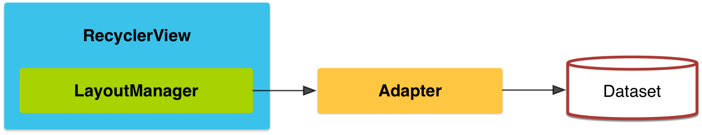

# 創建Lists與Cards

> 編寫: [allenlsy](https://github.com/allenlsy) - 原文: <https://developer.android.com/training/material/lists-cards.html>

要在應用中創建複雜的列表和使用 Material Design 的卡片列表，你可以使用 [`RecyclerView`](http://developer.android.com/reference/android/support/v7/widget/RecyclerView.html) 和 [`CardView`](http://developer.android.com/reference/android/support/v7/widget/CardView.html)。

## 創建列表

`RecyclerView` 組件是一個更高級和伸縮性更強的 ListView。這個組件是一個顯示大量數據的容器，通過維護有限量的View，來達到滾動時的高效。當你的數據集在運行過程中會根據用戶行為或網絡事件更新時，應該使用 `RecyclerView`。

`RecyclerView` 通過以下方式簡化顯示流程，並操作大量數據：

* 使用 Layout manager 來定位元素
* 為常用操作定義默認動畫，比如添加或移除元素

你也可以為 RecyclerView 自定義 Layout manager 和動畫。



**圖1**. The `RecyclerView` widget.

要使用 RecyclerView 組件，你需要定義一個 adapter 和 layout manager。創建 adapter，要繼承 `RecyclerView.Adapter` 類。實現類的細節取決於你的數據集和視圖類型。更多信息，請看以下樣例。


**Layout manager**把元素視圖放在 `RecyclerView`，並決定什麼時候重用不可見的元素視圖。要重用（或回收）視圖時，layout manager 會讓 adapter 用另外的元素內容替換視圖內的內容。回收 View 這個方法能提高性能，因為它避免了創建不必要的view對象，或執行昂貴的 `findViewById()` 查找。

`RecyclerView` 提供以下內建的 layout manager:

* `LinearLayoutManager` 用於顯示橫向或縱向的滾動列表
* `GridLayoutManager` 用於顯示方格元素
* `StaggeredGridLayoutManager` 在 staggered 方格中顯示元素

創建一個自定義的 layout manager，要繼承於 `RecyclerView.LayoutManager` 類

## 動畫

添加和刪除元素的動畫在 RecyclerView 中是默認被啟用的。要自定義動畫，你需要繼承`RecyclerView.ItemAnimator` 類，使用`RecyclerView.setItemAnimator()`方法。

### 例子

以下代碼示例瞭如何添加 RecyclerView 到一個 Layout :

```xml
<!-- A RecyclerView with some commonly used attributes -->
<android.support.v7.widget.RecyclerView
    android:id="@+id/my_recycler_view"
    android:scrollbars="vertical"
    android:layout_width="match_parent"
    android:layout_height="match_parent"/>
```

添加 RecyclerView 組件到Layout之後，獲得一個到 RecyclerView 的對象，連接它到 Layout manager，再附上 adapter 用於數據顯示：

```java
public class MyActivity extends Activity {
    private RecyclerView mRecyclerView;
    private RecyclerView.Adapter mAdapter;
    private RecyclerView.LayoutManager mLayoutManager;

    @Override
    protected void onCreate(Bundle savedInstanceState) {
        super.onCreate(savedInstanceState);
        setContentView(R.layout.my_activity);
        mRecyclerView = (RecyclerView) findViewById(R.id.my_recycler_view);

        // use this setting to improve performance if you know that changes
        // in content do not change the layout size of the RecyclerView
        mRecyclerView.setHasFixedSize(true);

        // use a linear layout manager
        mLayoutManager = new LinearLayoutManager(this);
        mRecyclerView.setLayoutManager(mLayoutManager);

        // specify an adapter (see also next example)
        mAdapter = new MyAdapter(myDataset);
        mRecyclerView.setAdapter(mAdapter);
    }
    ...
}
```

Adapter 支持獲取數據集元素，創建元素的視圖，並可以將新元素的內容去替代不可見元素視圖中的內容。以下代碼展示了一個簡單的實現，其中的數據集包含了一個字符串數組，數據元素用 TextView 顯示：

```java

public class MyAdapter extends RecyclerView.Adapter<MyAdapter.ViewHolder> {
    private String[] mDataset;

    // Provide a reference to the views for each data item
    // Complex data items may need more than one view per item, and
    // you provide access to all the views for a data item in a view holder
    public static class ViewHolder extends RecyclerView.ViewHolder {
        // each data item is just a string in this case
        public TextView mTextView;
        public ViewHolder(TextView v) {
            super(v);
            mTextView = v;
        }
    }

    // Provide a suitable constructor (depends on the kind of dataset)
    public MyAdapter(String[] myDataset) {
        mDataset = myDataset;
    }

    // Create new views (invoked by the layout manager)
    @Override
    public MyAdapter.ViewHolder onCreateViewHolder(ViewGroup parent,
                                                   int viewType) {
        // create a new view
        View v = LayoutInflater.from(parent.getContext())
                               .inflate(R.layout.my_text_view, parent, false);
        // set the view's size, margins, paddings and layout parameters
        ...
        ViewHolder vh = new ViewHolder(v);
        return vh;
    }

    // Replace the contents of a view (invoked by the layout manager)
    @Override
    public void onBindViewHolder(ViewHolder holder, int position) {
        // - get element from your dataset at this position
        // - replace the contents of the view with that element
        holder.mTextView.setText(mDataset[position]);

    }

    // Return the size of your dataset (invoked by the layout manager)
    @Override
    public int getItemCount() {
        return mDataset.length;
    }
}

```

## 創建卡片


CardView 繼承於 FrameLayout 類，它可以在卡片中顯示信息，並保持在不同平臺上擁有統一的風格。CardView 組件可以設定陰影和圓角。

要創建一個帶陰影的卡片，使用 `card_view:cardElevation` 屬性。CardView 使用了Android 5.0 (API level 21)中的真實高度值以及動態陰影效果，在 5.0 以下的版本中有編程實現陰影的備選方案。更多內容，請參見保持兼容性章節。

使用以下屬性來自定義CardView：

* 使用`card_view:cardCornerRadius`在layout中設置圓角
* 使用`CardView.setRadius`在代碼中設置圓角
* 使用`card_view:carBackgroundColor`來設置背景顏色

以下代碼展示如何在layout中添加CardView:

```xml
<LinearLayout xmlns:android="http://schemas.android.com/apk/res/android"
    xmlns:tools="http://schemas.android.com/tools"
    xmlns:card_view="http://schemas.android.com/apk/res-auto"
    ... >
    <!-- A CardView that contains a TextView -->
    <android.support.v7.widget.CardView
        xmlns:card_view="http://schemas.android.com/apk/res-auto"
        android:id="@+id/card_view"
        android:layout_gravity="center"
        android:layout_width="200dp"
        android:layout_height="200dp"
        card_view:cardCornerRadius="4dp">

        <TextView
            android:id="@+id/info_text"
            android:layout_width="match_parent"
            android:layout_height="match_parent" />
    </android.support.v7.widget.CardView>
</LinearLayout>

```

更多信息，參見CardView的API文檔。

## 添加依賴

RecyclerView和CardView都是v7 support 庫的一部分。要使用這兩個組件，在你的Gradle依賴中添加兩個模塊：

```
dependencies {
    ...
    compile 'com.android.support:cardview-v7:21.0.+'
    compile 'com.android.support:recyclerview-v7:21.0.+'
}
```
