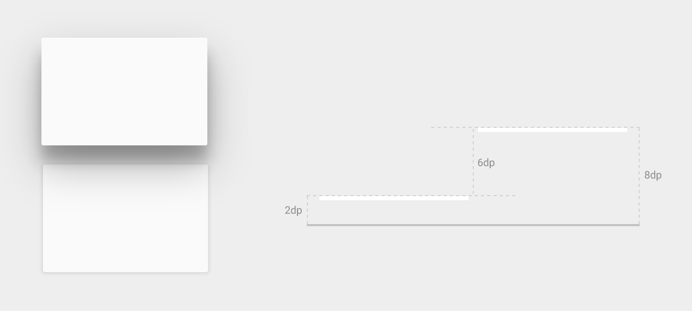

# 定義Shadows與Clipping視圖

> 編寫: [allenlsy](https://github.com/allenlsy) - 原文: <https://developer.android.com/training/material/shadows-clipping.html>

Material Design 引入了UI元素深度的概念。深度可以幫助用戶理解每個元素的不同重要性，讓用戶集中注意力做手頭的工作。

視圖的elevation，用 Z 屬性來表示，它決定了陰影的大小：更大的 Z 值可以投射出更大更柔軟的陰影。Z 值較大的視圖會遮蓋住Z值較小的視圖。不過，Z值大小不會影響視圖的大小。

陰影是由被投射視圖的上級視圖來完成繪製，因此他受上級視圖影響，附著在上級視圖上。

Elevation對於創建臨時上升這種動畫同樣很有用。

更多信息，請參見[3D空間中的對象](http://www.google.com/design/spec/what-is-material/objects-in-3d-space.html)。

## 給視圖賦Elevation值

視圖的 Z 值有兩個組成部分：

* elevation: 靜態組成部分
* translation: 動態部分，用於動畫

Z = elevation + translationZ



**圖1** - 不同深度view的陰影.

在layout中設置視圖的elevation，要使用`android:elevation`屬性。要在Activity代碼中設置elevation，使用`View.setElevation()`方法。

要設置視圖的translation，使用`View.setTranslationZ()`方法。

新的`ViewPropertyAnimator.z()` 和 `ViewPropertyAnimator.translationZ()` 方法使你可以很容易的實現elevation動畫。更多信息，請查看ViewPropertyAnimator和[屬性動畫開發指南](https://developer.android.com/guide/topics/graphics/prop-animation.html)。

你也可以使用 StateListAnimator 來聲明動畫。這非常適用於要通過狀態改變來觸發動畫的情況，比如當用戶按下按鈕。更多信息，請查看[Animate View State Changes（當視圖狀態變化的動畫，譯者注）](https://developer.android.com/training/material/animations.html#ViewState)。

Z值的計算單位是dp。

## 自定義視圖的陰影和輪廓

視圖背景的邊界決定了陰影的形狀。**輪廓**是一個圖形對象的外圍形狀，決定了觸摸反饋動畫的ripple區域。

假設以下是個視圖：

```xml
<TextView
    android:id="@+id/myview"
    ...
    android:elevation="2dp"
    android:background="@drawable/myrect" />
```

背景drawable定義為一個圓角的矩形：

```xml
<!-- res/drawable/myrect.xml -->
<shape xmlns:android="http://schemas.android.com/apk/res/android"
       android:shape="rectangle">
    <solid android:color="#42000000" />
    <corners android:radius="5dp" />
</shape>
```

這個視圖會投影出圓角，因為背景drawble可以決定視圖輪廓。如果提供一個自定義的輪廓，會覆蓋這個默認的陰影形狀。

以下方式可以自定義視圖的輪廓：

1. 繼承 `ViewOutlineProvider` 類
2. 覆寫 `getOutline()` 函數.
3. 用 `View.setOutlineProvider()` 方法來設定視圖的輪廓提供者.

使用`Outline`類的函數，你可以創建橢圓和帶圓角的矩形輪廓。視圖的輪廓提供者會從視圖的背景中獲取輪廓。如果不想讓視圖投射陰影，你可以設置輪廓提供者為 null。

## Clipping 視圖

Clipping 視圖（附著視圖，譯者注）使你輕鬆的改變視圖的形狀。你可以為了一致性而附著視圖，也可以是為了當用戶輸入信息時，改變視圖的形狀。你可以通過`View.setClipToOutline()` 將視圖附著給一個輪廓，或使用`android:clipToOutline`屬性。只有矩形、圓形和圓角矩形輪廓支持附著功能，你可以通過`Outlin.canClip()`方法來檢查是否支持附著。

把視圖附著給drawable的形狀，要將這個drawable設置為視圖的背景，並調用`View.setClipToOutline()` 方法。

附著視圖是一個昂貴的操作，所以不要對附著過的形狀是進行動畫。要實現這個效果，使用 [Reveal Effect](https://developer.android.com/training/material/animations.html#Reveal) 動畫
