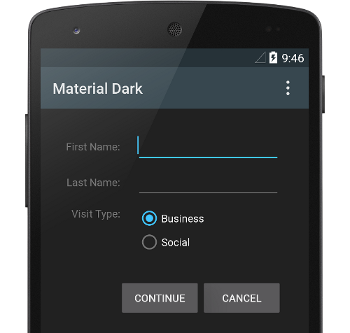

# 使用Material的主題

> 編寫: [allenlsy](https://github.com/allenlsy) - 原文: <https://developer.android.com/training/material/theme.html>

新的 Material 主題提供：

* 系統組件，用於設定調色板
* 系統組件的觸摸反饋動畫
* Activity 切換動畫

你可以根據你的品牌特徵修改調色板，從而自定義 Material 主題。你可以通過主題屬性調整 action bar 和狀態欄的顏色，就像下圖一樣：


系統組件擁有新的設計和觸摸反饋動畫。你可以自定義調色板，反饋動畫和 Activity 切換動畫。

Material 主題被定義在：

* `@android:style/Theme.Material` (暗色版本)
* `@android:style/Theme.Material.Light` (亮色版本)
* `@android:style/Theme.Material.Light.DarkActionBar`




想知道可用的 Material style 的列表，可以在 API 文檔中參見 [R.style](http://developer.android.com/reference/android/R.style.html).

> **Note:**  Material 主題只支持 Android 5.0 (API level 21) 及以上版本。[v7 Support 庫](https://developer.android.com/tools/support-library/features.html#v7)提供了一些組件的 Material Deisgn 樣式，也支持自定義調色板。更多信息，請參見維護兼容性章節。

## 自定義調色板

在根據自己的品牌自定義調色板時，你需要在繼承 material 主題時定義 theme 屬性。

```xml
<resources>
  <!-- inherit from the material theme -->
  <style name="AppTheme" parent="android:Theme.Material">
    <!-- Main theme colors -->
    <!--   your app branding color for the app bar -->
    <item name="android:colorPrimary">@color/primary</item>
    <!--   darker variant for the status bar and contextual app bars -->
    <item name="android:colorPrimaryDark">@color/primary_dark</item>
    <!--   theme UI controls like checkboxes and text fields -->
    <item name="android:colorAccent">@color/accent</item>
  </style>
</resources>
```

## 自定義狀態欄

Material 主題使得你很容易自定義狀態欄，你可以設定適合自己品牌的顏色，並提供足夠的對比度，以顯示白色的狀態圖標。設置狀態欄顏色時，要在繼承 Material 主題時設定 `android:statsBarColor` 屬性。默認情況下，`android:statusBarColor` 會繼承 `android:colorPrimaryDark` 的值。

你也可以在狀態欄的背景上繪畫。比如，你想讓位於照片之上的狀態欄透明，並保留一點深色漸變以確保白色圖標可見。這樣的話，設定 `android:statusBarColor` 屬性為 `@android:color/transparent` 並調整窗口的 Flag 標記。你也可以用 `Window.setStatusBarColor()` 來實現動畫或淡入淡出。

>**Note:** 狀態欄必須隨時保持和 primary toolbar (即頂部Actionbar，譯者注) 的界線清晰。除了一種情況，即在狀態欄後面顯示圖片或媒體內容時之外，你都要用漸變色來確保前臺圖標仍然可見。

當你自定義導航欄和狀態欄時，要麼兩者都透明，要麼只修改狀態欄。其他情況下，導航欄應該保持黑色。

## 主題單獨視圖

XML layout 中的元素可以定義 `android:theme` 屬性， 用於引用主題資源。這個屬性修改了自己和子元素的主題，對於要修改局部顏色主題的情況十分有用。
