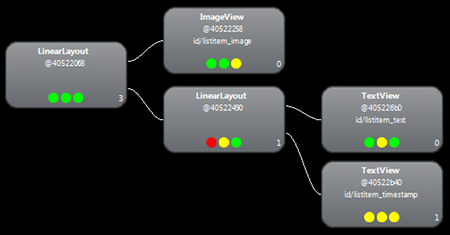
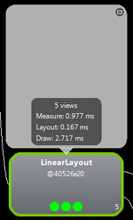
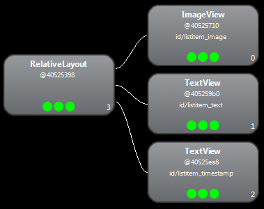
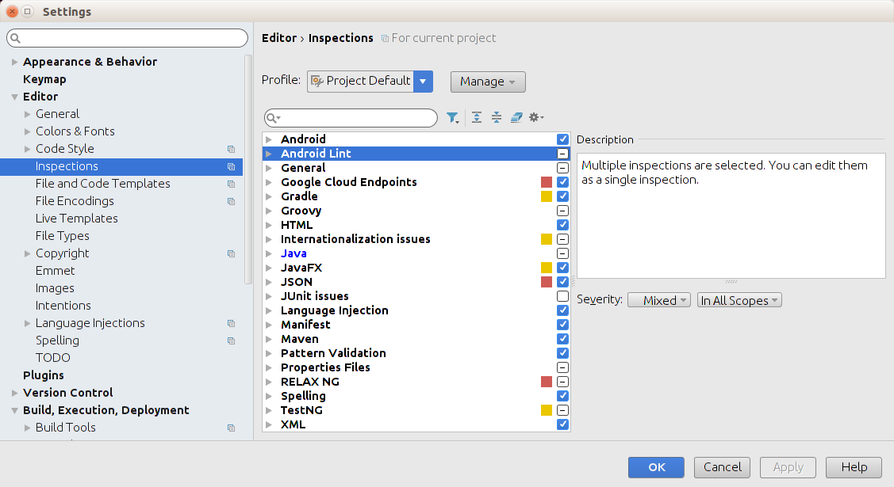

# 優化layout的層級

> 編寫:[allenlsy](https://github.com/allenlsy) - 原文:<http://developer.android.com/training/improving-layouts/optimizing-layout.html>

一個常見的誤區是，用最基礎的 Layout 結構可以提高 Layout 的 性能。然而，因為程序的每個組件和 Layout 都需要經過初始化、佈局和繪製的過程，如果佈局嵌套導致層級過深，上面的初始化，佈局和繪製操作就更加耗時。例如，使用嵌套的 LinearLayout 可能會使得 View 的層級結構過深，此外，嵌套使用了 `layout_weight` 參數的 LinearLayout 的計算量會尤其大，因為每個子元素都需要被測量兩次。這對需要多次重複 inflate 的 Layout 尤其需要注意，比如嵌套在 ListView 或 GridView 時。

在本課中，你將學習使用 [Hierarchy Viewer](http://developer.android.com/tools/help/hierarchy-viewer.html)和[Layoutopt](http://developer.android.com/tools/help/layoutopt.html)來檢查和優化 Layout。

## 檢查 Layout

Android SDK 工具箱中有一個叫做 [Hierarchy Viewer](http://developer.android.com/tools/help/hierarchy-viewer.html) 的工具，能夠在程序運行時分析 Layout。你可以用這個工具找到 Layout 的性能瓶頸。

Hierarchy Viewer 會讓你選擇設備或者模擬器上正在運行的進程，然後顯示其 Layout 的樹型結構。每個塊上的交通燈分別代表了它在測量、佈局和繪畫時的性能，幫你找出瓶頸部分。

比如，下圖是 ListView 中一個列表項的 Layout 。列表項裡，左邊放一個小位圖，右邊是兩個層疊的文字。像這種需要被多次 inflate 的 Layout ，優化它們會有事半功倍的效果。

`hierarchyviewer` 這個工具在 `<sdk>/tools/` 中。當打開時，它顯示一張可使用設備的列表，和它正在運行的組件。點擊 **Load View Hierarchy** 來查看所選組件的層級。比如，下圖就是前一個圖中所示 Layout 的層級關係。

在上圖中，你可以看到一個三層結構，其中右下角的 TextView 在佈局的時候有問題。點擊這個TextView可以看到每個步驟所花費的時間。

可以看到，渲染一個完整的列表項的時間就是：

* 測量: 0.977ms
* 佈局: 0.167ms
* 繪製: 2.717ms

## 修正 Layout

上面的 Layout 由於有這個嵌套的 LinearLayout 導致性能太慢，可能的解決辦法是將 Layout 層級扁平化 - 變淺變寬，而不是又窄又深。RelativeaLayout 作為根節點時就可以達到目的。所以，當換成基於 RelativeLayout 的設計時，你的 Layout 變成了兩層。新的 Layout 變成這樣：

現在渲染列表項的時間：

* 測量: 0.598ms
* 佈局: 0.110ms
* 繪製: 2.146ms

可能看起來是很小的進步，但是由於它對列表中每個項都有效，這個時間要翻倍。

這個時間的主要差異是由於在 LinearLayout 中使用 `layout_weight` 所致，因為會減慢“測量”的速度。這只是一個正確使用各種 Layout 的例子，當你使用 `layout_weight` 時有必要慎重。

## 使用 Lint

> 大部分叫做 lint 的編程工具，都是類似於代碼規範的檢測工具。比如JSLint，CSSLinkt， JSONLint 等等。譯者注。

運行 [Lint](http://tools.android.com/tips/lint) 工具來檢查 Layout 可能的優化方法，是個很好的實踐。Lint 已經取代了 Layoutopt 工具，它擁有更強大的功能。Lint 中包含的一些檢測[規則](http://tools.android.com/tips/lint-checks)有：

* 使用compound drawable — 用一個compound drawable 替代一個包含 `ImageView` 和 `TextView` 的 `LinearLayout` 會更有效率。
* 合併根 frame — 如果 `FrameLayout` 是 Layout 的根節點，並且沒有使用 padding 或者背景等，那麼用 merge 標籤替代他們會稍微高效些。
* 沒用的子節點 — 一個沒有子節點或者背景的 Layout 應該被去掉，來獲得更扁平的層級
* 沒用的父節點 — 一個節點如果沒有兄弟節點，並且它不是 `ScrollView` 或根節點，沒有背景，這樣的節點應該直接被子節點取代，來獲得更扁平的層級
* 太深的 Layout — Layout 的嵌套層數太深對性能有很大影響。嘗試使用更扁平的 Layout ，比如 `RelativeLayout` 或 `GridLayout` 來提高性能。一般最多不超過10層。

另一個使用 Lint 的好處就是，它內置於 Android Studio 中。Lint 在你導編譯程序時自動運行。Android Studio 中，你可以為單獨的 build variant 或者所有 variant 運行 lint。

你也可以在 Android Studio 中管理檢測選項，在 **File > Settings > Project Settings** 中。檢測配置頁面會顯示支持的檢測項目。

Lint 有自動修復、提示建議和直接跳轉到問題處的功能。
