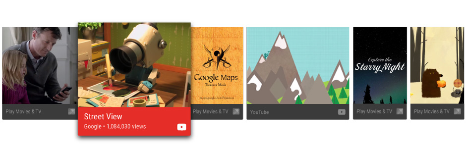

<!-- # Recommending TV Content # -->
# 推薦TV內容

> 編寫:[awong1900](https://github.com/awong1900) - 原文:http://developer.android.com/training/tv/discovery/recommendations.html

<!--When interacting with TVs, users generally prefer to give minimal input before watching content. An ideal scenario for many TV users is: sit down, turn on, and watch. The fewest steps to get users to content they enjoy is generally the path they prefer.-->

當操作TV時，用戶通常喜歡使用最少的輸入操作來找內容。許多用戶的理想場景是，坐下，打開TV然後觀看。用最少的步驟讓用戶觀看他們的喜歡的內容是最好的方式。

<!--The Android framework assists with minimum-input interaction by providing a recommendations row on the home screen. Content recommendations appear as the first row of the TV home screen after the first use of the device. Contributing recommendations from your app's content catalog can help bring users back to your app.-->

Android framework為了實現較少交互而提供了主屏幕推薦欄。在設備第一次使用時候，內容推薦出現在TV主屏幕的第一欄。應用程序的內容目錄提供推薦建議可以把用戶帶回到我們的應用。


<!--Figure 1. An example of the recommendations row.-->
圖1. 一個推薦欄的例子

<!--This lesson teaches you how to create recommendations and provide them to the Android framework so users can easily discover and enjoy your app content. This discussion describes some code from the Android Leanback sample app.-->

這節課教我們如何創建推薦和提供他們到Android framework，這樣用戶能容易的發現和使用我們的應用內容。這個討論描述了一些代碼，在[Android Leanback示例代碼](https://github.com/googlesamples/androidtv-Leanback)。

<!--## Create a Recommendations Service ##-->
## 創建推薦服務

<!--Content recommendations are created with background processing. In order for your application to contribute to recommendations, create a service that periodically adds listings from your app's catalog to the system's list of recommendations.-->

內容推薦是被後臺處理創建。為了把我們的應用提供到內容推薦，創建一個週期性添加列表服務，從應用目錄到系統推薦列表。

<!--The following code example illustrates how to extend IntentService to create a recommendation service for your application:-->

接下來的代碼描繪瞭如何擴展[IntentService](http://developer.android.com/reference/android/app/IntentService.html)為我們的應用創建推薦服務：

```java
public class UpdateRecommendationsService extends IntentService {
    private static final String TAG = "UpdateRecommendationsService";
    private static final int MAX_RECOMMENDATIONS = 3;

    public UpdateRecommendationsService() {
        super("RecommendationService");
    }

    @Override
    protected void onHandleIntent(Intent intent) {
        Log.d(TAG, "Updating recommendation cards");
        HashMap<String, List<Movie>> recommendations = VideoProvider.getMovieList();
        if (recommendations == null) return;

        int count = 0;

        try {
            RecommendationBuilder builder = new RecommendationBuilder()
                    .setContext(getApplicationContext())
                    .setSmallIcon(R.drawable.videos_by_google_icon);

            for (Map.Entry<String, List<Movie>> entry : recommendations.entrySet()) {
                for (Movie movie : entry.getValue()) {
                    Log.d(TAG, "Recommendation - " + movie.getTitle());

                    builder.setBackground(movie.getCardImageUrl())
                            .setId(count + 1)
                            .setPriority(MAX_RECOMMENDATIONS - count)
                            .setTitle(movie.getTitle())
                            .setDescription(getString(R.string.popular_header))
                            .setImage(movie.getCardImageUrl())
                            .setIntent(buildPendingIntent(movie))
                            .build();

                    if (++count >= MAX_RECOMMENDATIONS) {
                        break;
                    }
                }
                if (++count >= MAX_RECOMMENDATIONS) {
                    break;
                }
            }
        } catch (IOException e) {
            Log.e(TAG, "Unable to update recommendation", e);
        }
    }

    private PendingIntent buildPendingIntent(Movie movie) {
        Intent detailsIntent = new Intent(this, DetailsActivity.class);
        detailsIntent.putExtra("Movie", movie);

        TaskStackBuilder stackBuilder = TaskStackBuilder.create(this);
        stackBuilder.addParentStack(DetailsActivity.class);
        stackBuilder.addNextIntent(detailsIntent);
        // Ensure a unique PendingIntents, otherwise all recommendations end up with the same
        // PendingIntent
        detailsIntent.setAction(Long.toString(movie.getId()));

        PendingIntent intent = stackBuilder.getPendingIntent(0, PendingIntent.FLAG_UPDATE_CURRENT);
        return intent;
    }
}
```

<!--In order for this service to be recognized by the system and run, register it using your app manifest. The following code snippet illustrates how to declare this class as a service:-->

使服務被系統意識和運行，在應用manifest中註冊它，接下來的代碼片段展示瞭如何定義這個類做為服務：

```xml
<manifest ... >
  <application ... >
    ...

    <service
            android:name="com.example.android.tvleanback.UpdateRecommendationsService"
            android:enabled="true" />
  </application>
</manifest>
```

<!--### Refreshing Recommendations ###-->
### 刷新推薦

<!--Base your recommendations on user behavior and data such as play lists, wish lists, and associated content. When refreshing recommendations, don't just remove and repost them, because doing so causes the recommendations to appear at the end of the recommendations row. Once a content item, such as a movie, has been played, remove it from the recommendations.-->

基於用戶的行為和數據來推薦，例如播放列表，喜愛列表和相關內容。當刷新推薦時，不僅僅是刪除和重新加載他們，因為這樣會導致推薦出現在推薦欄的結尾。一旦一個內容項被播放，如一個影片，從推薦中[刪除它](http://developer.android.com/guide/topics/ui/notifiers/notifications.html#Removing)。

<!--The order of an app's recommendations is preserved according to the order in which the app provides them. The framework interleaves app recommendations based on recommendation quality, as measured by user behavior. Better recommendations make an app's recommendations more likely to appear near the front of the list.-->

應用的推薦順序被保存依據應用提供他們的順序。framework interleave應用推薦基於推薦質量，用戶習慣的收集。最好的推薦應是推薦最合適的出現在列表前面。

<!--## Build Recommendations ##-->
## 創建推薦

<!--Once your recommendation service starts running, it must create recommendations and pass them to the Android framework. The framework receives the recommendations as Notification objects that use a specific template and are marked with a specific category.-->

一旦我們的推薦服務開始運行，它必須創建推薦和推送他們到Android framework。Framework收到推薦作為[通知](http://developer.android.com/reference/android/app/Notification.html)對象。它用特定的模板並且標記為特定的目錄。

<!--### Setting the Values ###-->
### 設置值

<!--To set the UI element values for the recommendation card, you create a builder class that follows the builder pattern described as follows. First, you set the values of the recommendation card elements.-->

去設置推薦卡片的UI元素，創建一個builder類用接下來的builder樣式描述。首先，設置推薦卡片元素的值。

```java
public class RecommendationBuilder {
    ...

    public RecommendationBuilder setTitle(String title) {
            mTitle = title;
            return this;
        }

        public RecommendationBuilder setDescription(String description) {
            mDescription = description;
            return this;
        }

        public RecommendationBuilder setImage(String uri) {
            mImageUri = uri;
            return this;
        }

        public RecommendationBuilder setBackground(String uri) {
            mBackgroundUri = uri;
            return this;
        }
...
```

<!--### Creating the Notification ###-->
### 創建通知

<!--Once you've set the values, you then build the notification, assigning the values from the builder class to the notification, and calling NotificationCompat.Builder.build().-->

一旦我們設置了值，然後去創建通知，從builder類分配值到通知，並且調用[NotificationCompat.Builder.build](http://developer.android.com/reference/android/support/v4/app/NotificationCompat.Builder.html#build())。

<!--Also, be sure to call setLocalOnly() so the NotificationCompat.BigPictureStyle notification won't show up on other devices.-->

並且，確信調用[setLocalOnly()](http://developer.android.com/reference/android/support/v4/app/NotificationCompat.Builder.html#setLocalOnly(boolean))，這樣[NotificationCompat.BigPictureStyle](http://developer.android.com/reference/android/support/v4/app/NotificationCompat.BigPictureStyle.html)通知不將顯示在另一個設備。

<!--The following code example demonstrates how to build a recommendation.-->
接下來的代碼示例展示瞭如何創建推薦。

```java
public class RecommendationBuilder {
    ...

    public Notification build() throws IOException {
        ...

        Notification notification = new NotificationCompat.BigPictureStyle(
                new NotificationCompat.Builder(mContext)
                        .setContentTitle(mTitle)
                        .setContentText(mDescription)
                        .setPriority(mPriority)
                        .setLocalOnly(true)
                        .setOngoing(true)
                        .setColor(mContext.getResources().getColor(R.color.fastlane_background))
                        .setCategory(Notification.CATEGORY_RECOMMENDATION)
                        .setLargeIcon(image)
                        .setSmallIcon(mSmallIcon)
                        .setContentIntent(mIntent)
                        .setExtras(extras))
                .build();

        return notification;
    }
}
```

<!--## Run Recommendations Service ##-->
## 運行推薦服務

<!--Your app's recommendation service must run periodically in order to create current recommendations. To run your service, create a class that runs a timer and invokes it at regular intervals. The following code example extends the BroadcastReceiver class to start periodic execution of a recommendation service every half hour:-->

我們的應用推薦服務必須週期性運行確保創建當前的推薦。去運行我們的服務，創建一個類運行計時器和在週期間隔關聯它。接下來的代碼例子擴展了[BroadcastReceiver](http://developer.android.com/reference/android/content/BroadcastReceiver.html)類去開始每半小時的推薦服務的週期性執行：

```java
public class BootupActivity extends BroadcastReceiver {
    private static final String TAG = "BootupActivity";

    private static final long INITIAL_DELAY = 5000;

    @Override
    public void onReceive(Context context, Intent intent) {
        Log.d(TAG, "BootupActivity initiated");
        if (intent.getAction().endsWith(Intent.ACTION_BOOT_COMPLETED)) {
            scheduleRecommendationUpdate(context);
        }
    }

    private void scheduleRecommendationUpdate(Context context) {
        Log.d(TAG, "Scheduling recommendations update");

        AlarmManager alarmManager = (AlarmManager) context.getSystemService(Context.ALARM_SERVICE);
        Intent recommendationIntent = new Intent(context, UpdateRecommendationsService.class);
        PendingIntent alarmIntent = PendingIntent.getService(context, 0, recommendationIntent, 0);

        alarmManager.setInexactRepeating(AlarmManager.ELAPSED_REALTIME_WAKEUP,
                INITIAL_DELAY,
                AlarmManager.INTERVAL_HALF_HOUR,
                alarmIntent);
    }
}
```

<!--This implementation of the BroadcastReceiver class must run after start up of the TV device where it is installed. To accomplish this, register this class in your app manifest with an intent filter that listens for the completion of the device boot process. The following sample code demonstrates how to add this configuration to the manifest:-->

這個[BroadcastReceiver](http://developer.android.com/reference/android/content/BroadcastReceiver.html)類的實現必須運行在TV設備啟動後。 為了完成這個，註冊這個類在應用manifest的intet filter中，它監聽設備啟動完成。接下來的代碼展示瞭如何添加這個配置到manifest。

```xml
<manifest ... >
  <application ... >
    <receiver android:name="com.example.android.tvleanback.BootupActivity"
              android:enabled="true"
              android:exported="false">
      <intent-filter>
        <action android:name="android.intent.action.BOOT_COMPLETED"/>
      </intent-filter>
    </receiver>
  </application>
</manifest>
```

<!-- >**Important**: Receiving a boot completed notification requires that your app requests the RECEIVE_BOOT_COMPLETED permission. For more information, see ACTION_BOOT_COMPLETED.-->
>**Important**： 接收一個啟動完成通知需要我們的應用有[RECEIVE_BOOT_COMPLETED](http://developer.android.com/reference/android/Manifest.permission.html#RECEIVE_BOOT_COMPLETED)權限。更多信息，查看[ACTION_BOOT_COMPLETED](http://developer.android.com/reference/android/content/Intent.html#ACTION_BOOT_COMPLETED)。

<!--In your recommendation service class' onHandleIntent() method, post the recommendation to the manager as follows:-->
在推薦服務類的[onHandleIntent()](http://developer.android.com/reference/android/app/IntentService.html#onHandleIntent(android.content.Intent))方法中，用以下代碼提交推薦到管理器：

```java
Notification notification = notificationBuilder.build();
mNotificationManager.notify(id, notification);
```

-------
[下一節: 使TV應用是可被搜索的 >](searchable.html)
