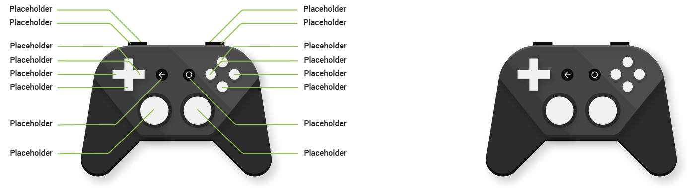

# 創建TV遊戲應用

> 編寫:[dupengwei](https://github.com/dupengwei) - 原文:http://developer.android.com/training/tv/games/index.html

TV屏幕為手機遊戲開發者提供了大量的新思考。這些領域包括它的大尺寸，它的控制方案和所有玩家可以同時觀看的事實。

## 顯示器
開發TV遊戲時有兩點要記住，就是TV屏幕具有共享顯示器的特性，和橫向設計遊戲的需求。

### 考慮共享顯示
客廳TV帶來了多人遊戲的設計挑戰，客廳TV遊戲時所有玩家都可以看到。這個問題與遊戲，特別是依靠每個玩家用於隱藏信息的遊戲（如紙牌遊戲、戰略遊戲）息息相關。
我們可以通過實現一些機制來解決一個玩家竊取另一玩家信息的問題。這些機制是：

- 屏幕罩可以幫助隱藏信息。例如，在一個回合制遊戲，像單詞或卡片遊戲，一次只有一個玩家能看到顯示的內容。當這個玩家完成一個步驟，遊戲允許他用一個能阻礙其他人看到祕密信息的罩遮住屏幕。當下一個玩家開始操作，這個罩就會打開顯示他自己的信息。
- 在手機或平板電腦上運行一個夥伴app作為第二屏幕，通過這種方式讓玩家隱藏信息。

### 支持橫向顯示
TV總是單向顯示的：我們不能翻轉它的屏幕，且沒有縱向顯示。要總是以橫向顯示模式設計我們的TV遊戲。

## 輸入設備
TV沒有觸摸屏接口，所以更重要的是獲取控制要正確，並確保玩家使用起來要直觀和有趣。處理控制器還介紹了其他一些問題需要注意，如跟蹤多個控制器，，處理斷開要適當。

### 支持D-pad控制
圍繞方向鍵（D-pad）控制來計劃我們的控制方案，因為這種控制是Android TV設備的默認設置。玩家需要在遊戲的所有方面使用方向鍵（D-pad）——不僅僅是控制核心遊戲設置，而且能導航菜單和廣告。因此，我們還應該確保我們的Android TV遊戲不能涉及觸摸屏。例如，一個Android TV遊戲不應該告訴玩家> 點擊這裡繼續。
如何塑造玩家使用控制器與遊戲進行互動的方式將是實現良好用戶體驗的關鍵：

- **通信控制器的要求**。利用Android市場上app的產品描述將控制器的期望傳達給玩家們。如果一個遊戲使用搖桿遊戲手柄比只用一個方向鍵更合適，請將這一事實說清楚。玩家使用一個不適合遊戲的控制器玩遊戲很可能導致遊戲體驗欠佳，從而對遊戲的評價造成不利影響。
- **使用一致的按鈕映射**。直觀和靈活的按鈕映射是良好用戶體驗的關鍵。例如，我們應該遵守使用A按鈕接受，而B按鈕取消的既定習慣。我們也可以提供重映射形式方面的靈活性。關於按鈕映射的更多信息，參見[Handling Controller Actions](http://developer.android.com/training/game-controllers/controller-input.html)。
- **檢測控制器功能並相應地調整**。查詢控制器的能力以優化控制器和遊戲直接的匹配程度。例如，我們可能打算讓一個玩家通過搖晃控制器來控制一個對象。然而，如果玩家的控制器缺少加速計和陀螺儀硬件設施，搖晃控制器並不會產生效果。所以，我們的遊戲應該檢查控制器，如果該控制器不支持運行檢測，則切換到另一個可用的控制方案。更多關於檢測控制器功能的信息，參見[Controllers Across Android Versions](http://developer.android.com/training/game-controllers/compatibility.html)。

### 提供適當的後退按鈕的行為
返回按鈕不應該作為切換。例如，不能使用它打開和關閉一個菜單。它應該只能導航後退，breadcrumb-style，玩家之前訪問過屏幕頁面，例如：遊戲界面>遊戲暫停界面>遊戲主界面>Android主界面。
由於返回按鈕應該只能進行線性導航（後退），我們可以使用返回按鈕離開一個遊戲內菜單（由不同的按鈕打開），回到遊戲界面。更多關於導航設計的信息，參見[Navigation with Back and Up](http://developer.android.com/design/patterns/navigation.html)。學習更多關於實現的信息，參見[Providing Proper Back Navigation](http://developer.android.com/training/implementing-navigation/temporal.html)。


### 使用適當的按鈕
並不是所有的遊戲控制器提供開始,搜索,或菜單按鈕。確保我們的UI不取決於這些按鈕的使用。

### 處理多個控制器
當多個玩家玩遊戲,每個都有他或她自己的控制器，做好每對“玩家-控制器”的映射是很重要的。關於如何實現“控制器-數量”識別的信息，參見[Input Devices](http://developer.android.com/reference/android/view/InputDevice.html#getControllerNumber)。
  
### 處理控制器的斷開
當控制器從遊戲中斷開時，遊戲應該暫停，並彈出一個對話框促使斷開的玩家重新連接他或她的控制器。
對話框還應提供排除故障的提示（如，一個彈出的對話框告訴玩家“檢查我們的藍牙連接”）關於實現輸入設備支持的更多信息,參見[Handling Controller
  Actions](http://developer.android.com/training/game-controllers/controller-input.html)。具體關於藍牙連接的信息，參見[Bluetooth](http://developer.android.com/guide/topics/connectivity/bluetooth.html)。
 
### 展示控制器說明
如果我們的遊戲提供了可視化的遊戲控制說明，控制器圖片應該是免費的、品牌化的，並且只能包含與[Android兼容的按鈕](http://developer.android.com/training/game-controllers/controller-input.html#button)。
Android兼容的控制器樣圖，點擊[Android TV Gamepad Template (ZIP)](http://storage.googleapis.com/androiddevelopers/design/android_tv_gamepad_template-2014-10.zip)下載。它包含一個黑底的白色控制器和一個白底的黑色控制器，是一個PNG類型的Adobe®Illustrator®文件。

**Figure 1.** 控制器說明的示例請使用[Android TV Gamepad Template (ZIP)](http://storage.googleapis.com/androiddevelopers/design/android_tv_gamepad_template-2014-10.zip)

## Manifest
有一些特殊的東西應該包含在遊戲的Android Manifest裡。

### 在屏幕主界面顯示遊戲
Android TV主界面採用單獨一行來顯示遊戲，與常規應用分開顯示。為了讓遊戲出現在遊戲列表，設置遊戲的manifest清單的<application>標籤下的`android:isGame`屬性為`"true"`。例如：

```xml
<application
	...  
	android:isGame="true" 
	...  
>
```

### 聲明遊戲控制器支持

遊戲控制器對於TV設備的用戶來說可能不是有效的。為了適當的通知用戶，遊戲需要（或只支持）一個控制器，我們必須在app的manifest裡包含這些條目。如果我們需要一個遊戲控制器，我們必須在app的manifest中包含以下條目：

```xml
<uses-feature android:name="android.hardware.gamepad"/>
```

如果我們的遊戲使用了一個遊戲控制器，但是不需要，在app的manifest裡包含以下的功能條目：

```xml
<uses-feature android:name="android.hardware.gamepad" android:required="false"/>
```

更多關於manifest條目的信息，參見[App Manifest](http://developer.android.com/guide/topics/manifest/manifest-intro.html)。

## Google Play Game 服務
如果我們的遊戲集成了Google Play Game 服務，我們應該記住一些關於成果的注意事項，登錄，保存遊戲，和多人遊戲。

### 成就
我們的遊戲應包含至少5個(可獲取的)成果。只有一個用戶從一個受支持的輸入設備控制遊戲應該能夠獲得成就。關於成就的更多信息以及如何實現，參見[Achievements in Android](https://developers.google.com/games/services/android/achievements)。

### 登錄
我們的遊戲應該試圖在啟動的時候讓用戶登錄。如果玩家連續幾次拒絕登錄後，遊戲應該停止詢問。學習更多關於登錄的信息在[Implementing Sign-in on
  Android](https://developers.google.com/games/services/training/signin)。
  
### 保存
使用Google Play Services[保存遊戲](https://developers.google.com/games/services/common/concepts/savedgames)來存儲保存的遊戲。我們應該講保存的遊戲綁定到一個特定的谷歌賬號，作為唯一標識，甚至在跨設備時也不受影響。無論玩家使用手機或TV，遊戲應該可以從同一個用戶賬號獲取到保存的遊戲信息。

我們也應該在我們的遊戲的UI提供一個選項,讓玩家刪除本地和雲存儲端的數據。我們可能把選項放在遊戲的設置界面。使用Play Services保存遊戲的實現細節，參見[Saved Games in Android](https://developers.google.com/games/services/android/savedgames)

### 多人遊戲
一個遊戲要提供多人遊戲體驗，必須允許至少2個玩家進入一個房間。進一步瞭解Android的多人遊戲信息，參見Android developer網站的[Real-time Multiplayer](https://developers.google.com/games/services/android/realtimeMultiplayer)和[Turn-based Multiplayer]()文檔。

### 退出
提供一個一致和明顯的UI元素,讓用戶適當的退出遊戲。這個元素應該用方向鍵導航按鈕訪問，這樣做而不是依賴Home鍵提供退出功能，是因為在使用不同的控制器時，若依賴Home鍵提供退出功能，這既不一致也不可靠。

## Web
不要讓android TV的遊戲瀏覽網頁。Android TV不支持web瀏覽器。

> **Note：**我們可以使用[WebView](http://developer.android.com/reference/android/webkit/WebView.html)類實現登錄像Google+ 和 Facebook這樣的服務。

## 網絡
遊戲經常需要更大的帶寬提供最佳的性能,許多用戶寧願選擇有線網而不願選擇WiFi來提供性能。我們的app應該對有線網和WiFi連接都進行檢查。如果我們的app只針對TV，我們不需要檢查3G/LTE服務，而移動app則需要檢查3G/LTE服務。

------------
[下一節: TV應用清單 >](../checklist.html)


