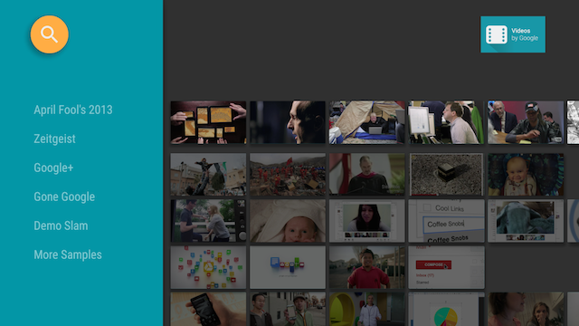

#提供一個Card視圖

編寫:[huanglizhuo](https://github.com/huanglizhuo) - 原文:<http://developer.android.com/training/tv/playback/card.html>


在前面的課程中，我們創建一個目錄瀏覽器，實現了瀏覽 fragment，顯示了媒體項目的列表。在本課程中，我們將創建該卡視圖的媒體項目，並在瀏覽fragment中呈現出來。

[BaseCardView](http://developer.android.com/reference/android/support/v17/leanback/widget/BaseCardView.html)類以及子類顯示與媒體項目相關聯的元數據。在本節課程中使用的[ImageCardView](http://developer.android.com/reference/android/support/v17/leanback/widget/ImageCardView.html)類顯示隨著媒體項目的標題內容的圖像。

這節課介紹了GitHub上 [ Android Leanback sample app](https://github.com/googlesamples/androidtv-Leanback)的示例應用程序代碼。使用該示例代碼，開始我們自己的應用程序。



##創建一個卡片呈現者

[Presenter](http://developer.android.com/reference/android/support/v17/leanback/widget/Presenter.html)生成視圖並把類和它們綁定起來。在我們的瀏覽 fragment 中將內容呈現給用戶,我們為內容卡片創建[Presenter](http://developer.android.com/reference/android/support/v17/leanback/widget/Presenter.html)並把它傳給適配器然後將內容呈現在屏幕上。在下面的代碼中,CardPresenter在[ LoaderManager](http://developer.android.com/reference/android/support/v4/app/LoaderManager.html)的[onLoadFinished](http://developer.android.com/reference/android/support/v4/app/LoaderManager.LoaderCallbacks.html#onLoadFinished(android.support.v4.content.Loader<D>, D))方法中被創建。

```xml
@Override
public void onLoadFinished(Loader<HashMap<String, List<Movie>>> arg0,
                           HashMap<String, List<Movie>> data) {

    mRowsAdapter = new ArrayObjectAdapter(new ListRowPresenter());
    CardPresenter cardPresenter = new CardPresenter();

    int i = 0;

    for (Map.Entry<String, List<Movie>> entry : data.entrySet()) {
        ArrayObjectAdapter listRowAdapter = new ArrayObjectAdapter(cardPresenter);
        List<Movie> list = entry.getValue();

        for (int j = 0; j < list.size(); j++) {
            listRowAdapter.add(list.get(j));
        }
        HeaderItem header = new HeaderItem(i, entry.getKey(), null);
        i++;
        mRowsAdapter.add(new ListRow(header, listRowAdapter));
    }

    HeaderItem gridHeader = new HeaderItem(i, getString(R.string.more_samples),
            null);

    GridItemPresenter gridPresenter = new GridItemPresenter();
    ArrayObjectAdapter gridRowAdapter = new ArrayObjectAdapter(gridPresenter);
    gridRowAdapter.add(getString(R.string.grid_view));
    gridRowAdapter.add(getString(R.string.error_fragment));
    gridRowAdapter.add(getString(R.string.personal_settings));
    mRowsAdapter.add(new ListRow(gridHeader, gridRowAdapter));

    setAdapter(mRowsAdapter);

    updateRecommendations();
}
```

##創建一個卡片視圖

在這步中,我們將用view holder創建一個卡片presenter來為卡片視圖呈現媒體項目。注意,每個presenter只能創建一個view類別。如果我們有倆個不同的卡片視圖,我們就得創建倆個不同的presenter

在[presenter](http://developer.android.com/reference/android/support/v17/leanback/widget/Presenter.html)實現[onCreateViewHolder](http://developer.android.com/reference/android/support/v17/leanback/widget/Presenter.html#onCreateViewHolder(android.view.ViewGroup))時創建一個可以呈現內容項目的view holder。

```xml
@Override
public class CardPresenter extends Presenter {

    private Context mContext;
    private static int CARD_WIDTH = 313;
    private static int CARD_HEIGHT = 176;
    private Drawable mDefaultCardImage;

    @Override
    public ViewHolder onCreateViewHolder(ViewGroup parent) {
        mContext = parent.getContext();
        mDefaultCardImage = mContext.getResources().getDrawable(R.drawable.movie);
...
```

在[onCreateViewHolder](http://developer.android.com/reference/android/support/v17/leanback/widget/Presenter.html#onCreateViewHolder(android.view.ViewGroup))方法中,創建呈現內容的卡片視圖。下面的例子用的是[ImageCardView](http://developer.android.com/reference/android/support/v17/leanback/widget/ImageCardView.html)

當卡片被選中時,默認的行為是放大展開。如果我們想創建不同顏色的卡片可以向下面這樣調用[setSelected](http://developer.android.com/reference/android/support/v17/leanback/widget/BaseCardView.html#setSelected(boolean))方法中實現。

```xml
...
    ImageCardView cardView = new ImageCardView(mContext) {
        @Override
        public void setSelected(boolean selected) {
            int selected_background = mContext.getResources().getColor(R.color.detail_background);
            int default_background = mContext.getResources().getColor(R.color.default_background);
            int color = selected ? selected_background : default_background;
            findViewById(R.id.info_field).setBackgroundColor(color);
            super.setSelected(selected);
        }
    };
...
```

當用戶打開我們的應用時,[Presenter.ViewHolder ](http://developer.android.com/reference/android/support/v17/leanback/widget/Presenter.ViewHolder.html)為內容項目顯示了卡片視圖。我們需要調用[setFocusable(true) ](http://developer.android.com/reference/android/view/View.html#setFocusable(boolean))和[setFocusableInTouchMode(true)](http://developer.android.com/reference/android/view/View.html#setFocusableInTouchMode(boolean))方法設置接收來自D-pad的焦點控制。

```xml
...
    cardView.setFocusable(true);
    cardView.setFocusableInTouchMode(true);
    return new ViewHolder(cardView);
}
```

當用戶選中[ImageCardView](http://developer.android.com/reference/android/support/v17/leanback/widget/ImageCardView.html)時,它用我們制定的顏色背景展開文字內容,就像下面這樣。


------------
[下一節：創建詳細信息View >](detail.html)