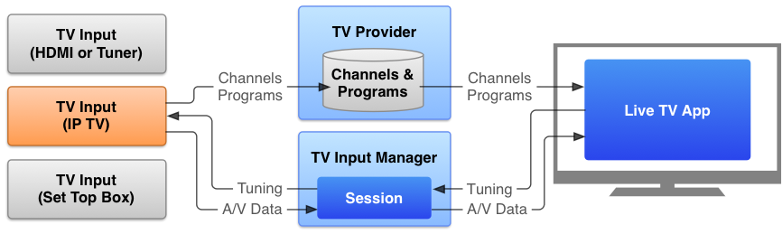

# 創建TV直播應用

> 編寫:[dupengwei](https://github.com/dupengwei) - 原文:http://developer.android.com/training/tv/tif/index.html

看電視直播節目和其他連續的、基於頻道的內容是TV體驗的主要部分。Android 通過Android 5.0中的TV Input Framework支持直播視頻內容的接收和重放（API Level 21）。該框架提供了一個統一的方法，從硬件源（如HDMI端口和內置調諧器）和軟件源（如流傳在互聯網上的視頻）接收音頻和視頻內容。

該框架能使開發人員通過實現TV輸入服務定義直播TV輸入源。該服務發佈一個頻道和節目列表到一個TV Provider上。電視設備的直播電視應用從TV Provider獲取可用的頻道和節目列表並顯示給用戶。當用戶選擇某個特定的頻道，直播TV應用軟件通過TV Input Manager為相關TV輸入服務創建一個會話，並告訴TV輸入服務調整到請求頻道，然後將內容顯示到TV應用軟件提供的顯示器上。

**圖1**.電視輸入框架功能圖

TV Input Framework 的設計目的是提供各種各樣的TV輸入源並把它們整合到一個單一的用戶界面供用戶瀏覽、查看和享受內容。為你想要傳播的節目構建一個TV輸入服務之後，用戶可以更加輕易地通過TV設備收看這些節目。

更多關於TV輸入框架的信息，請參考[android.media.tv](http://developer.android.com/reference/android/media/tv/package-summary.html)。

-----------------

