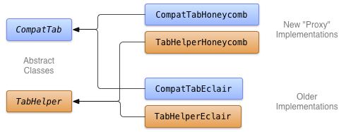

# 抽象出新的APIs

> 編寫:[spencer198711](https://github.com/spencer198711) - 原文:<http://developer.android.com/training/backward-compatible-ui/abstracting.html>

假如你想使用[Action Bar Tabs](http://developer.android.com/guide/topics/ui/actionbar.html#Tabs)作為你的應用的頂層導航的主要形式。不幸的是，[ActionBar](http://developer.android.com/reference/android/app/ActionBar.html) APIs只在Android 3.0（API等級11）之後才能使用。因此，如果你想要在運行之前版本的Android平臺的設備上分發你的應用，你需要提供一個支持新的API的實現，同時提供一個回退機制，使得能夠使用舊的APIs。

在本課程中，使用了具有面向特定版本實現的抽象類去構建一個tab頁形式的用戶界面，並以此提供向後兼容性。這一課描述瞭如何為新的tab API創建一個抽象層，並以此作為構建tab組件的第一步。

## 為抽象做準備

在Java編程語言中，抽象包含了創建一個或者多個接口或抽象類去隱藏具體的實現細節。在新版本的Android API的情況中，你可以使用抽象去構建能感知版本的組件，這個組件會在新版本的設備上使用當前的APIs，當回退到老的設備上同時存在兼容的APIs。

當使用這種方法時，你首先需要決定哪些要使用的類需要提供向後兼容，然後去根據新類中的public接口去創建抽象類。在創建抽象接口的過程中，你應該儘可能多的為新APIs創建鏡像。這會最大化前向兼容性，使得在將來當這些接口不再需要的時候，廢棄這些接口會更加容易。

在為新的APIs創建抽象類之後，任何數量的實現都可以在運行的過程中去創建和選擇使用哪種。出於後向兼容的目的，這些實現可以通過所需的API級別而有所變化。一個實現可能會使用最新發布的APIs，而其他的則會去使用比較老的APIs。

## 創建抽象的Tab接口

為了能夠創建一個向後兼容的tabs，你首先需要決定你的應用需要哪些功能和哪些特定的APIs接口。在頂層分節tabs的情況下，假設你有以下功能需求：

1. 顯示圖標和文本的Tab指示器
2. Tabs可以跟一個Fragment實例向關聯
3. Activity可以監聽到Tab變化

提前準備這些需求能夠讓你控制抽象層的範圍。這意味著你可以花更少的時間去創建抽象層的多個具體實現，並很快就能使用這些新的後向兼容的實現。

Tabs的關鍵APIs是[ActionBar](http://developer.android.com/reference/android/app/ActionBar.html)和[ActionBar.Tab](http://developer.android.com/reference/android/app/ActionBar.Tab.html)，為了能夠使得tab能夠感知Android版本，這些是需要抽象出來的APIs。這個示例項目的需求要求同Eclair(API等級5)保持一致性，同時能夠利用Honeycomb(API等級11)中新的tab功能。一張展示能夠支持這兩種實現的類結構和它們的抽象父類的圖顯示如下：



* 圖1.抽象基類和版本相關的子類實現類結構圖

## Abstract ActionBar.Tab

通過創建一個代表tab的抽象類來開始著手構建tab抽象層，這個類是[Actionbar.Tab](http://developer.android.com/reference/android/app/ActionBar.Tab.html)接口的鏡像:

```java
public abstract class CompatTab {
    ...
    public abstract CompatTab setText(int resId);
    public abstract CompatTab setIcon(int resId);
    public abstract CompatTab setTabListener(
            CompatTabListener callback);
    public abstract CompatTab setFragment(Fragment fragment);
	public abstract CharSequence getText();
    public abstract Drawable getIcon();
    public abstract CompatTabListener getCallback();
    public abstract Fragment getFragment();
    ...
}
```

在這裡，為了簡化諸如tab對象和Activity的聯繫（未在代碼片段中顯示）等公共的功能，你可以使用一個抽象類而不是去使用接口。

## 抽象出Action Bar Tab的方法

下一步，定義一個能夠允許你往Activity中創建和添加tab抽象類，並定義類似[ActionBar.newTab()](http://developer.android.com/reference/android/app/ActionBar.html#newTab())和[ActionBar.addTab()](http://developer.android.com/reference/android/app/ActionBar.html#addTab(android.app.ActionBar.Tab))的方法。

```java
public abstract class TabHelper {
    ...
	public CompatTab newTab(String tag) {
        // This method is implemented in a later lesson.
    }
	public abstract void addTab(CompatTab tab);
	...
}
```

在下一課程中，你將會創建TabHelper和CompatTab的實現，它能夠在新舊不同的平臺版本上都能工作。
