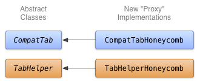

# 代理至新的APIs

> 編寫: [spencer198711](https://github.com/spencer198711) - 原文:<http://developer.android.com/training/backward-compatible-ui/new-implementation.html>

這一課展示瞭如何編寫CompatTab和TabHelper等抽象類的子類，並且使用了較新的APIs。你的應用可以在支持這些新的APIs的平臺版本的設備上使用這種實現方式。

## 使用較新的APIs實現Tabs

CompatTab和TabHelper抽象類的具體子類是一種代理實現，它們使用了使用較新的APIs。由於抽象類在之前的課程中定義並且是對新APIs接口（類結構、方法簽名等等）的鏡像，使用新APIs的具體子類只是簡單的代理方法調用和方法調用的結果。

你可以在這些具體子類中直接使用較新的APIs，由於使用延遲類加載的方式，在早期版本的設備上並不會發生崩潰現象。這些類在首次次被訪問（實例化類對象或者訪問類的靜態屬性或靜態方法）的時候才會去加載並初始化。因此，只要你不在Honeycomb之前的設備上實例化Honeycomb相關的實現，dalvik虛擬機都不會拋出[VerifyError](http://developer.android.com/reference/java/lang/VerifyError.html)異常。

對於本實現，一個比較好的命名約定是把具體子類需要的API等級或者版本名字附加在APIs接口的後邊。例如，本地tab實現可以由`CompatTabHoneycomb`和`abHelperHoneycomb`這兩個類提供，名字後面附加Honeycomb是由於它們都依賴於Android 3.0（API等級11）之後版本的APIs。



* 圖1. Honeycomb上tabs實現的類關係圖.

## 實現CompatTabHoneycomb

`CompatTabHoneycomb`是`CompatTab`抽象類的具體實現並用來引用單獨的tabs。`CompatTabHoneycomb`只是簡單的代理[ActionBar.Tab](http://developer.android.com/reference/android/app/ActionBar.Tab.html)對象的方法調用。
開始使用ActionBar.Tab的APIs實現CompatTabHoneycomb：

```java
public class CompatTabHoneycomb extends CompatTab {
    // The native tab object that this CompatTab acts as a proxy for.
    ActionBar.Tab mTab;
    ...
	protected CompatTabHoneycomb(FragmentActivity activity, String tag) {
        ...
        // Proxy to new ActionBar.newTab API
        mTab = activity.getActionBar().newTab();
    }
	public CompatTab setText(int resId) {
        // Proxy to new ActionBar.Tab.setText API
        mTab.setText(resId);
        return this;
    }
	...
    // Do the same for other properties (icon, callback, etc.)
}
```

## 實現TabHelperHoneycomb

`TabHelperHoneycomb`是`TabHelper`抽象類的具體實現，`TabHelperHoneycomb`代理方法調用到[ActionBar](http://developer.android.com/reference/android/app/ActionBar.html)對象，而這個ActionBar對象是從包含他的[Activity](http://developer.android.com/reference/android/app/Activity.html)中獲取的。

實現`TabHelperHoneycomb`，代理其方法調用到[ActionBar](http://developer.android.com/reference/android/app/ActionBar.html)的API：

```java
public class TabHelperHoneycomb extends TabHelper {
    ActionBar mActionBar;
    ...

    protected void setUp() {
        if (mActionBar == null) {
            mActionBar = mActivity.getActionBar();
            mActionBar.setNavigationMode(
                    ActionBar.NAVIGATION_MODE_TABS);
        }
    }

    public void addTab(CompatTab tab) {
        ...
        // Tab is a CompatTabHoneycomb instance, so its
        // native tab object is an ActionBar.Tab.
        mActionBar.addTab((ActionBar.Tab) tab.getTab());
    }

    // The other important method, newTab() is part of
    // the base implementation.
}
```
