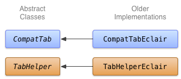

# 使用舊的APIs實現新API的效果

> 編寫: [spencer198711](https://github.com/spencer198711) - 原文:<http://developer.android.com/training/backward-compatible-ui/older-implementation.html>

這一課討論瞭如何創建一個支持舊的設備並且與新的APIs接口相同的實現。

## 決定一個替代方案

在以向後兼容的方式使用較新的UI功能的時候，最具挑戰的任務是為舊的平臺版本決定一個解決方案。在很多情況下，使用舊的UI框架中的功能是有可能完成這些新的UI組件的。例如：

* Action Bar可以使用水平的包含圖片按鈕的LinearLayout來實現，這個在Activity中的LinearLayout作為自定義標題欄或者僅僅作為視圖。下拉功能行為可以使用設備的菜單按鈕來實現。
* Action Bar的tab頁可以使用包含按鈕的水平的LinearLayout，或者使用[TabWidget](http://developer.android.com/reference/android/widget/TabWidget.html)UI控件來實現。
* [NumberPicker](http://developer.android.com/reference/android/widget/NumberPicker.html)和[Switch](http://developer.android.com/reference/android/widget/Switch.html)控件可以分別通過使用[Spinner](http://developer.android.com/reference/android/widget/Spinner.html)和[ToggleButton](http://developer.android.com/reference/android/widget/ToggleButton.html)控件來實現。
* [ListPopupWindow](http://developer.android.com/reference/android/widget/ListPopupWindow.html)和[PopupMenu](http://developer.android.com/reference/android/widget/PopupMenu.html)控件可以通過使用[PopupWindow](http://developer.android.com/reference/android/widget/PopupWindow.html)來實現。

為了往老的設備上向後移植UI組件，這些一般不是一刀切的解決方案。注意用戶體驗：在老的設備上，用戶可能不熟悉新的界面設計模式和UI組件，思考一下如何使用熟悉的控件去實現相同的功能。在很多種情況下，這些通常不會被注意到，特別是在如果新的UI組件在應用程序的生態系統中是突出的（比如Action Bar），或者交互模型是非常簡單和直觀的(比如使用[ViewPager](http://developer.android.com/reference/android/support/v4/view/ViewPager.html)去滑動界面)。

## 使用舊的APIs實現Tabs

你可以使用[TabWidget](http://developer.android.com/reference/android/widget/TabWidget.html)和[TabHost](http://developer.android.com/reference/android/widget/TabHost.html)（儘管其中一個也可以使用水平方向的Button控件）去創建Action Bar Tabs的老的實現。可以在TabHelperEclair和CompatTabEclair的類中去實現，因為這些實現使用了不遲於Android 2.0（Eclair）的APIs。



* 圖1. Eclair版本上實現tabs的類圖

`CompatTabEclair`在實例變量中保存了諸如tab文本和tab圖標等tab屬性，因為在老的版本中沒有[ActionBar.Tab](http://developer.android.com/reference/android/app/ActionBar.Tab.html)對象去處理這些數據存儲。

```java
public class CompatTabEclair extends CompatTab {
    // Store these properties in the instance,
    // as there is no ActionBar.Tab object.
    private CharSequence mText;
    ...

    public CompatTab setText(int resId) {
        // Our older implementation simply stores this
        // information in the object instance.
        mText = mActivity.getResources().getText(resId);
        return this;
    }

    ...
    // Do the same for other properties (icon, callback, etc.)
}
```

`TabHelperEclair`利用了[TabHost](http://developer.android.com/reference/android/widget/TabHost.html)控件的方法去創建[TabHost.TabSpec](http://developer.android.com/reference/android/widget/TabHost.TabSpec.html)對象和tab的頁面指示效果：

```java
public class TabHelperEclair extends TabHelper {
    private TabHost mTabHost;
    ...

    protected void setUp() {
        if (mTabHost == null) {
            // Our activity layout for pre-Honeycomb devices
            // must contain a TabHost.
            mTabHost = (TabHost) mActivity.findViewById(
                    android.R.id.tabhost);
            mTabHost.setup();
        }
    }

    public void addTab(CompatTab tab) {
        ...
        TabSpec spec = mTabHost
                .newTabSpec(tag)
                .setIndicator(tab.getText()); // And optional icon
        ...
        mTabHost.addTab(spec);
    }

    // The other important method, newTab() is part of
    // the base implementation.
}
```

現在你已經有了兩種`CompatTab`和`TabHelper`的實現，一種是使用了新的APIs為了能夠在Android 3.0或其後版本設備上能夠運行，另一種則是使用了舊的APIs為了在Android 2.0或之前的設備上能夠運行。下一課討論在應用中使用這兩種實現。
