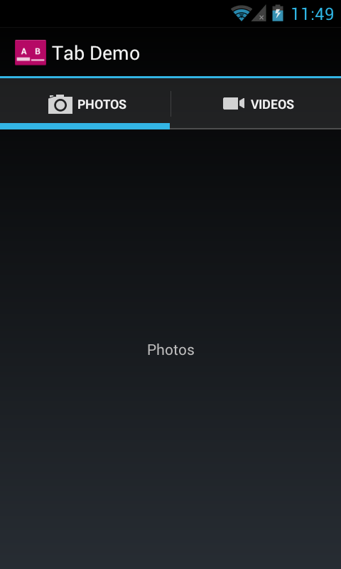

# 使用能感知版本的組件

> 編寫:[spencer198711](https://github.com/spencer198711) - 原文:<http://developer.android.com/training/backward-compatible-ui/using-component.html>

既然對`TabHelper`和`CompatTab`你已經有了兩種具體實現，一個為Android 3.0和其後版本，一個為Android 3.0之前的版本。現在，該使用這些實現做些事情了。這一課討論了創建在這兩種實現之前切換的邏輯，創建能夠感知版本的界面佈局，最終使用我們創建的後向兼容的UI組件。

## 添加切換邏輯
`TabHelper`抽象類基於當前設備的平臺版本，是用來創建適當版本的`TabHelper`和`CompatTab`實例的工廠類：

```java
public abstract class TabHelper {
    ...
    // Usage is TabHelper.createInstance(activity)
    public static TabHelper createInstance(FragmentActivity activity) {
        if (Build.VERSION.SDK_INT >= Build.VERSION_CODES.HONEYCOMB) {
            return new TabHelperHoneycomb(activity);
        } else {
            return new TabHelperEclair(activity);
        }
    }

    // Usage is mTabHelper.newTab("tag")
    public CompatTab newTab(String tag) {
        if (Build.VERSION.SDK_INT >= Build.VERSION_CODES.HONEYCOMB) {
            return new CompatTabHoneycomb(mActivity, tag);
        } else {
            return new CompatTabEclair(mActivity, tag);
        }
    }
    ...
}
```

## 創建能感知版本的Activity佈局

下一步是提供能夠支持兩種tab實現的Activity界面佈局。對於老的實現（TabHelperEclair），你需要確保你的界面佈局包含TabWidget和TabHost，同時存在一個包含tab內容的佈局容器。

res/layout/main.xml:

```java
<!-- This layout is for API level 5-10 only. -->
<TabHost xmlns:android="http://schemas.android.com/apk/res/android"
    android:id="@android:id/tabhost"
    android:layout_width="match_parent"
    android:layout_height="match_parent">

    <LinearLayout
        android:orientation="vertical"
        android:layout_width="match_parent"
        android:layout_height="match_parent"
        android:padding="5dp">

        <TabWidget
            android:id="@android:id/tabs"
            android:layout_width="match_parent"
            android:layout_height="wrap_content" />

        <FrameLayout
            android:id="@android:id/tabcontent"
            android:layout_width="match_parent"
            android:layout_height="0dp"
            android:layout_weight="1" />

    </LinearLayout>
</TabHost>
```

對於`TabHelperHoneycomb`的實現，你唯一要做的就是一個包含tab內容的[FrameLayout](http://developer.android.com/reference/android/widget/FrameLayout.html)，這是由於[ActionBar](http://developer.android.com/reference/android/app/ActionBar.html)已經提供了tab相關的頁面。

res/layout-v11/main.xml:

```java
<FrameLayout xmlns:android="http://schemas.android.com/apk/res/android"
    android:id="@android:id/tabcontent"
    android:layout_width="match_parent"
    android:layout_height="match_parent" />
```

在運行的時候，Android將會根據平臺版本去決定使用哪個版本的`main.xml`佈局文件。這根上一節中選擇哪一個版本的`TabHelper`所展示的邏輯是相同的。

## 在Activity中使用TabHelper

在Activity的[onCreate()](http://developer.android.com/reference/android/app/Activity.html#onCreate(android.os.Bundle))方法中，你可以獲得一個`TabHelper`對象，並且使用以下代碼添加tabs：

```java
@Override
public void onCreate(Bundle savedInstanceState) {
    setContentView(R.layout.main);

    TabHelper tabHelper = TabHelper.createInstance(this);
    tabHelper.setUp();

    CompatTab photosTab = tabHelper
            .newTab("photos")
            .setText(R.string.tab_photos);
    tabHelper.addTab(photosTab);

    CompatTab videosTab = tabHelper
            .newTab("videos")
            .setText(R.string.tab_videos);
    tabHelper.addTab(videosTab);
}
```

當運行這個應用的時候，代碼會自動顯示對應的界面佈局和實例化對應的`TabHelperHoneycomb`或`TabHelperEclair`對象，而實際使用的類對於Actvity來說是不透明的，因為它們擁有共同的`TabHelper`接口。

以下是這種實現運行在Android 2.3和Android 4.0上的界面截圖：




* 圖1.向後兼容的tabs運行在Android 2.3設備上（使用TabHelperEclair）和運行在Android 4.0設備上的截圖

