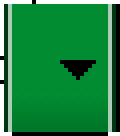

# 支持不同的屏幕大小

> 編寫:[riverfeng](https://github.com/riverfeng) - 原文:<http://developer.android.com/training/multiscreen/screensizes.html>

這節課教你如何通過以下幾種方式支持多屏幕：

1、確保你的佈局能自適應屏幕

2、根據你的屏幕配置提供合適的UI佈局

3、確保正確的佈局適合正確的屏幕。

4、提供縮放正確的位圖（bitmap）

## 使用“wrap_content”和“match_parent”

為了確保你的佈局能靈活的適應不同的屏幕尺寸，針對一些view組件，你應該使用wrap_content和match_parent來設置他們的寬和高。如果你使用了wrap_content，view的寬和高會被設置為該view所包含的內容的大小值。如果是match_parent（在API 8之前是fill_parent）則會匹配該組件的父控件的大小。

通過使用wrap_content和match_parent尺寸值代替硬編碼的尺寸，你的視圖將分別只使用控件所需要的空間或者被拓展以填充所有有效的空間。比如：
```xml
<LinearLayout xmlns:android="http://schemas.android.com/apk/res/android"
    android:orientation="vertical"
    android:layout_width="match_parent"
    android:layout_height="match_parent">
    <LinearLayout android:layout_width="match_parent"
                  android:id="@+id/linearLayout1"
                  android:gravity="center"
                  android:layout_height="50dp">
        <ImageView android:id="@+id/imageView1"
                   android:layout_height="wrap_content"
                   android:layout_width="wrap_content"
                   android:src="@drawable/logo"
                   android:paddingRight="30dp"
                   android:layout_gravity="left"
                   android:layout_weight="0" />
        <View android:layout_height="wrap_content"
              android:id="@+id/view1"
              android:layout_width="wrap_content"
              android:layout_weight="1" />
        <Button android:id="@+id/categorybutton"
                android:background="@drawable/button_bg"
                android:layout_height="match_parent"
                android:layout_weight="0"
                android:layout_width="120dp"
                style="@style/CategoryButtonStyle"/>
    </LinearLayout>

    <fragment android:id="@+id/headlines"
              android:layout_height="fill_parent"
              android:name="com.example.android.newsreader.HeadlinesFragment"
              android:layout_width="match_parent" />
</LinearLayout>
```
注意上面的例子使用wrap_content和match_parent來指定組件尺寸而不是使用固定的尺寸。這樣就能使你的佈局正確的適配不同的屏幕尺寸和屏幕方向（這裡的配置主要是指屏幕的橫豎屏切換）。

例如，下圖演示的就是該佈局在豎屏和橫屏模式下的效果，注意組件的尺寸是自動適應寬和高的。


圖1：News Reader示例app（左邊豎屏，右邊橫屏）。

## 使用相對佈局（RelativeLayout）

你可以使用LinearLayout以及wrap_content和match_parent組合來構建複雜的佈局，但是LinearLayout卻不允許你精準的控制它子view的關係，子view在LinearLayout中只能簡單一個接一個的排成行。如果你需要你的子view不只是簡簡單單的排成行的排列，更好的方法是使用RelativeLayout，它允許你指定你佈局中控件與控件之間的關係，比如，你可以指定一個子view在左邊，另一個則在屏幕的右邊。
```xml
<?xml version="1.0" encoding="utf-8"?>
<RelativeLayout xmlns:android="http://schemas.android.com/apk/res/android"
    android:layout_width="match_parent"
    android:layout_height="match_parent">
    <TextView
        android:id="@+id/label"
        android:layout_width="match_parent"
        android:layout_height="wrap_content"
        android:text="Type here:"/>
    <EditText
        android:id="@+id/entry"
        android:layout_width="match_parent"
        android:layout_height="wrap_content"
        android:layout_below="@id/label"/>
    <Button
        android:id="@+id/ok"
        android:layout_width="wrap_content"
        android:layout_height="wrap_content"
        android:layout_below="@id/entry"
        android:layout_alignParentRight="true"
        android:layout_marginLeft="10dp"
        android:text="OK" />
    <Button
        android:layout_width="wrap_content"
        android:layout_height="wrap_content"
        android:layout_toLeftOf="@id/ok"
        android:layout_alignTop="@id/ok"
        android:text="Cancel" />
</RelativeLayout>
```


圖2：QVGA（小尺寸屏幕）屏幕下截圖


圖3：WSVGA（大尺寸屏幕）屏幕下截圖

> 注意：儘管組件的尺寸發生了變化，但是它的子view之間的空間關係還是通過RelativeLayout.LayoutParams已經指定好了。

## 使用尺寸限定詞

（譯者注：這裡的限定詞主要是指在編寫佈局文件時，將佈局文件放在加上類似large，sw600dp等這樣限定詞的文件夾中，以此來告訴系統根據屏幕選擇對應的佈局文件，比如下面例子的layout-large文件夾）

從上一節的學習里程中，我們知道如何編寫靈活的佈局或者相對佈局，它們都能通過拉伸或者填充控件來適應不同的屏幕，但是它們卻不能為每個不同屏幕尺寸提供最好的用戶體驗。因此，你的應用不應該只是實現靈活的佈局，同時也應該為不同的屏幕配置提供幾種不同的佈局方式。你可以通過配置限定（configuration qualifiers）來做這件事情，它能在運行時根據你當前設備的配置（比如不同的屏幕尺寸設計了不同的佈局）來選擇合適的佈局資源。

 比如，很多應用都為大屏幕實現了“兩個窗格”模式（應用可能在一個窗格中實現一個list的item，另外一個則實現list的content），平板和電視都是大到能在一個屏幕上適應兩個窗格，但是手機屏幕卻只能分別顯示。所以，如果你想實現這些佈局，你就需要以下文件：

res/layout/main.xml.單個窗格（默認）佈局：

```xml
<LinearLayout xmlns:android="http://schemas.android.com/apk/res/android"
    android:orientation="vertical"
    android:layout_width="match_parent"
    android:layout_height="match_parent">

    <fragment android:id="@+id/headlines"
              android:layout_height="fill_parent"
              android:name="com.example.android.newsreader.HeadlinesFragment"
              android:layout_width="match_parent" />
</LinearLayout>
```

res/layout-large/main.xml,兩個窗格佈局：

```xml
<LinearLayout xmlns:android="http://schemas.android.com/apk/res/android"
    android:layout_width="fill_parent"
    android:layout_height="fill_parent"
    android:orientation="horizontal">
    <fragment android:id="@+id/headlines"
              android:layout_height="fill_parent"
              android:name="com.example.android.newsreader.HeadlinesFragment"
              android:layout_width="400dp"
              android:layout_marginRight="10dp"/>
    <fragment android:id="@+id/article"
              android:layout_height="fill_parent"
              android:name="com.example.android.newsreader.ArticleFragment"
              android:layout_width="fill_parent" />
</LinearLayout>
```

注意第二個佈局文件的目錄名字“large qualifier”，在大尺寸的設備屏幕時（比如7寸平板或者其他大屏幕的設備）就會選擇該佈局文件，而其他比較小的設備則會選擇沒有限定詞的另一個佈局（也就是第一個佈局文件）。

## 使用最小寬度限定詞

在Android 3.2之前，開發者還有一個困難，那就是Android設備的“large”屏幕尺寸，其中包括Dell Streak（設備名稱），老版Galaxy Tab和一般的7寸平板，有很多的應用都想針對這些不同的設備（比如5和7寸的設備）定義不同的佈局，但是這些設備都被定義為了large尺寸屏幕。也是因為這個，所以Android在3.2的時候開始使用最小寬度限定詞。

最小寬度限定詞允許你根據設備的最小寬度（dp單位）來指定不同佈局。比如，傳統的7寸平板最小寬度為600dp，如果你希望你的UI能夠在這樣的屏幕上顯示兩個窗格（不是一個窗格顯示在小屏幕上），你可以使用上節中提到的使用同樣的兩個佈局文件。不同的是，使用sw600來指定兩個方框的佈局使用在最小寬度為600dp的設備上。

res/layout/main.xml,單個窗格（默認）佈局：
```xml
<LinearLayout xmlns:android="http://schemas.android.com/apk/res/android"
    android:orientation="vertical"
    android:layout_width="match_parent"
    android:layout_height="match_parent">

    <fragment android:id="@+id/headlines"
              android:layout_height="fill_parent"
              android:name="com.example.android.newsreader.HeadlinesFragment"
              android:layout_width="match_parent" />
</LinearLayout>
```

res/layout-sw600dp/main.xml,兩個方框佈局：
```xml
<LinearLayout xmlns:android="http://schemas.android.com/apk/res/android"
    android:layout_width="fill_parent"
    android:layout_height="fill_parent"
    android:orientation="horizontal">
    <fragment android:id="@+id/headlines"
              android:layout_height="fill_parent"
              android:name="com.example.android.newsreader.HeadlinesFragment"
              android:layout_width="400dp"
              android:layout_marginRight="10dp"/>
    <fragment android:id="@+id/article"
              android:layout_height="fill_parent"
              android:name="com.example.android.newsreader.ArticleFragment"
              android:layout_width="fill_parent" />
</LinearLayout>
```
這樣意味著當你的設備的最小寬度等於600dp或者更大時，系統選擇layout-sw600dp/main.xml（兩個窗格）的佈局，而小一點的屏幕則會選擇layout/main.xml（單個窗格）的佈局。
然而，在3.2之前的設備上，這樣做並不是很好的選擇。因為3.2之前還沒有將sw600dp作為一個限定詞出現，所以，你還是需要使用large限定詞來做。因此，你還是應該要有一個佈局文件名為res/layout-large/main.xml，和res/layout-sw600dp/main.xml一樣。在下一節中，你將學到如何避免像這樣出現重複的佈局文件。

## 使用佈局別名

最小寬度限定詞只能在android3.2或者更高的版本上使用。因此，你還是需要使用抽象尺寸（small，normal，large，xlarge）來兼容以前的版本。比如，你想要將你的UI設計為在手機上只顯示一個方框的佈局，而在7寸平板或電視，或者其他大屏幕設備上顯示多個方框的佈局，你可能得提供這些文件：

* res/layout/main.xml：單個窗格佈局

* res/layout-large：多個窗格佈局

* res/layout-sw600dp：多個窗格佈局

最後兩個文件都是一樣的，因為其中一個將會適配Android3.2的設備，而另外一個則會適配其他Android低版本的平板或者電視。
為了避免這些重複的文件（維護讓人感覺頭痛就是因為這個），你可以使用別名文件。比如，你可以定義如下佈局：

* res/layout/main.xml，單個方框佈局
* res/layout/main_twopans.xml，兩個方框佈局

然後添加這兩個文件：

* res/values-large/layout.xml：

```xml
<resources>
    <item name="main" type="layout">@layout/main_twopanes</item>
</resources>
```
* res/values-sw600dp/layout.xml：
```xml
<resources>
    <item name="main" type="layout">@layout/main_twopanes</item>
</resources>
```
最後兩個文件擁有相同的內容，但它們並沒有真正意義上的定義佈局。它們只是將main_twopanes設置成為了別名main，它們分別處在large和sw600dp選擇器中，所以它們能適配Android任何版本的平板和電視（在3.2之前平板和電視可以直接匹配large，而3.2或者以上的則匹配sw600dp）。

## 使用方向限定詞

有一些佈局不管是在橫向還是縱向的屏幕配置中都能顯示的非常好，但是更多的時候，適當的調整一下會更好。在News Reader應用例子中，以下是佈局在不同屏幕尺寸和方向的行為：

* 小屏幕，縱向：一個窗格加logo
* 小屏幕，橫向：一個窗格加logo
* 7寸平板，縱向：一個窗格加action bar
* 7寸平板，橫向：兩個寬窗格加action bar
* 10寸平板，縱向：兩個窄窗格加action bar
* 10寸平板，橫向：兩個寬窗格加action bar
* 電視，橫向：兩個寬窗格加action bar

這些每個佈局都會在res/layout目錄下定義一個xml文件，如此，應用就能根據屏幕配置的變化根據別名匹配到對應的佈局來適應屏幕。

res/layout/onepane.xml：

```xml
<LinearLayout xmlns:android="http://schemas.android.com/apk/res/android"
    android:orientation="vertical"
    android:layout_width="match_parent"
    android:layout_height="match_parent">

    <fragment android:id="@+id/headlines"
              android:layout_height="fill_parent"
              android:name="com.example.android.newsreader.HeadlinesFragment"
              android:layout_width="match_parent" />
</LinearLayout>
```

res/layout/onepane_with_bar.xml:

```xml
<LinearLayout xmlns:android="http://schemas.android.com/apk/res/android"
    android:orientation="vertical"
    android:layout_width="match_parent"
    android:layout_height="match_parent">
    <LinearLayout android:layout_width="match_parent"
                  android:id="@+id/linearLayout1"
                  android:gravity="center"
                  android:layout_height="50dp">
        <ImageView android:id="@+id/imageView1"
                   android:layout_height="wrap_content"
                   android:layout_width="wrap_content"
                   android:src="@drawable/logo"
                   android:paddingRight="30dp"
                   android:layout_gravity="left"
                   android:layout_weight="0" />
        <View android:layout_height="wrap_content"
              android:id="@+id/view1"
              android:layout_width="wrap_content"
              android:layout_weight="1" />
        <Button android:id="@+id/categorybutton"
                android:background="@drawable/button_bg"
                android:layout_height="match_parent"
                android:layout_weight="0"
                android:layout_width="120dp"
                style="@style/CategoryButtonStyle"/>
    </LinearLayout>

    <fragment android:id="@+id/headlines"
              android:layout_height="fill_parent"
              android:name="com.example.android.newsreader.HeadlinesFragment"
              android:layout_width="match_parent" />
</LinearLayout>
```

res/layout/twopanes.xml:
```xml
<LinearLayout xmlns:android="http://schemas.android.com/apk/res/android"
    android:layout_width="fill_parent"
    android:layout_height="fill_parent"
    android:orientation="horizontal">
    <fragment android:id="@+id/headlines"
              android:layout_height="fill_parent"
              android:name="com.example.android.newsreader.HeadlinesFragment"
              android:layout_width="400dp"
              android:layout_marginRight="10dp"/>
    <fragment android:id="@+id/article"
              android:layout_height="fill_parent"
              android:name="com.example.android.newsreader.ArticleFragment"
              android:layout_width="fill_parent" />
</LinearLayout>
```

res/layout/twopanes_narrow.xml:
```xml
<LinearLayout xmlns:android="http://schemas.android.com/apk/res/android"
    android:layout_width="fill_parent"
    android:layout_height="fill_parent"
    android:orientation="horizontal">
    <fragment android:id="@+id/headlines"
              android:layout_height="fill_parent"
              android:name="com.example.android.newsreader.HeadlinesFragment"
              android:layout_width="200dp"
              android:layout_marginRight="10dp"/>
    <fragment android:id="@+id/article"
              android:layout_height="fill_parent"
              android:name="com.example.android.newsreader.ArticleFragment"
              android:layout_width="fill_parent" />
</LinearLayout>
```
現在所有可能的佈局我們都已經定義了，唯一剩下的問題是使用方向限定詞來匹配對應的佈局給屏幕。這時候，你就可以使用佈局別名的功能了：

res/values/layouts.xml：
```xml
<resources>
    <item name="main_layout" type="layout">@layout/onepane_with_bar</item>
    <bool name="has_two_panes">false</bool>
</resources>
```

res/values-sw600dp-land/layouts.xml:
```xml
<resources>
    <item name="main_layout" type="layout">@layout/twopanes</item>
    <bool name="has_two_panes">true</bool>
</resources>
```

res/values-sw600dp-port/layouts.xml:
```xml
<resources>
    <item name="main_layout" type="layout">@layout/onepane</item>
    <bool name="has_two_panes">false</bool>
</resources>
```

res/values-large-land/layouts.xml:
```xml
<resources>
    <item name="main_layout" type="layout">@layout/twopanes</item>
    <bool name="has_two_panes">true</bool>
</resources>
```

res/values-large-port/layouts.xml:
```xml
<resources>
    <item name="main_layout" type="layout">@layout/twopanes_narrow</item>
    <bool name="has_two_panes">true</bool>
</resources>
```

## 使用.9.png圖片

支持不同的屏幕尺寸同時也意味著你的圖片資源也必須能兼容不同的屏幕尺寸。比如，一個button的背景圖片就必須要適應該button的各種形狀。

如果你在使用組件時可以改變圖片的大小，你很快就會發現這是一個不明確的選擇。因為運行的時候，圖片會被拉伸或者壓縮（這樣容易造成圖片失真）。避免這種情況的解決方案就是使用點9圖片，這是一種能夠指定哪些區域能夠或者不能夠拉伸的特殊png文件。

因此，在設計的圖片需要與組件一起變大變小時，一定要使用點9.若要將位圖轉換為點9，你可以用一個普通的圖片開始（下圖，是在4倍變焦情況下的圖片顯示）。


你可以通過sdk中的draw9patch程序（位於tools/directory目錄下）來畫點9圖片。通過沿左側和頂部邊框繪製像素來標記應該被拉伸的區域。也可以通過沿右側和底部邊界繪製像素來標記。就像下圖所示一樣：



請注意，上圖沿邊界的黑色像素。在頂部邊框和左邊框的那些表明圖像的可拉伸區域，右邊和底部邊框則表示內容應該放置的地方。

此外，注意.9.png這個格式，你也必須用這個格式，因為系統會檢測這是一個點9圖片而不是一個普通PNG圖片。

當你將這個應用到組件的背景的時候（通過設置android:background="@drawable/button"），android框架會自動正確的拉伸圖像以適應按鈕的大小，下圖就是各種尺寸中的顯示效果：


