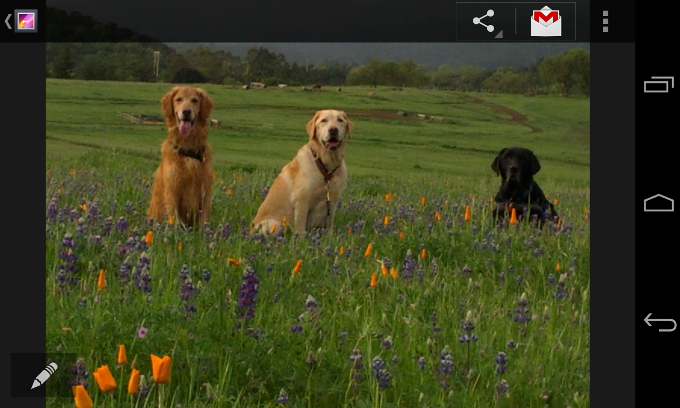

# 淡化系統Bar

> 編寫:[K0ST](https://github.com/K0ST) - 原文:<http://developer.android.com/training/system-ui/dim.html>

本課程將向你講解如何在Android 4.0(*API level 14*)與更高的的系統版本上淡化系統欄(System bar,狀態欄與導航欄)。早期版本的Android沒有提供一個自帶的方法來淡化系統欄。

當你使用這個方法的時候，內容區域並不會發生大小的變化，只是系統欄的圖標會收起來。一旦用戶觸摸狀態欄或者是導航欄的時候，這兩個系統欄就又都會完全顯示（無透明度）。這種方法的優勢是系統欄仍然可見，但是它們的細節被隱藏掉了，因此可以在不犧牲快捷訪問系統欄的情況下創建一個沉浸式的體驗。

**這節課將教您**

1. 淡化狀態欄和導航欄
2. 顯示狀態欄和導航欄

**同時您應該閱讀**

* [Action Bar API 指南](http://developer.android.com/guide/topics/ui/actionbar.html)
* [Android Design Guide](http://developer.android.com/design/index.html)

## 淡化狀態欄和系統欄

如果要淡化狀態和通知欄，在版本為4.0以上的Android系統上，你可以像如下使用`SYSTEM_UI_FLAG_LOW_PROFILE`這個標籤。

```java
// This example uses decor view, but you can use any visible view.
View decorView = getActivity().getWindow().getDecorView();
int uiOptions = View.SYSTEM_UI_FLAG_LOW_PROFILE;
decorView.setSystemUiVisibility(uiOptions);
```

一旦用戶觸摸到了狀態欄或者是系統欄，這個標籤就會被清除，使系統欄重新顯現（無透明度）。在標籤被清除的情況下，如果你想重新淡化系統欄就必須重新設定這個標籤。

圖1展示了一個圖庫中的圖片，界面的系統欄都已被淡化（需要注意的是圖庫應用完全隱藏狀態欄，而不是淡化它）；注意導航欄（圖片的右側）上變暗的白色的小點，他們代表了被隱藏的導航操作。


**圖1.**淡化的系統欄

圖2展示的是同一張圖片，系統欄處於顯示的狀態。



**圖2.**顯示的系統欄

## 顯示狀態欄與導航欄

如果你想動態的清除顯示標籤，你可以使用`setSystemUiVisibility()`方法：

```java
View decorView = getActivity().getWindow().getDecorView();
// Calling setSystemUiVisibility() with a value of 0 clears
// all flags.
decorView.setSystemUiVisibility(0);
```
