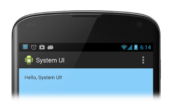
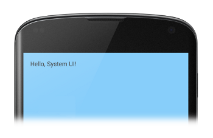

# 隱藏狀態欄

> 編寫:[K0ST](https://github.com/K0ST) - 原文:<http://developer.android.com/training/system-ui/status.html>

**這節課將教您**

1. 在4.0及以下版本中隱藏狀態欄
2. 在4.1及以上版本中隱藏狀態欄
3. 在4.4及以上版本中隱藏狀態欄
4. 讓內容顯示在狀態欄之後
5. 同步狀態欄與Action Bar的變化

**同時您應該閱讀**

* [Action Bar API 指南](http://developer.android.com/guide/topics/ui/actionbar.html)
* [Android Design Guide](http://developer.android.com/design/index.html)

本課程將教您如何在不同版本的Android下隱藏狀態欄。隱藏狀態欄（或者是導航欄）可以讓內容得到更多的展示空間，從而提供一個更加沉浸式的用戶體驗。

圖1展示了顯示狀態欄的界面



**圖1**. 顯示狀態欄.

圖2展示了隱藏狀態欄的界面。請注意，Action Bar這個時候也被隱藏了。請永遠不要在隱藏狀態欄的時候顯示Action Bar。



**圖2**. 隱藏狀態欄.

## 在4.0及以下版本中隱藏狀態欄

在Android 4.0及更低的版本中，你可以通過設置`WindowManager`來隱藏狀態欄。你可以動態的隱藏，也可以在你的manifest文件中設置Activity的主題。如果你的應用的狀態欄在運行過程中會一直隱藏，那麼推薦你使用改寫manifest設定主題的方法（嚴格上來講，即便設置了manifest你也可以動態的改變界面主題）。

```xml
<application
    ...
    android:theme="@android:style/Theme.Holo.NoActionBar.Fullscreen" >
    ...
</application>
```

設置主題的優勢是：
* 易於維護，且不像動態設置標籤那樣容易出錯
* 有更流暢的UI轉換，因為在初始化你的Activity之前，系統已經得到了需要渲染UI的信息

另一方面我們可以選擇使用`WindowManager`來動態隱藏狀態欄。這個方法可以更簡單的在用戶與App進行交互式展示與隱藏狀態欄。

```java
public class MainActivity extends Activity {

    @Override
    protected void onCreate(Bundle savedInstanceState) {
        super.onCreate(savedInstanceState);
        // If the Android version is lower than Jellybean, use this call to hide
        // the status bar.
        if (Build.VERSION.SDK_INT < 16) {
            getWindow().setFlags(WindowManager.LayoutParams.FLAG_FULLSCREEN,
                    WindowManager.LayoutParams.FLAG_FULLSCREEN);
        }
        setContentView(R.layout.activity_main);
    }
    ...
}
```
當你設置`WindowManager`標籤之後（無論是通過Activity主題還是動態設置），這個標籤都會一直生效直到你清除它。

設置了`FLAG_LAYOUT_IN_SCREEN`之後，你可以擁有與啟用`FLAG_FULLSCREEN`後相同的屏幕區域。這個方法防止了狀態欄隱藏和展示的時候內容區域的大小變化。

## 在4.1及以上版本中隱藏狀態欄

在Android 4.1(API level 16)以及更高的版本中，你可以使用[setSystemUiVisibility()](http://developer.android.com/reference/android/view/View.html#setSystemUiVisibility(int))來進行動態隱藏。`setSystemUiVisibility()`在View層面設置了UI的標籤，然後這些設置被整合到了Window層面。`setSystemUiVisibility()`給了你一個比設置`WindowManager`標籤更加粒度化的操作。下面這段代碼隱藏了狀態欄：

```java
View decorView = getWindow().getDecorView();
// Hide the status bar.
int uiOptions = View.SYSTEM_UI_FLAG_FULLSCREEN;
decorView.setSystemUiVisibility(uiOptions);
// Remember that you should never show the action bar if the
// status bar is hidden, so hide that too if necessary.
ActionBar actionBar = getActionBar();
actionBar.hide();
```

注意以下幾點：
* 一旦UI標籤被清除(比如跳轉到另一個Activity),如果你還想隱藏狀態欄你就必須再次設定它。詳細可以看第五節如何監聽並響應UI可見性的變化。
* 在不同的地方設置UI標籤是有所區別的。如果你在Activity的onCreate()方法中隱藏系統欄，當用戶按下home鍵系統欄就會重新顯示。當用戶再重新打開Activity的時候，onCreate()不會被調用，所以系統欄還會保持可見。如果你想讓在不同Activity之間切換時，系統UI保持不變，你需要在onResume()與onWindowFocusChaned()裡設定UI標籤。
* setSystemUiVisibility()僅僅在被調用的View顯示的時候才會生效。
* 當從View導航到別的地方時，用setSystemUiVisibility()設置的標籤會被清除。


## 讓內容顯示在狀態欄之後

在Android 4.1及以上版本，你可以將應用的內容顯示在狀態欄之後，這樣當狀態欄顯示與隱藏的時候，內容區域的大小就不會發生變化。要做到這個效果，我們需要用到`SYSTEM_UI_FLAG_LAYOUT_FULLSCREEN`這個標誌。同時，你也有可能需要`SYSTEM_UI_FLAG_LAYOUT_STABLE`這個標誌來幫助你的應用維持一個穩定的佈局。

當使用這種方法的時候，你就需要來確保應用中特定區域不會被系統欄掩蓋（比如地圖應用中一些自帶的操作區域）。如果被覆蓋了，應用可能就會無法使用。在大多數的情況下，你可以在佈局文件中添加`android:fitsSystemWindows`標籤，設置它為true。它會調整父ViewGroup使它留出特定區域給系統欄，對於大多數應用這種方法就足夠了。

在一些情況下，你可能需要修改默認的padding大小來獲取合適的佈局。為了控制內容區域的佈局相對系統欄（它佔據了一個叫做“內容嵌入”`content insets`的區域）的位置，你可以重寫`fitSystemWindows(Rect insets)`方法。當窗口的內容嵌入區域發生變化時，`fitSystemWindows()`方法會被view的hierarchy調用，讓View做出相應的調整適應。重寫這個方法你就可以按你的意願處理嵌入區域與應用的佈局。

## 同步狀態欄與Action Bar的變化

在Android 4.1及以上的版本，為了防止在Action Bar隱藏和顯示的時候佈局發生變化，你可以使用Action Bar的overlay模式。在Overlay模式中，Activity的佈局佔據了所有可能的空間，好像Action Bar不存在一樣，系統會在佈局的上方繪製Aciton Bar。雖然這會遮蓋住上方的一些佈局，但是當Action Bar顯示或者隱藏的時候，系統就不需要重新改變佈局區域的大小，使之無縫的變化。

要啟用Action Bar的overlay模式，你需要創建一個繼承自Action Bar主題的自定義主題，將`android:windowActionBarOverlay`屬性設置為true。要了解詳細信息，請參考[添加Action Bar](basics\actionbar\index.html)課程中的[Action Bar的覆蓋層疊](basics\acitonbar\overlaying.html)。

設置`SYSTEM_UI_FLAG_LAYOUT_FULLSCREEN`來讓你的activity使用的屏幕區域與設置`SYSTEM_UI_FLAG_FULLSCREEN`時的區域相同。當你需要隱藏系統UI時，使用`SYSTEM_UI_FLAG_FULLSCREEN`。這個操作也同時隱藏了Action Bar（因為` windowActionBarOverlay="true"`），當同時顯示與隱藏ActionBar與狀態欄的時候，使用一個動畫來讓他們相互協調。
