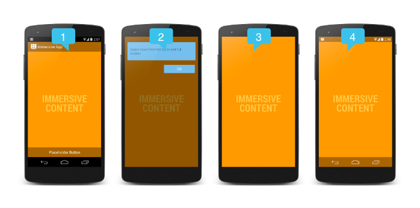
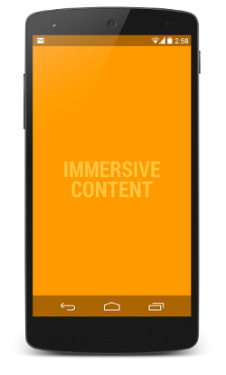

# 全屏沉浸式應用

> 編寫:[K0ST](https://github.com/K0ST) - 原文:<http://developer.android.com/training/system-ui/immersive.html>

**這節課將教您**

1. 選擇一種沉浸方式
2. 使用非粘性沉浸模式
3. 使用粘性沉浸模式

Adnroid 4.4(API level 19)中引入為`setSystemUiVisibility()`引入了一個新標籤`SYSTEM_UI_FLAG_IMMERSIVE`，它可以讓應用進入真正的全屏模式。當這個標籤與`SYSTEM_UI_FLAG_HIDE_NAVIGATION`和`SYSTEM_UI_FLAG_FULLSCREEN`一起使用的時候，導航欄和狀態欄就會隱藏，讓你的應用可以接受屏幕上任何地方的觸摸事件。


當沉浸式全屏模式啟用的時候，你的Activity會繼續接受各類的觸摸事件。用戶可以通過在邊緣區域向內滑動來讓系統欄重新顯示。這個操作清空了`SYSTEM_UI_FLAG_HIDE_NAVIGATION`(和`SYSTEM_UI_FLAG_FULLSCREEN`，如果有的話)兩個標籤，因此係統欄重新變得可見。如果設置了的話，這個操作同時也觸發了`View.OnSystemUiVisibilityChangeListener`。然而， 如果你想讓系統欄在一段時間後自動隱藏的話，你應該使用`SYSTEM_UI_FLAG_IMMERSIVE_STICKY`標籤。請注意，帶有'sticky'的標籤不會觸發任何的監聽器，因為在這個模式下展示的系統欄是處於暫時(transient)的狀態。

圖1展示了各種不同的“沉浸式”狀態



**圖1**. 沉浸模式狀態.

在上圖中：

1. **非沉浸模式** —— 展示了應用進入沉浸模式之前的狀態。也展示了設置`IMMERSIVE`標籤後用戶滑動展示系統欄的狀態。用戶滑動後，`SYSTEM_UI_FLAG_HIDE_NAVIGATION`和`SYSTEM_UI_FLAG_FULLSCREEN`就會被清除，系統欄就會重新顯示並保持可見。
請注意，最好的實踐方式就是讓所有的UI控件的變化與系統欄的顯示隱藏保持同步，這樣可以減少屏幕顯示所處的狀態，同時提供了更無縫平滑的用戶體驗。因此所有的UI控件跟隨系統欄一同顯示。一旦應用進入了沉浸模式，相應的UI控件也跟隨著系統欄一同隱藏。為了確保UI的可見性與系統欄保持一致，我們需要一個監聽器`View.OnSystemUiVisibilityChangeListener`來監聽系統欄的變化。這在下一節中將詳細講解。

2. **提示氣泡**——第一次進入沉浸模式時，系統將會顯示一個提示氣泡，提示用戶如何再讓系統欄顯示出來。
> **Note**：如果為了測試你想強制顯示提示氣泡，你可以先將應用設為沉浸模式，然後按下電源鍵進入鎖屏模式，並在5秒中之後打開屏幕。

3. **沉浸模式**—— 這張圖展示了隱藏了系統欄和其他UI控件的狀態。你可以設置`IMMERSIVE`和`IMMERSIVE_STICKY`來進入這個狀態。
4. **粘性標籤**——這就是你設置了`IMMERSIVE_STICKY`標籤時的UI狀態，用戶會向內滑動以展示系統欄。半透明的系統欄會臨時的進行顯示，一段時間後自動隱藏。滑動的操作並不會清空任何標籤，也不會觸發系統UI可見性的監聽器，因為暫時顯示的導航欄並不被認為是一種可見性狀態的變化。

> **Note**：`immersive`類的標籤只有在與`SYSTEM_UI_FLAG_HIDE_NAVIGATION`,` SYSTEM_UI_FLAG_FULLSCREEN`中一個或兩個一起使用的時候才會生效。你可以只使用其中的一個，但是一般情況下你需要同時隱藏狀態欄和導航欄以達到沉浸的效果。

## 選擇一種沉浸方式

`SYSTEM_UI_FLAG_IMMERSIVE`與`SYSTEM_UI_FLAG_IMMERSIVE_STICKY `都提供了沉浸式的體驗，但是在上面的描述中，他們是不一樣的，下面講解一下什麼時候該用哪一種標籤。

* 如果你在寫一款圖書瀏覽器、新聞雜誌閱讀器，請將`IMMERSIVE`標籤與`SYSTEM_UI_FLAG_FULLSCREEN `,` SYSTEM_UI_FLAG_HIDE_NAVIGATION`一起使用。因為用戶可能會經常訪問Action Bar和一些UI控件，又不希望在翻頁的時候有其他的東西進行干擾。`IMMERSIVE`在該種情況下就是個很好的選擇。
* 如果你在打造一款真正的沉浸式應用，而且你希望屏幕邊緣的區域也可以與用戶進行交互，並且用戶也不會經常訪問系統UI。這個時候就要將`IMMERSIVE_STICKY`和`SYSTEM_UI_FLAG_FULLSCREEN` `SYSTEM_UI_FLAG_HIDE_NAVIGATION`兩個標籤一起使用。比如做一款遊戲或者繪圖應用就很合適。
* 如果你在打造一款視頻播放器，並且需要少量的用戶交互操作。你可能就需要之前版本的一些方法了（從Android 4.0開始）。對於這種應用，簡單的使用`SYSTEM_UI_FLAG_FULLSCREEN`與`SYSTEM_UI_FLAG_HIDE_NAVIGATION`就足夠了，不需要使用`immersive`標籤。

## 使用非粘性沉浸模式

當你使用`SYSTEM_UI_FLAG_IMMERSIVE`標籤的時候，它是基於其他設置過的標籤(`SYSTEM_UI_FLAG_HIDE_NAVIGATION`和`SYSTEM_UI_FLAG_FULLSCREEN`)來隱藏系統欄的。當用戶向內滑動，系統欄重新顯示並保持可見。

用其他的UI標籤(如`SYSTEM_UI_FLAG_LAYOUT_HIDE_NAVIGATION`和`SYSTEM_UI_FLAG_LAYOUT_STABLE`)來防止系統欄隱藏時內容區域大小發生變化是一種很不錯的方法。你也需要確保Action Bar和其他系統UI控件同時進行隱藏。下面這段代碼展示瞭如何在不改變內容區域大小的情況下，隱藏與顯示狀態欄和導航欄。

```java
// This snippet hides the system bars.
private void hideSystemUI() {
    // Set the IMMERSIVE flag.
    // Set the content to appear under the system bars so that the content
    // doesn't resize when the system bars hide and show.
    mDecorView.setSystemUiVisibility(
            View.SYSTEM_UI_FLAG_LAYOUT_STABLE
            | View.SYSTEM_UI_FLAG_LAYOUT_HIDE_NAVIGATION
            | View.SYSTEM_UI_FLAG_LAYOUT_FULLSCREEN
            | View.SYSTEM_UI_FLAG_HIDE_NAVIGATION // hide nav bar
            | View.SYSTEM_UI_FLAG_FULLSCREEN // hide status bar
            | View.SYSTEM_UI_FLAG_IMMERSIVE);
}

// This snippet shows the system bars. It does this by removing all the flags
// except for the ones that make the content appear under the system bars.
private void showSystemUI() {
    mDecorView.setSystemUiVisibility(
            View.SYSTEM_UI_FLAG_LAYOUT_STABLE
            | View.SYSTEM_UI_FLAG_LAYOUT_HIDE_NAVIGATION
            | View.SYSTEM_UI_FLAG_LAYOUT_FULLSCREEN);
}
```
你可能同時也希望在如下的幾種情況下使用`IMMERSIVE`標籤來提供更好的用戶體驗：
* 註冊一個監聽器來監聽系統UI的變化。
* 實現`onWindowFocusChanged()`函數。如果窗口獲取了焦點，你可能需要對系統欄進行隱藏。如果窗口失去了焦點，比如說彈出了一個對話框或菜單，你可能需要取消那些將要在`Handler.postDelayed()`或其他地方的隱藏操作。
* 實現一個`GestureDetector`，它監聽了` onSingleTapUp(MotionEvent)`事件。可以使用戶點擊內容區域來切換系統欄的顯示狀態。單純的點擊監聽可能不是最好的解決方案，因為當用戶在屏幕上拖動手指的時候（假設點擊的內容佔據了整個屏幕），這個事件也會被觸發。

更多關於此話題的討論，可以觀看這個視頻 [DevBytes: Android 4.4 Immersive Mode](http://www.youtube.com/embed/cBi8fjv90E4)


## 使用粘性沉浸模式

當使用了`SYSTEM_UI_FLAG_IMMERSIVE_STICKY`標籤的時候，向內滑動的操作會讓系統欄臨時顯示，並處於半透明的狀態。此時沒有標籤會被清除，系統UI可見性監聽器也不會被觸發。如果用戶沒有進行操作，系統欄會在一段時間內自動隱藏。

圖2展示了當使用`IMMERSIVE_STICKY`標籤時，半透明的系統欄展示與又隱藏的狀態。



**圖2**. 自動隱藏系統欄.

下面是一段實現代碼。一旦窗口獲取了焦點，只要簡單的設置`IMMERSIVE_STICKY`與上面討論過的其他標籤即可。

```java
@Override
public void onWindowFocusChanged(boolean hasFocus) {
        super.onWindowFocusChanged(hasFocus);
    if (hasFocus) {
        decorView.setSystemUiVisibility(
                View.SYSTEM_UI_FLAG_LAYOUT_STABLE
                | View.SYSTEM_UI_FLAG_LAYOUT_HIDE_NAVIGATION
                | View.SYSTEM_UI_FLAG_LAYOUT_FULLSCREEN
                | View.SYSTEM_UI_FLAG_HIDE_NAVIGATION
                | View.SYSTEM_UI_FLAG_FULLSCREEN
                | View.SYSTEM_UI_FLAG_IMMERSIVE_STICKY);}
}
```

> **Notes**：如果你想實現`IMMERSIVE_STICKY`的自動隱藏效果，同時也需要展示你自己的UI控件。你只需要使用`IMMERSIVE`與`Handler.postDelayed()`或其他類似的東西，讓它幾秒後重新進入沉浸模式即可。
