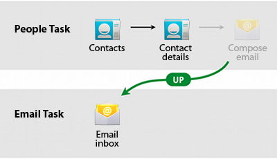

# 提供向上導航與歷史導航

> 編寫:[XizhiXu](https://github.com/XizhiXu) - 原文:<http://developer.android.com/training/design-navigation/ancestral-temporal.html>

既然現在我們能進入應用界面某個層級，我需要提供一個方法來在層級裡向上導航到父親或祖先界面中。此外，我們應該保證通過 *Back* 按鈕來回退歷史導航記錄。

> **回退/向上導航設計**

> 設計指南請閱讀 Android 設計文檔的[Navigation](http://developer.android.com/design/patterns/navigation.html)模式指導

## 支持歷史導航：***Back***

歷史導航，或者說在歷史的界面間導航，在 Android 系統中由來已久。不論其他狀態如何，所有 Android 用戶都期望 *Back* 按鈕能帶他們回到之前的界面。歷史界面集全都以用戶的 Launcher 應用為基礎（電話的 “Home” 鍵）。也就是說，按下 *Back* 鍵足夠多次數後你應該回到 Launcher，之後 *Back* 鍵不做任何事情。

**Figure 1.** 從 Contacts（聯繫人）app中進入電子郵件 app 然後按 *Back* 鍵的行為

應用自身通常不必考慮去管理 *Back* 按鈕。系統自己自動處理 [*task* 和 *back
H1H2H3H4
stack*（回退棧）](http://developer.android.com/guide/components/tasks-and-back-stack.html)，或者叫歷史界面列表。 *Back* 按鈕默認反向訪問界面列表，然後當按鈕被按下時從列表中移除當前界面。

但是總是有一些你可能需要重寫 *Back* 行為的例子。比如，你屏幕包含一個嵌入的網頁瀏覽器，在這個瀏覽器中你的用戶可和頁面元件進行交互來在網頁間導航。你可能希望當用戶按下設備的 *Back* 鍵時觸發嵌入瀏覽器的默認 *back* 操作。當到達了瀏覽器內部歷史的起始點，你就應該遵從系統 *Back* 按鈕的默認行為了。

## 提供向上導航：***Up*** 和 ***Home***

Android 3.0 之前，最常見的向上導航的形式以 *Home* 表示。大體上是以在設備 *Menu* 按鈕裡提供一個 *Home* 的可選項這樣的方法來實現，或者 *Home* 按鈕出現在屏幕的左上角作為 Action Barbar（詳見Android 設計的[模式](http://developer.android.com/design/patterns/actionbar.html)章節）的一個組件。當選中 *Home* 後，用戶被帶到界面層級的頂層，通常被叫做應用的主界面。

提供對程序主界面的直接訪問能帶給用戶一種舒適感和安全感。無論位於應用程序何處，如果你在 App 中迷路了，你可以點選 *Home* 然後回到那熟悉的主界面。

Android 3.0 引入了 *Up* 記號，它被展示在了 Action Bar 上代替了上述的 *Home* 按鈕。點擊 *Up*，用戶將被帶入到結構中的父界面。這個導航操作通常就是進入前一個界面（就像之前 *Back* 按鈕討論中描述的一樣），但是並不是永遠都這樣。因此，開發者必須保證 *Up* 對於每個界面都會導航到某個既定的父親界面。

**Figure 2.** 從聯繫人 App 中進入電子郵件 App 然後按 *Up* 導航的行為

某些情況下，*Up* 適合執行某個行為而非導航到一個父親節點。以 Android 3.0 平板上的 Gmail 應用為例。當查看一封郵件的對話時把設備平放，對話列表和對話詳情將並排顯示。這是一種[之前課程](multiple-sizes.html)中的父、子界面組合。然而，當豎屏查看郵件對話時，只有對話詳情被顯示。*Up* 按鈕被用來使父視窗滑入屏幕顯示。當左側視窗可見時再按一次 *Up* 按鈕，單個對話便回到全屏的對話列表中。

> **實現提醒：** 實現 *Home* 或 *Up* 導航的最佳做法就是保證清除back stack中的子界面。對於 *Home*，Home 界面是唯一留在back stack中的界面。對於 *Up* 導航，當前界面也應該從back stack中移除，除非 *Back* 在不同界面層級間導航。你可以將[ FLAG_ACTIVITY_CLEAR_TOP](http://developer.android.com/reference/android/content/Intent.html#FLAG_ACTIVITY_CLEAR_TOP)和[FLAG_ACTIVITY_NEW_TASK](http://developer.android.com/reference/android/content/Intent.html#FLAG_ACTIVITY_NEW_TASK)這兩個 Intent 標記一起使用來實現它。

最後一節課中，我們應用現在為止所有課程中討論的概念來為我們新聞應用例子創建交互設計 Wireframe（線框圖）。

[下節課：綜合：設計我們的樣例 App](wireframing.md)
