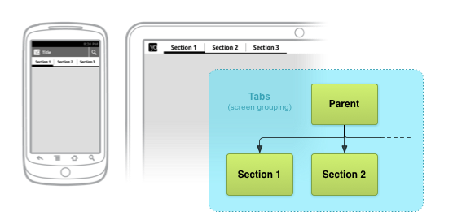

# 提供向下與橫向導航

> 編寫:[XizhiXu](https://github.com/XizhiXu) - 原文:<http://developer.android.com/training/design-navigation/descendant-lateral.html>

一種提供查看應用整體界面結構的方式就是顯示層級導航。這節課我們討論 *向下導航*，它允許用戶進入子界面。我們還討論 *橫向* 導航，它允許用戶訪問同級界面。

**Figure 1.** 向下和橫向導航

有兩種同級界面：容器關聯和區塊關聯界面。*容器關聯（Collection-related)* 界面展示由父界面放入同個容器裡地那些條目。*區塊關聯(Section-related)* 界面展示父界面不同部分的信息，例如：一個部分可能展示某對象的文字信息，可是另一個部分則提供對象地理位置的地圖。一個父界面的區塊關聯界面數量通常較少。

**Figure 2.** 容器關聯子界面和區塊關聯子界面。

向下和橫向導航可用List（列表），Tab（標籤）或者其他 UI 模式來實現。 *UI 模式*, 與軟件設計模式很類似，是重複交互設計問題的一般化解決方案。下幾章，我們將探究一些常用的橫向導航模式。

## Button和簡單的控件

> **Button設計**

> 設計指南請閱讀 Android 設計文檔的[Button](http://developer.android.com/design/building-blocks/buttons.html)指導

對於區塊關聯的界面，最直接和熟悉的導航界面就是提供可觸或鍵盤可得焦點的控件。例如，Button，固定大小的 List View 或 文本鏈接，雖然後者不是一個觸屏導航的理想 UI 元素。一旦點選了這些控件，子界面被打開，完全替代當前上下文環境（屏幕）。Button或其他簡單地控件很少被用來呈現容器中的項目。

**Figure 3.** Button導航模式例子和對應界面圖。Dashboard 模式見下文。

Dashboard（操作面板）模式是一種一般以Button為主來獲取不同應用劃分模塊的模式。一個dashboard就是個大圖標Button表格，它表示了父界面絕大部分內容。這個表格通常是2、3行或列，取決於 App 的頂層劃分。此模式展示全部區塊的視覺效果非常豐富。巨大的觸摸控件也讓 UI 特別好使。當每個區塊都同等重要時，Dashboard模式最好用。然而，這個模式在大屏上效果不佳，他讓用戶直接獲取 App 內容時多走了一步彎路。

還有更多套用了各種其他 UI 模式來提升內容即得性和獨特的展示效果，但仍保持著直觀特點的高級 UI 模式。

## Lists, Grids, Carousels, and Stacks

> **List 和 Grid List 設計**

> 設計指南請閱讀 Android 設計文檔的[Lists](http://developer.android.com/design/building-blocks/lists.html)和[Grid Lists](http://developer.android.com/design/building-blocks/grid-lists.html)指導。

對於容器關聯的界面，特別是文字信息，垂直滑動列表通常是最直接最熟悉的做法。對於視覺更豐富的內容（例如，圖片，視頻），可用垂直滑動的 Grid，水平滾動的 List（有時被叫做 Carousel），或 Stack（有時叫做卡片，Card）來代替。這些 UI 元素通常用在呈現容器內的條目，或大量子界面最好，而不是零星的毫無關聯的同級子界面。

**Figure 4.** 控件例子和對應界面圖

這個模式還有些問題。深層列表導航常常叫 drill-down（鑽井）列表導航，它的list層層嵌套。這種導航笨拙低效。獲得某塊內容需要點擊多次，帶給用戶很差的體驗，特別是活躍用戶。

使用縱向list也可能帶來尷尬的用戶交互，並且如果list條目簡單地的拉伸話也可能用不好大屏空白。解決方法就是提供額外的信息，例如用文字彙總填充那些可用的水平空間。或者在左右添加個視窗。

## Tabs（標籤）

> **Tab 設計**

> 設計指南請閱讀 Android 設計文檔的[Tab](http://developer.android.com/design/building-blocks/tabs.html)指導

Tab是非常流行的橫向導航。這個模式允許組合同級界面，就是說tab可嵌入原本可能成為另一個界面的子界面內容。Tab適合用在小量的區塊關聯界面。

**Figure 5.** 手機和平板導航例子和對應界面圖

幾個使用Tab時的最佳做法。Tab在關聯界面種應該一直存在，只有指定內容區域發生改變，並且tab提示在任何時候都可用。此外，tab切換不能算作歷史。例如，如果用戶從 Tab *A* 切換到 Tab *B*，按 *Back* 按鈕（詳情看[下節](ancestral-temporal.html)）不該重選 Tab *A*。Tab通常水平排布，可是有時其他tab展現形式，例如Action bar（詳見Android 設計的[模式](http://developer.android.com/design/patterns/actionbar.html)章節）的下拉菜單，也是可以的。最後，最重要的是，tab應該在界面頂端和內容對應。

tab導航相對於list和button導航，有很多即得的優點：

* 既然只有一個初始時既選的活動tab，用戶能立即從界面獲取tab的內容。

* 用戶可在相關界面內快速導航，不用重新訪問父界面。

  > **注意：** 當切換Tab時，保證立即切換很重要。不要加載時彈個確認對話框來阻塞tab的訪問。

導致這個模式被批評常見的原因就是必須從展示內容的屏幕空間分一些給tab提示欄。但是結果還能接受，權衡一般都向使用此模式的方向傾斜。你可以隨意個性化你的tab提示欄，加點文字或圖標什麼的讓縱向空間合理利用。但是調整tab寬度時，請確保tab夠大到能讓人無誤點擊。

## 水平分頁（Swipe View）

> **Swipe View 設計**

> 設計指南請閱讀 Android 設計文檔的[Swipe View](http://developer.android.com/design/patterns/swipe-views.html)指導

另一種橫向導航的模式就是水平分頁，也叫做 Swipe View。這個模式在容器關聯的同級界面上最好用，例如類別列表（世界，金融，技術和健康新聞）。就像Tab，這個模式也允許組合界面，這樣父界面就能在佈局內嵌入子界面的內容。

**Figure 6.** 水平分頁導航例子和對應界面圖

在水平分頁 UI 中，一次只展示一個子界面（這兒叫*頁*，*page*）。用戶能通過觸摸屏幕然後按想要訪問相鄰頁面的方向拖拽導航到同級界面。為補充這種手勢交互通常由另一種 UI 元素提示當前頁和可訪問頁。這樣能幫助用戶發覺內容並且也提供了更多的上下文環境信息給用戶。當為區塊關聯的同級模塊使用這種模式的水平導航時，這個做法很有必要。這些提示界面元素的例子包括點標（tick  mark），滑動標註（scrolling label）和標籤（tab）：

**Figure 7.** 搭配分頁的 UI 元件。

當子界面包含水平平移視圖時（例如地圖）也最好避免使用這種模式，因為這些衝突的交互會威脅你界面的易用性。

此外，對於同級關聯界面，如果內容類型具有一定相似性而且同級界面數量較少時，水平分頁再適合不過了。就這一點，這個模式可以和tab一起用。tab放在內容上方來最大化界面直觀性。對於容器關聯界面，當界面間有天然的順序時，水平分頁是最符合直覺的，例如頁面代表連續的日曆日。對於無窮無盡的數據，特別是雙向都有內容數據，分頁機制效果非常棒。

下節課，我們討論在內容層級中允許用戶往上和回退到之前訪問界面的導航的機制。

[下節課：提供向上和時間導航](ancestral-temporal.md)

