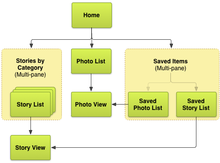

# 為多種大小的屏幕進行規劃

> 編寫:[XizhiXu](https://github.com/XizhiXu) - 原文:<http://developer.android.com/training/design-navigation/multiple-sizes.html>

雖然上節中的界面完備圖在手持設備和相似大小設備上可行，但並不是和某個設備因素綁死的。Android應用需要適配一大把不同類型的設備，從3"的手機到10"的平板到42"的電視。這節課中我們探討把完備圖中不同界面組合起來的策略和原因。

> **Note:** 為電視設計應用程序還需要注意其他的因素，包括互動方式（就是說，它沒觸屏），長距離情況下文本的可讀性，還有其他的。雖然這個討論在本課範疇之外，你仍然可以在 [Google TV](https://developers.google.com/tv) 文檔的[設計模式](https://developers.google.com/tv/android/docs/gtv_android_patterns)中找到有關為電視設計的信息。

## 用多視窗佈局（Multi-pane Layout）組合界面

> **多視窗佈局（Multi-pane Layout）設計**

> 設計指南請閱讀 Android 設計部分的[多視窗佈局](http://developer.android.com/design/patterns/multi-pane-layouts.html)。

3 到 4英寸的屏幕通常只適合每次展示單個縱向內容視窗，一個列表，或某列表項的具體信息，等等。所以在這些設備上，界面通常對映於信息層次上的某一級（類別 → 列表 → 詳情）。

更大的諸如平板和電視上的屏幕通常會有更多的可用界面空間，並且他們能夠展示多個內容視窗。橫屏中，視窗從左到右以細節程度遞增的順序排列。因常年使用桌面應用和網站，用戶變得特別適應大屏上的多視窗。很多桌面應用和網站提供左側導航視窗，或者使用總/分（master/detail）兩個視窗佈局。

為了符合這些用戶期望，通常很有必要為平板提供多個信息視窗來避免留下過多空白或無意間引入尷尬的交互，比如 10 x 0.5" 按鈕。

下面圖例示範了當把 UI 設計遷移到更大的佈局時出現的一些問題，並且展示瞭如何用多視窗佈局來處理這些問題：

**圖 1.** 大橫屏使用單視窗導致尷尬的空白和過長行。

**圖 2.** 橫屏多視窗佈局產生更好的視覺平衡，更大的效用和可讀性。

> **實現提醒：** 當決定好了區分使用單視窗佈局和多視窗佈局的屏幕大小基準線後，你就可以為不同屏幕大小區間（例如 `large/xlarge`）或最低屏幕寬度（例如 `sw600dp`）提供不同的佈局了。

> **實現提醒：** 單一界面被實現為 [Activity](http://developer.android.com/reference/android/app/Activity.html) 的子類, 單獨的內容視窗則可實現為 [Fragment](http://developer.android.com/reference/android/app/Fragment.html) 的子類。這樣最大化了跨越不同結構因素和不同屏幕內容的代碼複用。

## 為不同平板方向設計

雖然現在我們還沒有開始在我們的屏幕上排布 UI 元素，但現在很是時候來考慮下我們的多視窗界面如何適配不同的設備方向了。多視窗佈局在橫屏時表現的非常棒，因為有大量可用的橫向空間。然而，在豎屏時，你的橫向空間被限制了，所以你需要為這個方向設計一個單獨的佈局。

下面是一些創建豎屏佈局的常見策略：

* **伸縮** 

  最直接的策略就是簡單地伸縮每個視窗的寬度來最好地在豎屏下的呈現內容。視窗可設置固定寬度或佔可用界面寬度的一定比例。

* **展開/摺疊** 

  伸縮策略的一個變種就是在豎屏中摺疊左側視窗的內容。當遇到總/分（master/detail）視窗中左側（master）視窗包含易摺疊列表項時，這個策略很有效。以一個實時聊天應用為例。橫屏中，左側列表可能包含聊天聯繫人的照片，姓名和在線狀態。在豎屏中，橫向空間可以將通過隱藏聯繫人姓名而且只顯示照片和在線狀態的提示圖標的方式來摺疊。也可以選擇性的提供展開控制，這種控制允許用戶展開左側視窗或反向操作。

* **顯示/隱藏** 

  這個方案中，左側視窗在豎屏模式下完全隱藏。然而，為了保證你界面的功能等價性，左側視窗必須功能可見（比如，添一個按鈕）。通常適合在 Action Bar 使用 *Up* 按鈕（詳見Android設計的[模式](http://developer.android.com/design/patterns/actionbar.html)文檔）來展示左側視窗，這將在[之後](ancestral-temporal.html)討論。

* **堆疊** 

  最後的策略就是在豎屏時垂直地堆放你一般橫向排布的視窗。當你的視窗不是簡單的文本列表，或者當有多個內容模塊與基本內容視窗同時運行時，這個策略很奏效。但是當心使用這個策略時出現上面提到的尷尬的空白問題。

## 組合界面圖中的界面

既然現在我們能夠通過提供大屏設備上的多視窗佈局來組合單獨的界面，那麼就讓我們把這個技術應用到我們[上節課](screen-planning.html)界面完備圖上吧，這樣我們應用的界面層次在這類設備上變得更具體了：

**Figure 3.** 更新後新聞應用例子的界面完備Map

下節課我們將討論 *向下* 和 *橫向* 導航，並且探討更多方法來組合界面使能最大化應用 UI 的直觀性和內容獲取速度。

[下一節：提供向下和橫向導航](descendant-lateral.md)
