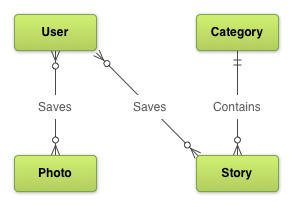

# 規劃界面和他們之間的關係

> 編寫:[XizhiXu](https://github.com/XizhiXu) - 原文:<http://developer.android.com/training/design-navigation/screen-planning.html>

多數 App 都有一種內在的信息模型，它能被表示成一個用對象類型構成的樹或圖。更淺顯的說，你可以畫一個有不同類型信息的圖，這些信息代表用戶在你 App 裡用戶與之互動的各種東西。軟件工程師和數據架構師經常使用實例-關係圖（Entity-Relationship Diagram，ERD）描述一個應用的信息模型。

讓我們考慮一個讓用戶瀏覽一群已分類好的新聞事件和圖片的應用例子。這種 App 一個可能的模型如下 ERD 圖。

**Figure 1.** 新聞應用例子的實例關係圖

## 創建一個界面列表

一旦你定義了信息模型，你就可以開始定義那些能使用戶在你的 App  中有效地發掘，查看和操作數據的上下文環境了。實際上，其中一種方法就是確定供用戶導航和交互數據所需的 *界面完備集*（歸納了所有界面的集合）。但我們實際發現的界面集合應該根據目標設備變化。在設計過程中早點考慮到這點很重要，這樣可以保證程序可以適應運行環境。

在我們的例子中，我們想讓用戶**查看**，**保存**和**分享**分類好了的**新聞**和**圖片**。下面是涵蓋了這些用例的界面完備列表。

* 用來訪問新聞和圖片的 Home 或者 "Launchpad" 畫面
* 類別列表
* 某個分類下的新聞列表
* 新聞詳情 View （在這裡我們可以保存和分享）
* 圖片列表，不分類
* 圖片詳情 View （在這裡我們可以保存和分享）
* 所有保存項列表
* 圖片保存列表
* 新聞保存列表

## 圖示界面關係

現在我們可以定義界面間的有向關係了。一個從界面 *A* 指向另一個界面 *B* 的箭頭表示通過用戶在畫面 *A* 的某個交互動作可直達畫面 *B* 。一旦我們定義了界面集和他們之間的關係，我們可以將他們一起全部表示在一張界面圖中了：

**Figure 2.** 新聞應用例子的界面完備Map

如果之後我們想允許用戶提交新聞事件或者上傳圖片，我們可以在圖中加額外的界面。

## 脫離簡陋設計

這時，我們可以據這張完備的界面圖設計一個功能完備應用了。可以由列表和導向子界面的按鈕構成一個簡單的UI：

* 導向不同頁面的按鈕（例如，新聞，圖片，保存的項目）
* 縱向列表表示集合（例如，新聞列表，圖片列表，等等）
* 詳細信息（例如，新聞 View ，圖片 View ，等等）

但是，你可以利用屏幕組合技術和更高深導航元素以一種更直觀，設備更理解的方式呈現內容。下節課，我們探索屏幕組合技術，比如為平板而生的多視窗（Multi-pane）佈局。之後，我將深入講解更多不同的 Android 常見導航模式。

[下節課：規劃多種觸屏大小](multi-sizes.html)
