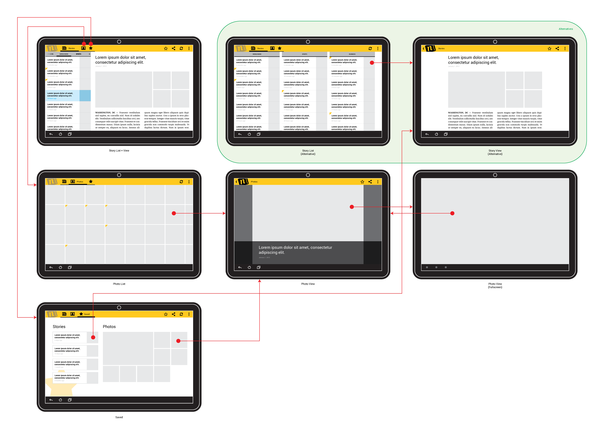

# 綜合：設計我們的樣例 App

> 編寫:[XizhiXu](https://github.com/XizhiXu) - 原文:<http://developer.android.com/training/design-navigation/wireframing.html>

現在我們對導航模式和界面組合技術有了深入的理解，是時候應用到我們的界面上了。讓我再看看我們第一節課上提到的新聞應用的界面完備圖：

**Figure 1.** 新聞應用例子的界面完備集

我們下一步得去我們前幾節討論的導航模式選擇，然後應用到這個界面圖中。這樣就能最大化導航速度並且最少化獲取內容的點擊次數，但又能參考 Android 做法來保證界面的直觀性和一致性。此外，我們也需要根據我們不同目標設備的參數做出不同的決定。為方便，我們集中討論平板和手持設備。

## 選擇模式

首先，我們二級界面（*新聞類別列表* ，*圖片列表* 和 *保存列表*）可用 Tab 組合在一起。注意到我們不必使用水平排列的 Tab；某些情況下下拉菜單可作為合適的替代品，特別在手機這種窄屏設備上。在手機上，我們能用 Tab 把 *圖片保存列表* 和 *新聞保存列表* 組合到一起，或在平板上用多個縱向排列的內容視窗。

最後，讓我們看看如何展示新聞。第一個簡化不同新聞類別間導航的選項：使用水平分頁，然後再在滑動區域上添加一組標籤來提示當前可見和臨近的新聞類別。對於平板橫屏，我們可以進一步地展示能水平分頁的 *新聞列表* 界面作為左邊的視窗，並且把 *新聞詳情 View* 界面作為基礎內容視窗放在右邊。

下圖分別表示在手持設備和平板上應用了這些導航模式後的新界面圖。

**Figure 2.** 手持設備上新聞應用例子的最終界面集

**Figure 3.** 平板上新聞應用例子的最終界面集，橫屏

至此，得好好考慮下界面圖的衍化了，以免我們選擇的模式實際上用不了（比如當你畫應用界面佈局的草圖時）。下面有個為平板衍化的界面圖樣例，它並排展示不同類別的 *新聞列表*，但是 *新聞詳情View* 保持獨立。

**Figure 4.** 平板上新聞應用例子的最終界面集，豎屏

## 畫草稿

[Wireframing](http://en.wikipedia.org/wiki/Website_wireframe)就是設計過程中你開始排布界面的那步。發揮你的創造性，想想怎麼排列這些 UI 元件來幫助你的用戶在你的 App 中導航。這時你要記住細枝末節是不重要的（別去想著做個實物）。

最簡單快速的起步方法就是用紙筆手畫你界面。一旦你開始畫，你會發現在你原本的界面圖或在你決定使用的模式中有很多實際的問題。某些情況下，模式理論上能很好的解決特定設計問題，但實際上他們可能失效並且給視覺交互添亂（例如，界面上出現了兩行 Tab）。如果那樣，探索下其他的導航模式，或在選擇的模式上做點變化，來讓你的草稿更優。

當你對初稿滿意後，繼續用一些軟件畫你的數字wireframe吧，例如：Adobe® Illustrator，Adobe® Fireworks，OmniGraffle 或者 向量圖工具。選擇畫圖工具時，考慮以下特性：

* 能畫體現交互的 wireframe 麼？像Adobe® Fireworks就能提供這個功能。

* 有界面“大師”功能（允許不同界面的視覺元素重用）？例如，Action Bar必須在你應用的每個界面都出現。

* 學習曲線怎樣？專業向量圖工具可能有個陡峭的學習曲線（越學越難），但有些功能小巧的 wireframing 設計工具可能更適合這個任務。

最後，XML 佈局編輯器，[Android 開發工具包（ADT）](http://developer.android.com/tools/help/adt.html)裡面的一個 Eclipse 插件，經常被用來畫草圖原型。但是，你應當貫注於高質量的佈局而非細節視覺設計。

## 創建數字草圖

在紙上畫完草圖並且選擇好一款心儀的數字wireframing工具後，你可以創建一個數字wireframe作為你應用視覺設計的起點。下面就是一些我們新聞客戶端wireframe例子，他們和我們之前的界面圖一一對應。

**Figure 5.** 新聞客戶端手機豎屏Wireframe樣例（下載 [SVG](http://developer.android.com/training/design-navigation/example-wireframe-phone.svg) 圖）

**Figure 6.** 新聞客戶端平板橫屏Wireframe樣例（下載 [SVG](http://developer.android.com/training/design-navigation/example-wireframe-tablet.svg) 圖）

（[下載表示設備的 Wireframe 的 SVG 圖](http://developer.android.com/training/design-navigation/example-wireframe-device-template.svg)）

## 下一步

現在你已經為你的應用設計出了高效直觀的 App 內部導航，你可用開始花時間來為單個界面改善 UI了。例如，展示交互內容時，你可以選擇使用更花哨的控件來代替簡單的文本標籤，圖像和按鈕。你也可以開始定義你應用的視覺風格。在這過程中把你品牌的元素作為視覺語言融入其中吧。

最後，也適時實現你的設計吧，使用 Android SDK 為你的應用寫寫代碼。想開始？看看下面的這些資源吧：

* [開發者指導：UI](http://developer.android.com/guide/topics/ui/index.html) :學習如何用 Android SDK 實現你的 UI 設計。

* [Action Bar](http://developer.android.com/guide/topics/ui/actionbar.html) :實現tab，向上導航，屏幕上動作，等等。

* [Fragment](http://developer.android.com/guide/components/fragments.html) :實現可重用，多視窗佈局

* [支持庫](http://developer.android.com/tools/support-library/index.html) :用`ViewPager`實現水平分頁（Swipe View）
