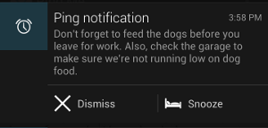

# 使用BigView樣式

> 編寫:[fastcome1985](https://github.com/fastcome1985) - 原文:<http://developer.android.com/training/notify-user/expanded.html>

Notification抽屜中的Notification主要有兩種視覺展示形式，normal view（平常的視圖，下同） 與 big view（大視圖，下同）。Notification的 big view樣式只有當Notification被擴展時才能出現。當Notification在Notification抽屜的最上方或者用戶點擊Notification時才會展現大視圖。


Big views在Android4.1被引進的，它不支持老版本設備。這節課叫你如何讓把big view notifications合併進你的APP，同時提供normal view的全部功能。更多信息請見[Notifications API guide](developer.android.com/guide/topics/ui/notifiers/notifications.html#BigNotify) 。


這是一個 normal view的例子

  

   圖1 Normal view notification.

這是一個 big view的例子

  
  
   圖2 Big view notification.

在這節課的例子應用中， normal view 與 big view給用戶相同的功能：
   *  繼續小睡或者消除Notification
   *  一個查看用戶設置的類似計時器的提醒文字的方法，

* normal view 通過當用戶點擊Notification來啟動一個新的activity的方式提供這些特性，記住當你設計你的notifications時，首先在normal view 中提供這些功能，因為很多用戶會與notification交互。


## 設置Notification用來登陸一個新的Activity

這個例子應用用[IntentService](developer.android.com/reference/android/app/IntentService.html)的子類（PingService）來構造以及發佈notification。
 在這個代碼片段中，[IntentService](developer.android.com/reference/android/app/IntentService.html)中的方法[onHandleIntent()](developer.android.com/reference/android/app/IntentService.html#onHandleIntent(android.content.Intent)) 指定了當用戶點擊notification時啟動一個新的activity。方法[setContentIntent()](developer.android.com/reference/android/support/v4/app/NotificationCompat.Builder.html#setContentIntent(android.app.PendingIntent))定義了pending intent在用戶點擊notification時被激發，因此登陸這個activity.


```java

Intent resultIntent = new Intent(this, ResultActivity.class);
resultIntent.putExtra(CommonConstants.EXTRA_MESSAGE, msg);
resultIntent.setFlags(Intent.FLAG_ACTIVITY_NEW_TASK |
        Intent.FLAG_ACTIVITY_CLEAR_TASK);

// Because clicking the notification launches a new ("special") activity,
// there's no need to create an artificial back stack.
PendingIntent resultPendingIntent =
         PendingIntent.getActivity(
         this,
         0,
         resultIntent,
         PendingIntent.FLAG_UPDATE_CURRENT
);

// This sets the pending intent that should be fired when the user clicks the
// notification. Clicking the notification launches a new activity.
builder.setContentIntent(resultPendingIntent);

```

## 構造big view
 這個代碼片段展示瞭如何在big view中設置buttons


```java

// Sets up the Snooze and Dismiss action buttons that will appear in the
// big view of the notification.
Intent dismissIntent = new Intent(this, PingService.class);
dismissIntent.setAction(CommonConstants.ACTION_DISMISS);
PendingIntent piDismiss = PendingIntent.getService(this, 0, dismissIntent, 0);

Intent snoozeIntent = new Intent(this, PingService.class);
snoozeIntent.setAction(CommonConstants.ACTION_SNOOZE);
PendingIntent piSnooze = PendingIntent.getService(this, 0, snoozeIntent, 0);

```

 這個代碼片段展示瞭如何構造一個[Builder](developer.android.com/reference/android/support/v4/app/NotificationCompat.Builder.html)對象，它設置了big view 的樣式為"big text",同時設置了它的內容為提醒文字。它使用[addAction()](developer.android.com/reference/android/support/v4/app/NotificationCompat.Builder.html#addAction(android.support.v4.app.NotificationCompat.Action))方法來添加將要在big view中出現的Snooze與Dismiss按鈕（以及它們相關聯的pending intents).

```java
// Constructs the Builder object.
NotificationCompat.Builder builder =
        new NotificationCompat.Builder(this)
        .setSmallIcon(R.drawable.ic_stat_notification)
        .setContentTitle(getString(R.string.notification))
        .setContentText(getString(R.string.ping))
        .setDefaults(Notification.DEFAULT_ALL) // requires VIBRATE permission
        /*
         * Sets the big view "big text" style and supplies the
         * text (the user's reminder message) that will be displayed
         * in the detail area of the expanded notification.
         * These calls are ignored by the support library for
         * pre-4.1 devices.
         */
        .setStyle(new NotificationCompat.BigTextStyle()
                .bigText(msg))
        .addAction (R.drawable.ic_stat_dismiss,
                getString(R.string.dismiss), piDismiss)
        .addAction (R.drawable.ic_stat_snooze,
                getString(R.string.snooze), piSnooze);

```
