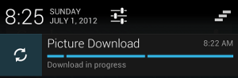

# 顯示Notification進度

> 編寫:[fastcome1985](https://github.com/fastcome1985) - 原文:<http://developer.android.com/training/notify-user/display-progress.html>

Notifications可以包含一個展示用戶正在進行的操作狀態的動畫進度指示器。如果你可以在任何時候估算這個操作得花多少時間以及當前已經完成多少，你可以用“determinate（確定的，下同）”形式的指示器（一個進度條）。如果你不能估算這個操作的長度，使用“indeterminate（不確定，下同）”形式的指示器（一個活動的指示器）。

進度指示器用[ProgressBar](developer.android.com/reference/android/widget/ProgressBar.html)平臺實現類來顯示。

使用進度指示器，可以調用 [setProgress()](http://developer.android.com/intl/zh-cn/reference/android/support/v4/app/NotificationCompat.Builder.html#setProgress%28int,%20int,%20boolean%29)方法。determinate 與 indeterminate形式將在下面的章節中介紹。

## 展示固定長度的進度指示器
為了展示一個確定長度的進度條，調用 [setProgress(max, progress, false)](developer.android.com/reference/android/support/v4/app/NotificationCompat.Builder.html#setProgress(int,%20int,%20boolean))方法將進度條添加進notification，然後發佈這個notification，第三個參數是個boolean類型，決定進度條是 indeterminate (true) 還是 determinate (false)。在你操作進行時，增加progress，更新notification。在操作結束時，progress應該等於max。一個常用的調用 [setProgress()](developer.android.com/reference/android/support/v4/app/NotificationCompat.Builder.html#setProgress(int,%20int,%20boolean))的方法是設置max為100，然後增加progress就像操作的“完成百分比”。

當操作完成的時候，你可以選擇或者讓進度條繼續展示，或者移除它。無論哪種情況下，記得更新notification的文字來顯示操作完成。移除進度條，調用[setProgress(0, 0, false)](developer.android.com/reference/android/support/v4/app/NotificationCompat.Builder.html#setProgress(int,%20int,%20boolean))方法.比如：


```java

int id = 1;
...
mNotifyManager =
        (NotificationManager) getSystemService(Context.NOTIFICATION_SERVICE);
mBuilder = new NotificationCompat.Builder(this);
mBuilder.setContentTitle("Picture Download")
    .setContentText("Download in progress")
    .setSmallIcon(R.drawable.ic_notification);
// Start a lengthy operation in a background thread
new Thread(
    new Runnable() {
        @Override
        public void run() {
            int incr;
            // Do the "lengthy" operation 20 times
            for (incr = 0; incr <= 100; incr+=5) {
                    // Sets the progress indicator to a max value, the
                    // current completion percentage, and "determinate"
                    // state
                    mBuilder.setProgress(100, incr, false);
                    // Displays the progress bar for the first time.
                    mNotifyManager.notify(id, mBuilder.build());
                        // Sleeps the thread, simulating an operation
                        // that takes time
                        try {
                            // Sleep for 5 seconds
                            Thread.sleep(5*1000);
                        } catch (InterruptedException e) {
                            Log.d(TAG, "sleep failure");
                        }
            }
            // When the loop is finished, updates the notification
            mBuilder.setContentText("Download complete")
            // Removes the progress bar
                    .setProgress(0,0,false);
            mNotifyManager.notify(id, mBuilder.build());
        }
    }
// Starts the thread by calling the run() method in its Runnable
).start();

```

 結果notifications顯示在圖1中，左邊是操作正在進行中的notification的快照，右邊是操作已經完成的notification的快照。


圖1 操作正在進行中與完成時的進度條


## 展示持續的活動的指示器

為了展示一個持續的(indeterminate)活動的指示器,用[setProgress(0, 0, true)](developer.android.com/reference/android/support/v4/app/NotificationCompat.Builder.html#setProgress(int,%20int,%20boolean))方法把指示器添加進notification，然後發佈這個notification 。前兩個參數忽略，第三個參數決定indicator 還是 indeterminate。結果是指示器與進度條有同樣的樣式，除了它的動畫正在進行。


在操作開始的時候發佈notification，動畫將會一直進行直到你更新notification。當操作完成時，調用 [setProgress(0, 0, false)](developer.android.com/reference/android/support/v4/app/NotificationCompat.Builder.html#setProgress(int,%20int,%20boolean)) 方法，然後更新notification來移除這個動畫指示器。一定要這麼做，否責即使你操作完成了，動畫還是會在那運行。同時也要記得更新notification的文字來顯示操作完成。

為了觀察持續的活動的指示器是如何工作的，看前面的代碼。定位到下面的幾行：


```java

// Sets the progress indicator to a max value, the current completion
// percentage, and "determinate" state
mBuilder.setProgress(100, incr, false);
// Issues the notification
mNotifyManager.notify(id, mBuilder.build());

```

將你找到的代碼用下面的幾行代碼代替，注意 setProgress()方法的第三個參數設置成了true,表示進度條是 indeterminate類型的。

```java

// Sets an activity indicator for an operation of indeterminate length
mBuilder.setProgress(0, 0, true);
// Issues the notification
mNotifyManager.notify(id, mBuilder.build());

```

結果顯示在圖2中:



圖2 正在進行的活動的指示器
