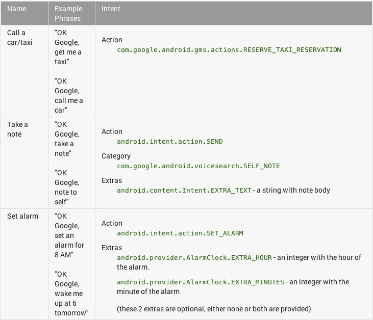
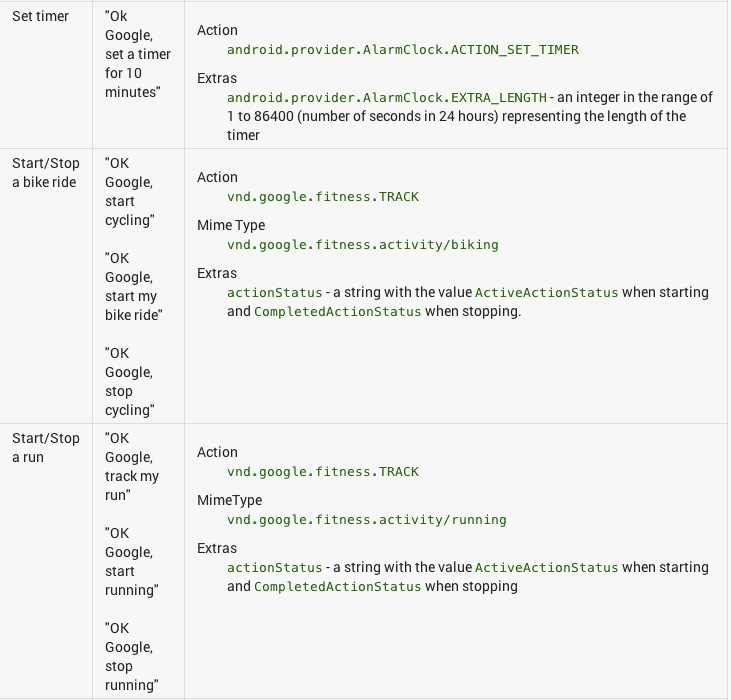
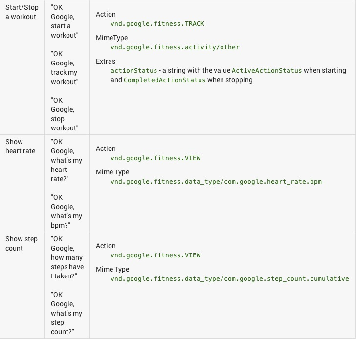

# 添加語音功能

> 編寫: [kesenhoo](https://github.com/kesenhoo) - 原文: <http://developer.android.com/training/wearables/apps/voice.html>

語音指令是可穿戴體驗的一個重要的部分。這使得用戶可以釋放雙手，快速發出指令。穿戴提供了2種類型的語音操作：

* **系統提供的**

  這些語音指令都是基於任務的，並且內置在Wear的平臺內。我們在activity中過濾我們想要接收的指令。例如包含"Take a note" 或者 "Set an alarm"的指令。

* **應用提供的**

  這些語音指令都是基於應用的，我們需要像聲明一個Launcher Icon一樣聲明這些指令。用戶通過說"Start "來使用那些語音指令，然後會啟動我們指定啟動的activity。

## 聲明系統提供的語音指令

Android Wear平臺基於用戶的操作提供了一些語音指令，例如"Take a note" 或者 "Set an alarm"。用戶發出想要做的操作指令，讓系統啟動最合適的activity。

當用戶說出語音指令時，我們的應用能夠過濾出用於啟動activity的intent。如果我們想要啟動一個在後臺執行任務的service，需要顯示一個activity作為視覺線索，並且在該activity中啟動service。當我們想要廢棄這個視覺線索時，需要確保執行了finish()。

例如，對於"Take a note"的指令，聲明下面這個intent filter來啟動一個名為`MyNoteActivity`的activity:

```xml
<activity android:name="MyNoteActivity">
      <intent-filter>
          <action android:name="android.intent.action.SEND" />
          <category android:name="com.google.android.voicesearch.SELF_NOTE" />
      </intent-filter>
  </activity>
```

下面列出了Wear平臺支持的語音指令：





關於註冊intent與獲取intent extra的信息，請參考[Common intents](http://developer.android.com/guide/components/intents-common.html).

## 聲明應用提供的語音指令

如果系統提供的語音指令無法滿足我們的需求，我們可以使用"Start MyActivityName"語音指令來直接啟動我們的應用。

註冊一個"Start"指令的方法和註冊手持應用上的Launcher Icon是一樣的。除了在launcher裡面需要一個應用圖標，而我們的應用需要一個語音指令。

為了指定在"Start"指令之後需要說出的文本, 我們需要指定想要啟動的activity的`label`屬性。例如，下面的intent filter能夠識別"Start MyRunningApp"語音指令並啟動`StartRunActivity`。

```xml
<application>
  <activity android:name="StartRunActivity" android:label="MyRunningApp">
      <intent-filter>
          <action android:name="android.intent.action.MAIN" />
          <category android:name="android.intent.category.LAUNCHER" />
      </intent-filter>
  </activity>
</application>
```

## 獲取自由格式的語音輸入

除了使用語音指令來啟動activity之外，我們也可以執行系統內置的語言識別activity來獲取用戶的語音輸入。這對於獲取用戶的輸入信息非常有幫助，例如執行搜索或者發送一個消息。

在我們的應用中，使用[ACTION_RECOGNIZE_SPEECH](http://developer.android.com/reference/android/speech/RecognizerIntent.html#ACTION_RECOGNIZE_SPEECH) action並調用<a href="http://developer.android.com/reference/android/app/Activity.html#startActivityForResult(android.content.Intent, int)">startActivityForResult()</a>。這樣可以啟動系統語音識別應用，並且我們可以在<a href="http://developer.android.com/reference/android/app/Activity.html#onActivityResult(int, int, android.content.Intent)">onActivityResult()</a>中處理返回的結果：

```java
private static final int SPEECH_REQUEST_CODE = 0;

// Create an intent that can start the Speech Recognizer activity
private void displaySpeechRecognizer() {
    Intent intent = new Intent(RecognizerIntent.ACTION_RECOGNIZE_SPEECH);
    intent.putExtra(RecognizerIntent.EXTRA_LANGUAGE_MODEL,
            RecognizerIntent.LANGUAGE_MODEL_FREE_FORM);
// Start the activity, the intent will be populated with the speech text
    startActivityForResult(intent, SPEECH_REQUEST_CODE);
}

// This callback is invoked when the Speech Recognizer returns.
// This is where you process the intent and extract the speech text from the intent.
@Override
protected void onActivityResult(int requestCode, int resultCode,
        Intent data) {
    if (requestCode == SPEECH_REQUEST && resultCode == RESULT_OK) {
        List<String> results = data.getStringArrayListExtra(
                RecognizerIntent.EXTRA_RESULTS);
        String spokenText = results.get(0);
        // Do something with spokenText
    }
    super.onActivityResult(requestCode, resultCode, data);
}
```
