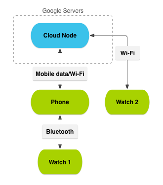

## 發送並同步數據

> 編寫:[wly2014](https://github.com/wly2014) - 原文: <http://developer.android.com/training/wearables/data-layer/index.html>

可穿戴數據層API(The Wearable Data Layer API)，Google Play services 的一部分，為手持與可穿戴應用提供了一個交流通道。此API包括一系列的數據對象，其可由系統通過網絡和能告知應用數據層重要事件的監聽器發送並同步：

**Data Items**

[DataItem](https://developer.android.com/reference/com/google/android/gms/wearable/DataItem.html)提供了手持設備與可穿戴設備間的自動同步的數據儲存。

**Messages**

[MessageApi](https://developer.android.com/reference/com/google/android/gms/wearable/MessageApi.html)類可以發送消息和善於處理遠程過程調用協議（RPC），比如，從可穿戴設備上控制手持設備的媒體播放器，或在可穿戴設備上啟動一個來自手持設備的intent。消息還適合單向請求或者請求/響應通信模型。如果手持設備與可穿戴設備成功連接，那麼系統會將傳遞的消息放進隊列並返回一個成功的結果碼。否則，會返回一個錯誤。成功碼並不代表成功地傳遞消息，這是因為設備可能在收到結果碼之後斷開連接。

**Asset**

[Asset](http://developer.android.com/reference/com/google/android/gms/wearable/Asset.html)對象用於發送如圖像這樣的二進制數據。將資源附加到數據元，系統會自動負責傳遞，並通過緩存大的資源來避免重複傳送以保護藍牙帶寬。

**WearableListenerService (for services)**

拓展的 [WearableListenerService](http://developer.android.com/reference/com/google/android/gms/wearable/WearableListenerService.html) 能夠監聽一個service中重要的數據層事件。系統控制 WearableListenerService 的生命週期，並當需要發送數據元或消息時，將其與service綁定，否則解除綁定。

**DataListener (for foreground activities)**

在一個前臺activity中實現[DataListener](http://developer.android.com/reference/com/google/android/gms/wearable/DataApi.DataListener.html)能夠監聽重要的數據通道事件。只有當用戶頻繁地使用應用時，用此代替WearableListenerService來監聽事件變化。

**Channel**

使用 [ChannelApi](http://developer.android.com/reference/com/google/android/gms/wearable/ChannelApi.html) 類來從手持設備傳輸大的數據項到可穿戴設備，例如音樂和電影。Channel API 用於傳輸數據有如下的好處：

* 當使用[Asset](http://developer.android.com/reference/com/google/android/gms/wearable/Asset.html)對象附加於[DataItem](https://developer.android.com/reference/com/google/android/gms/wearable/DataItem.html)對象時，在兩個或兩個以上已連接的設備間傳輸大的數據文件是不會自動同步。不像[DataApi](http://developer.android.com/reference/com/google/android/gms/wearable/DataApi.html)，Channel API 節省磁盤空間，而[DataApi](http://developer.android.com/reference/com/google/android/gms/wearable/DataApi.html)類是在同步已連接設備之前，就在本地設備上創建一份資源的拷貝。
* 可靠地傳輸對於使用[MessageApi](https://developer.android.com/reference/com/google/android/gms/wearable/MessageApi.html)類太大的文件。
* 傳輸數據流，例如從網絡服務器下載的音樂或者從麥克風傳進來的聲音。

> **Warning:** 因為這些Api是為手持設備與可穿戴設備間通信設計，所以我們只能使用這些Api來建立這些設備間的通信。例如，不能試著打開底層sockets來創建通信通道。

Android Wear支持多個可穿戴設備連接到一個手持式設備。例如，當用於在手持設備上保存了一個筆記，它會自動出現在用戶的Wear設備上。為了在設備之間同步數據，Google的服務器在設備的網絡上設置了一個雲節點。系統將數據同步到直連的設備、雲節點和通過Wi-Fi連接到雲節點的可穿戴設備。

**Figure 1.** 一個包含手持和可穿戴設備節點的實例網絡

## Lessons

[訪問可穿戴數據層](accessing.html)

這節課展示瞭如何創建一個客戶端來訪問數據層API。

[同步數據單元](data-items.html)

數據元是存儲在一個複製而來的數據倉庫中的對象，該倉庫可自動由手持設備同步到可穿戴設備。
    
[傳輸資源](assets.html)

Asset是典型地用來傳輸圖像和媒體二進制數據。

[發送與接收消息](messages.html)

消息被設計為自動跟蹤的消息，可以在手持與可穿戴設備間來回傳送。

[處理數據層的事件](events.html)

獲知數據層的變化與事件。
