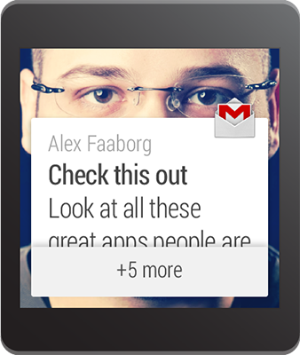
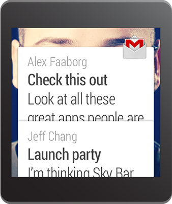

# 將 Notification 放成一疊

> 編寫:[wangyachen](https://github.com/wangyacheng) - 原文: <http://developer.android.com/training/wearables/notifications/stacks.html>

當為手持式設備創建Notification時，開發者應該將多個相似的Notification合併成一個概括式的Notification。例如，如果app創建了一系列接收短信的Notification，開發者不應該將多於一個Notification顯示到可穿戴設備上——當接收到多於一條消息的時候，用一個Notification提供一個摘要，比如"2條新消息"。

儘管如此，一個概括式的Notification在可穿戴設備上並不是很有用處，因為用戶不能在可穿戴設備上閱讀每條消息的詳細內容(他們必須在手持式設備上打開相應的app才能看到更多信息)。所以對可穿戴設備而言，開發者應該將所有的Notification都集中起來，放成一疊。這疊Notification以一張卡片的形式顯示出來，用戶可以將它展開，分別看到每個Notification的詳細內容。通過新方法[setGroup()](http://developer.android.com/reference/android/support/v4/app/NotificationCompat.Builder.html#setGroup(java.lang.String))能夠實現該功能，同時，也能保持手持式設備上顯示為一條概括式的Notification。




## 將每個Notification添加到一個群組中

為了創建一個stack，可以對每個想要放入該stack的Notification調用[setGroup()](http://developer.android.com/reference/android/support/v4/app/NotificationCompat.Builder.html#setGroup(java.lang.String))，並且指定一個group key。然後調用[notify()](http://developer.android.com/reference/java/lang/Object.html#notify())將其發送至可穿戴設備上。

```java
final static String GROUP_KEY_EMAILS = "group_key_emails";

// Build the notification, setting the group appropriately
Notification notif = new NotificationCompat.Builder(mContext)
         .setContentTitle("New mail from " + sender1)
         .setContentText(subject1)
         .setSmallIcon(R.drawable.new_mail);
         .setGroup(GROUP_KEY_EMAILS)
         .build();

// Issue the notification
NotificationManagerCompat notificationManager =
        NotificationManagerCompat.from(this);
notificationManager.notify(notificationId1, notif);
```

稍後，當開發者創建另一個Notification的時候，指定同樣的group key。當在調用[notify()](http://developer.android.com/reference/java/lang/Object.html#notify())的時候，這個Notification就會出現在之前那個Notification的同一個stack中，而非新建一張卡片。

```java
Notification notif2 = new NotificationCompat.Builder(mContext)
         .setContentTitle("New mail from " + sender2)
         .setContentText(subject2)
         .setSmallIcon(R.drawable.new_mail);
         .setGroup(GROUP_KEY_EMAILS)
         .build();

notificationManager.notify(notificationId2, notif2);
```

在默認的情況下，Notification的排列順序由開發者添加的先後順序決定，最近的Notification會被放置在最頂端。你可以通過[setSortKey()](http://developer.android.com/reference/android/support/v4/app/NotificationCompat.Builder.html#setSortKey(java.lang.String))來修改Notification的排順序。

## 添加概括式Notification

在手持設備上提供一個概括式的Notification是很重要的。因此除了要將每條單獨的Notification放置在同一個stack group中，還需要添加一個概括式的Notification，並對其調用[setGroupSummary()](http://developer.android.com/reference/android/support/v4/app/NotificationCompat.Builder.html#setGroupSummary(boolean))即可實現。

該Notification並不會出現在可穿戴設備上的stack中，只會出現在手持式設備上。


```java
Bitmap largeIcon = BitmapFactory.decodeResource(getResources(),
        R.drawable.ic_large_icon);

// Create an InboxStyle notification
Notification summaryNotification = new NotificationCompat.Builder(mContext)
        .setContentTitle("2 new messages")
        .setSmallIcon(R.drawable.ic_small_icon)
        .setLargeIcon(largeIcon)
        .setStyle(new NotificationCompat.InboxStyle()
                .addLine("Alex Faaborg   Check this out")
                .addLine("Jeff Chang   Launch Party")
                .setBigContentTitle("2 new messages")
                .setSummaryText("johndoe@gmail.com"))
        .setGroup(GROUP_KEY_EMAILS)
        .setGroupSummary(true)
        .build();

notificationManager.notify(notificationId3, summaryNotification);
```

該Notification使用了[NotificationCompat.InboxStyle](http://developer.android.com/reference/android/support/v4/app/NotificationCompat.InboxStyle.html)，這個style能夠讓開發者很輕鬆地創建郵件或者短信app的Notifications。開發者可以對概括式Notification使用這個style，或者[NotificationCompat](http://developer.android.com/reference/android/support/v4/app/NotificationCompat.html)中定義的其他style，或者不使用任何style也可以。

> **Tip：**如果想要和上面截圖中一樣的設計文本，請參考[Styling with HTML markup](http://developer.android.com/guide/topics/resources/string-resource.html#StylingWithHTML)和[Styling with Spannables](http://developer.android.com/guide/topics/resources/string-resource.html#StylingWithSpannables)。

概括式Notification能夠在不顯示在可穿戴設備上的前提下做到影響可穿戴設備上的Notification。當開發者創建一個概括式Notification時，可以利用[NotificationCompat.WearableExtender](http://developer.android.com/reference/android/support/v4/app/NotificationCompat.WearableExtender.html)，調用[setBackground()](http://developer.android.com/reference/android/support/v4/app/NotificationCompat.WearableExtender.html#setBackground(android.graphics.Bitmap))或者[addAction()](http://developer.android.com/reference/android/support/v4/app/NotificationCompat.WearableExtender.html#addAction(android.support.v4.app.NotificationCompat.Action))為可穿戴設備上的整個stack設置一個背景圖片或者一個action。以下代碼展示瞭如何為整個stack設置背景：

```java
Bitmap background = BitmapFactory.decodeResource(getResources(),
        R.drawable.ic_background);

NotificationCompat.WearableExtender wearableExtender =
        new NotificationCompat.WearableExtender()
        .setBackground(background);

// Create an InboxStyle notification
Notification summaryNotificationWithBackground =
        new NotificationCompat.Builder(mContext)
        .setContentTitle("2 new messages")
        ...
        .extend(wearableExtender)
        .setGroup(GROUP_KEY_EMAILS)
        .setGroupSummary(true)
        .build();
```

下一課：[創建可穿戴的應用](apps/index.html)


