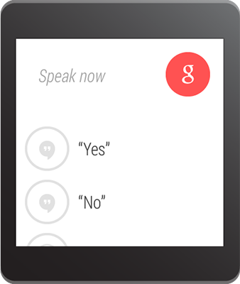

# 在 Notifcation 中接收語音輸入

> 編寫:[wangyachen](https://github.com/wangyacheng) - 原文:<http://developer.android.com/training/wearables/notifications/voice-input.html>

如果手持式設備上的Notification包含了一個輸入文本的action，比如回覆郵件，那麼這個action正常情況下應該會調起一個activity讓用戶進行輸入。但是，當這個action出現在可穿戴式設備上時，是沒有鍵盤可以讓用戶進行輸入的，所以開發者應該讓用戶指定一個反饋或者通過[RemoteInput](http://developer.android.com/reference/android/support/v4/app/RemoteInput.html)預先設定好文本信息。

當用戶通過語音或者選擇可見的消息進行回覆時，系統會將文本的反饋信息與開發者指定的Notification中的action中的[Intent](http://developer.android.com/reference/android/content/Intent.html)進行綁定，並且將該intent發送給手持設備中的app。

> **Note：**Android模擬器並不支持語音輸入。如果使用可穿戴式設備的模擬器的話，可以打開AVD設置中的**Hardware keyboard present**，實現用打字代替語音。


## 定義語音輸入

為了創建一個支持語音輸入的action，需要創建一個[RemoteInput.Builder](http://developer.android.com/reference/android/support/v4/app/RemoteInput.Builder.html)的實例，將其加到Notification的action中。這個類的構造函數接受一個String類型的參數，系統用這個參數作為語音輸入的key，後面我們會用這個key來取得在手持設備中輸入的文本。

舉個例子，下面展示瞭如何創建一個[RemoteInput](http://developer.android.com/reference/android/support/v4/app/RemoteInput.html)對象，其中，該提供了一個用於提示語音輸入的自定義label。

```java
// Key for the string that's delivered in the action's intent
private static final String EXTRA_VOICE_REPLY = "extra_voice_reply";

String replyLabel = getResources().getString(R.string.reply_label);

RemoteInput remoteInput = new RemoteInput.Builder(EXTRA_VOICE_REPLY)
        .setLabel(replyLabel)
        .build();
```

### 添加預先設定的文本反饋

除了要打開語音輸入支持之外，開發者還可以提供多達5條的文本反饋，這樣用戶可以直接選擇實現快速回復。該功能可通過調用[setChoices()](http://developer.android.com/reference/android/support/v4/app/RemoteInput.Builder.html#setChoices(java.lang.CharSequence[]))並傳遞一個String數組實現。



舉個例子，可以用resource數組的方式定義這些反饋：

`res/values/strings.xml`

```xml
<?xml version="1.0" encoding="utf-8"?>
<resources>
    <string-array name="reply_choices">
        <item>Yes</item>
        <item>No</item>
        <item>Maybe</item>
    </string-array>
</resources>
```

然後，填充 String 數組，並將其添加到[RemoteInput](http://developer.android.com/reference/android/support/v4/app/RemoteInput.html)中：

```java
public static final EXTRA_VOICE_REPLY = "extra_voice_reply";
...
String replyLabel = getResources().getString(R.string.reply_label);
String[] replyChoices = getResources().getStringArray(R.array.reply_choices);

RemoteInput remoteInput = new RemoteInput.Builder(EXTRA_VOICE_REPLY)
        .setLabel(replyLabel)
        .setChoices(replyChoices)
        .build();
```

## 添加語音輸入作為Notification的action

為了實現設置語音輸入，可以把[RemoteInput](http://developer.android.com/reference/android/support/v4/app/RemoteInput.html)對象通過[addRemoteInput()](http://developer.android.com/reference/android/support/v4/app/NotificationCompat.Action.Builder.html#addRemoteInput(android.support.v4.app.RemoteInput))設置到一個action中。然後我們可以將這個action應用到Notification中，例如：

```java
// Create an intent for the reply action
Intent replyIntent = new Intent(this, ReplyActivity.class);
PendingIntent replyPendingIntent =
        PendingIntent.getActivity(this, 0, replyIntent,
                PendingIntent.FLAG_UPDATE_CURRENT);

// Create the reply action and add the remote input
NotificationCompat.Action action =
        new NotificationCompat.Action.Builder(R.drawable.ic_reply_icon,
                getString(R.string.label, replyPendingIntent))
                .addRemoteInput(remoteInput)
                .build();

// Build the notification and add the action via WearableExtender
Notification notification =
        new NotificationCompat.Builder(mContext)
                .setSmallIcon(R.drawable.ic_message)
                .setContentTitle(getString(R.string.title))
                .setContentText(getString(R.string.content))
                .extend(new WearableExtender().addAction(action))
                .build();

// Issue the notification
NotificationManagerCompat notificationManager =
        NotificationManagerCompat.from(mContext);
notificationManager.notify(notificationId, notification);
```

當程序發出這個Notification的時候，用戶在可穿戴設備上左滑便可以看到reply的按鈕。

## 將語音輸入轉化為String

通過調用[getResultsFromIntent()](http://developer.android.com/reference/android/support/v4/app/RemoteInput.html#getResultsFromIntent(android.content.Intent))方法，將返回值放在"Reply"的action指定的intent中，開發者便可以在回覆的action的intent中指定的activity裡，接收到用戶轉錄後的消息。該方法返回的是包含了文本反饋的[Bundle](http://developer.android.com/reference/android/os/Bundle.html)。我們可以通過查詢[Bundle](http://developer.android.com/reference/android/os/Bundle.html)中的內容來獲得這條反饋。

> **Note：**請不要使用[Intent.getExtras()](http://developer.android.com/reference/android/content/Intent.html#getExtras())來獲取語音輸入的結果，因為語音輸入的內容是存儲在[ClipData](http://developer.android.com/reference/android/content/ClipData.html)中的。[getResultsFromIntent()](http://developer.android.com/reference/android/support/v4/app/RemoteInput.html#getResultsFromIntent(android.content.Intent))提供了一條很方便的途徑來接收字符數組類型的語音信息，並且不需要經過[ClipData](http://developer.android.com/reference/android/content/ClipData.html)自身的調用。

下面的代碼展示了一個接收intent，並且返回語音反饋信息的方法，該方法是依據之前例子中的`EXTRA_VOICE_REPLY`作為key進行檢索：

```java
/**
 * Obtain the intent that started this activity by calling
 * Activity.getIntent() and pass it into this method to
 * get the associated voice input string.
 */

private CharSequence getMessageText(Intent intent) {
    Bundle remoteInput = RemoteInput.getResultsFromIntent(intent);
        if (remoteInput != null) {
            return remoteInput.getCharSequence(EXTRA_VOICE_REPLY);
        }
    }
    return null;
}
```

下一課：[為Notification添加頁面](pages.html)


