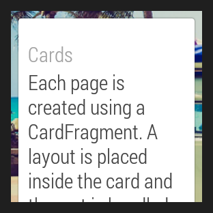

# 創建2D Picker

> 編寫: [roya](https://github.com/RoyaAoki) 原文:<https://developer.android.com/training/wearables/ui/2d-picker.html>

Android Wear中的[2D Picker](https://developer.android.com/design/wear/structure.html#2DPicker)模式允許用戶像換頁一樣從一組選項中導航和選擇。Wearable UI庫讓我們可以容易地用一個page grid來實現這個模式。其中，page grid是一個layout管理器，它允許用戶垂直和水平滾動頁面。

要實現這個模式，我們需要添加一個`GridViewPager`元素到activity的layout中，然後實現一個繼承`FragmentGridPagerAdapter`類的adapter以提供一組頁面。

> **Note:** Android SDK中的*GridViewPager*例子示範瞭如何在應用中使用 `GridViewPager` layout。這個例子的位於`android-sdk/samples/android-20/wearable/GridViewPager`目錄中。

## 添加Page Grid

像下面一樣添加一個`GridViewPager`元素到layout描述文件：

```xml
<android.support.wearable.view.GridViewPager
    xmlns:android="http://schemas.android.com/apk/res/android"
    android:id="@+id/pager"
    android:layout_width="match_parent"
    android:layout_height="match_parent" />
```
	    
我們可以使用任何[定義Layouts](https://developer.android.com/training/wearables/ui/layouts.html)技術以保證2D picker可以工作在圓形和方形兩種設備上。

## 實現Page Adapter

Page Adapter提供一組頁面以填充`GridViewPager`部件。要實現這個adapter，需要繼承Wearable UI庫中的`FragmentGridPageAdapter`類。

舉個例子，Android SDK內的*GridViewPager*例子中包含了下面的adapter實現，該實現提供一組靜態的具有自定義背景圖片的card：

```java
public class SampleGridPagerAdapter extends FragmentGridPagerAdapter {

    private final Context mContext;

    public SampleGridPagerAdapter(Context ctx, FragmentManager fm) {
        super(fm);
        mContext = ctx;
    }

    static final int[] BG_IMAGES = new int[] {
            R.drawable.debug_background_1, ...
            R.drawable.debug_background_5
    };

    // A simple container for static data in each page
    private static class Page {
        // static resources
        int titleRes;
        int textRes;
        int iconRes;
        ...
    }

    // Create a static set of pages in a 2D array
    private final Page[][] PAGES = { ... };

    // Override methods in FragmentGridPagerAdapter
    ...
}
```
	
picker調用`getFragment`和`getBackground`來取得內容以顯示到grid的每個位置中。

```java
// Obtain the UI fragment at the specified position
@Override
public Fragment getFragment(int row, int col) {
    Page page = PAGES[row][col];
    String title =
        page.titleRes != 0 ? mContext.getString(page.titleRes) : null;
    String text =
        page.textRes != 0 ? mContext.getString(page.textRes) : null;
    CardFragment fragment = CardFragment.create(title, text, page.iconRes);

    // Advanced settings (card gravity, card expansion/scrolling)
    fragment.setCardGravity(page.cardGravity);
    fragment.setExpansionEnabled(page.expansionEnabled);
    fragment.setExpansionDirection(page.expansionDirection);
    fragment.setExpansionFactor(page.expansionFactor);
    return fragment;
}

// Obtain the background image for the page at the specified position
@Override
public ImageReference getBackground(int row, int column) {
    return ImageReference.forDrawable(BG_IMAGES[row % BG_IMAGES.length]);
}
```
	
`getRowCount`方法告訴picker有多少行內容是可獲得的，`getColumnCount`方法告訴picker每行中有多少列內容是可獲得的。

```java
// Obtain the number of pages (vertical)
@Override
public int getRowCount() {
    return PAGES.length;
}

// Obtain the number of pages (horizontal)
@Override
public int getColumnCount(int rowNum) {
    return PAGES[rowNum].length;
}
```
	
adapter是實現細節取決於我們指定的某組頁面。由adapter提供的每個頁面是`Fragement`類型。在這個例子中，每個頁面是一個使用默認card layouts的`CardFragment`實例。然而，我們可以在同一個2D picker混合不同類型的頁面，比如cards，action icons，和自定義layouts，由具體情況決定。

不是所有行都需要有同樣數量的頁面。注意這個例子中的每行有不同的列數。我們也可以用一個 `GridViewPager` 組件實現只有一行或一列的1D picker。



**Figure 1:** GridViewPager例子

對於那些超出設備屏幕大小的card，`GridViewPager`為它們提供了滾動支持。這個例子配置了每張card可以按照需要進行展開，所以用戶可以滾動卡片的內容。當用戶滾動到card的盡頭，向同一方向滑動將顯示grid中的下一頁（如果下一頁存在的話）。

我們可以使用`getBackground()`方法自定義每頁的背景。當用戶在頁面間滑動時，`GridViewPager`自動在不同的背景之間使用視差滾動和淡出效果。

### 分配adapter實例給page grid

在activity中，分配一個adapter實現實例給`GridViewPager`組件：

```java
public class MainActivity extends Activity {

    @Override
    protected void onCreate(Bundle savedInstanceState) {
        super.onCreate(savedInstanceState);
        setContentView(R.layout.activity_main);
        ...
        final GridViewPager pager = (GridViewPager) findViewById(R.id.pager);
        pager.setAdapter(new SampleGridPagerAdapter(this, getFragmentManager()));
    }
}
```