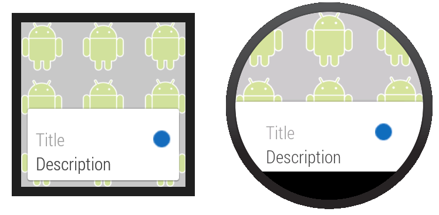
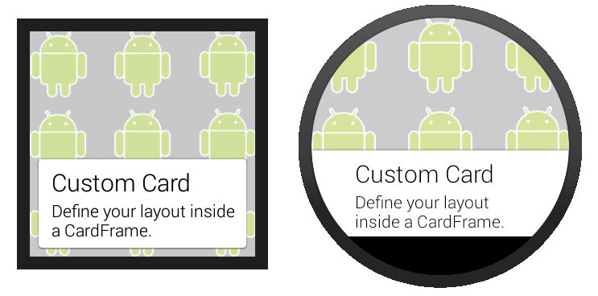

# 創建Card

> 編寫: [roya](https://github.com/RoyaAoki) 原文:<https://developer.android.com/training/wearables/ui/cards.html>

Card在不同的應用上以一致的外觀為用戶顯示信息。這個章節介紹如何在Android Wear應用中創建Card。

Wearable UI庫提供了為穿戴設備特別設計的Card實現。這個庫包含了`CardFrame`類，它將view包在一個Card風格的框架中，該框架有白色的背景、圓角和光投射陰影。`CardFrame`只能包含一個直接子類，通常是一個layout管理器，我們可以向它添加其他views以定製Card內容。

你有兩種方法嚮應用添加Card：

* 使用或繼承`CardFragment`類。
* 在layout的`CardScrollView`中添加一個Card。

> **Note:** 這個課程展示瞭如何在Android Wear activities中添加Card。Android可穿戴設備上的notifications同樣以Card的形式顯示。更多信息請查看[為Notification賦加可穿戴特性](https://developer.android.com/training/wearables/notifications/index.html)。

## 創建Card Fragment

`CardFragment`類提供一個默認的Card layout，該layout含有一個標題、描述文字和一個圖標。如果figure 1的默認Card layout符合你的要求，那麼使用這個方法向你的app添加Card。



**Figure 1.** 默認的`CardFragment` layout.

為了添加一個`CardFragment`到應用中，我們需要：

* 在layout中，為包含Card的節點分配一個ID
* 在activity中，創建一個`CardFragment`實例
* 使用fragment管理器將`CardFragment`實例添加到它的容器

下面的示例代碼顯示了Figure 1中的屏幕顯示代碼：

```xml
<android.support.wearable.view.BoxInsetLayout
xmlns:android="http://schemas.android.com/apk/res/android"
xmlns:app="http://schemas.android.com/apk/res-auto"
android:background="@drawable/robot_background"
android:layout_height="match_parent"
android:layout_width="match_parent">

    <FrameLayout
        android:id="@+id/frame_layout"
        android:layout_width="match_parent"
        android:layout_height="match_parent"
        app:layout_box="bottom">

    </FrameLayout>
</android.support.wearable.view.BoxInsetLayout>
```

下面的代碼添加`CardFragment`實例到Figure 1的activity中：

```java
protected void onCreate(Bundle savedInstanceState) {
    super.onCreate(savedInstanceState);
    setContentView(R.layout.activity_wear_activity2);

    FragmentManager fragmentManager = getFragmentManager();
    FragmentTransaction fragmentTransaction = fragmentManager.beginTransaction();
    CardFragment cardFragment = CardFragment.create(getString(R.string.cftitle),
                                                    getString(R.string.cfdesc),
                                                    R.drawable.p);
    fragmentTransaction.add(R.id.frame_layout, cardFragment);
    fragmentTransaction.commit();
}
```

為了使用`CardFragment`創建一個帶有自定義layout的Card，需要繼承這個類和重寫它的`onCreateContentView`方法。

## 添加CardFrame到Layout

我們也可以直接添加一個Card到layout中，如figure 2所示。當希望為layout文件中的Card自定義一個layout時，使用這個方法。



**Figure 2.** 添加一個`CardFrame`到layout.

下面的layout代碼例子示範了一個含有兩個節點的垂直linear layout。你可以創建更加複雜的layouts以適合你應用的需要。

```xml
<android.support.wearable.view.BoxInsetLayout
xmlns:android="http://schemas.android.com/apk/res/android"
xmlns:app="http://schemas.android.com/apk/res-auto"
android:background="@drawable/robot_background"
android:layout_height="match_parent"
android:layout_width="match_parent">

    <android.support.wearable.view.CardScrollView
        android:id="@+id/card_scroll_view"
        android:layout_height="match_parent"
        android:layout_width="match_parent"
        app:layout_box="bottom">

        <android.support.wearable.view.CardFrame
            android:layout_height="wrap_content"
            android:layout_width="fill_parent">

            <LinearLayout
                android:layout_height="wrap_content"
                android:layout_width="match_parent"
                android:orientation="vertical"
                android:paddingLeft="5dp">
                <TextView
                    android:fontFamily="sans-serif-light"
                    android:layout_height="wrap_content"
                    android:layout_width="match_parent"
                    android:text="@string/custom_card"
                    android:textColor="@color/black"
                    android:textSize="20sp"/>
                <TextView
                    android:fontFamily="sans-serif-light"
                    android:layout_height="wrap_content"
                    android:layout_width="match_parent"
                    android:text="@string/description"
                    android:textColor="@color/black"
                    android:textSize="14sp"/>
            </LinearLayout>
        </android.support.wearable.view.CardFrame>
    </android.support.wearable.view.CardScrollView>
</android.support.wearable.view.BoxInsetLayout>
```

當`CardScrollView`的內容小於容器時，這個例子上的`CardScrollView`節點讓我們可以配置Card的gravity，。這個例子是Card對齊屏幕底部：

```java
@Override
protected void onCreate(Bundle savedInstanceState) {
    super.onCreate(savedInstanceState);
    setContentView(R.layout.activity_wear_activity2);

    CardScrollView cardScrollView =
        (CardScrollView) findViewById(R.id.card_scroll_view);
    cardScrollView.setCardGravity(Gravity.BOTTOM);
}
```

`CardScrollView`檢測屏幕形狀後以不同的顯示方式在圓形或方形設備上顯示Card（在圓形屏幕上使用更寬的側邊緣。不管怎樣，在`BoxInsetLayout`中放置`CardScrollView`節點然後使用`layout_box="bottom"`屬性，這對圓形屏幕上的Card對齊底部並且沒有內容被剪裁是很有用的。