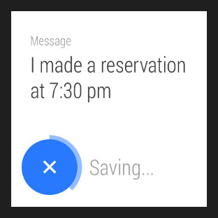
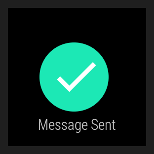

# 顯示確認界面

> 編寫: [roya](https://github.com/RoyaAoki) 原文:<https://developer.android.com/training/wearables/ui/confirm.html>

Android Wear應用中的[確認界面(Confirmations)](https://developer.android.com/design/wear/patterns.html#Countdown)通常是全屏或者相比於手持應用佔更大的部分。這樣確保用戶可以一眼看到確認界面(confirmations)且有一個足夠大的觸摸區域用於取消一個操作。

Wearable UI庫幫助我們在Android Wear應用中顯示確認動畫和定時器：

*確認定時器*

* 自動確認定時器為用戶顯示一個定時器動畫，讓用戶可以取消他們最近的操作。


*確認界面動畫*

* 確認界面動畫給用戶在完成一個操作時的視覺反饋。

下面的章節將演示瞭如何實現這些模式。

## 使用自動確認定時器

自動確認定時器讓用戶取消剛做的操作。當用戶做一個操作，我們的應用會顯示一個帶有定時動畫的取消按鈕，並且啟動該定時器。用戶可以在定時結束前選擇取消操作。如果用戶選擇取消操作或定時結束，我們的應用會得到一個通知。



**Figure 1:** 一個確認定時器.

為了在用戶完成操作時顯示一個確認定時器：

1. 添加`DelayedConfirmationView`元素到layout中。
2. 在activity中實現`DelayedConfirmationListener`接口。
3. 當用戶完成一個操作時，設置定時器的定時時間然後啟動它。

像下面這樣添加`DelayedConfirmationView`元素到layout中：

```xml
<android.support.wearable.view.DelayedConfirmationView
    android:id="@+id/delayed_confirm"
    android:layout_width="40dp"
    android:layout_height="40dp"
    android:src="@drawable/cancel_circle"
    app:circle_border_color="@color/lightblue"
    app:circle_border_width="4dp"
    app:circle_radius="16dp">
</android.support.wearable.view.DelayedConfirmationView>
```
	
在layout定義中，我們可以用`android:src`制定一個drawable資源，用於顯示在圓形裡。然後直接設置圓的參數。

為了獲得定時結束或用戶點擊按鈕時的通知，需要在activity中實現相應的listener方法：

```java
public class WearActivity extends Activity implements
                           DelayedConfirmationView.DelayedConfirmationListener {

    private DelayedConfirmationView mDelayedView;

    @Override
    protected void onCreate(Bundle savedInstanceState) {
        super.onCreate(savedInstanceState);
        setContentView(R.layout.activity_wear_activity);

        mDelayedView =
                (DelayedConfirmationView) findViewById(R.id.delayed_confirm);
        mDelayedView.setListener(this);
    }

    @Override
    public void onTimerFinished(View view) {
        // User didn't cancel, perform the action
    }

    @Override
    public void onTimerSelected(View view) {
        // User canceled, abort the action
    }
}
```

為了啟動定時器，添加下面的代碼到activity處理用戶選擇某個操作的位置中：

```java
// Two seconds to cancel the action
mDelayedView.setTotalTimeMs(2000);
// Start the timer
mDelayedView.start();
```
	
## 顯示確認動畫

為了當用戶在我們的應用中完成一個操作時顯示確認動畫，我們需要創建一個從應用中的某個activity啟動`ConfirmationActivity`的intent。我們可以用`EXTRA_ANIMATION_TYPE` intent extra來指定下面其中一種動畫：

* `SUCCESS_ANIMATION`
* `FAILURE_ANIMATION`
* `OPEN_ON_PHONE_ANIMATION`

我們還可以在確認圖標下面添加一條消息。



**Figure 2:** 一個確認動畫

要在應用中使用`ConfirmationActivity`，首先在manifest文件聲明這個activity：

```xml
<manifest>
  <application>
    ...
    <activity
        android:name="android.support.wearable.activity.ConfirmationActivity">
    </activity>
  </application>
</manifest>
```
	
然後確定用戶操作的結果，並使用intent啟動activity:

```java
Intent intent = new Intent(this, ConfirmationActivity.class);
intent.putExtra(ConfirmationActivity.EXTRA_ANIMATION_TYPE,
                ConfirmationActivity.SUCCESS_ANIMATION);
intent.putExtra(ConfirmationActivity.EXTRA_MESSAGE,
                getString(R.string.msg_sent));
startActivity(intent);
```

當確認動畫顯示結束後，`ConfirmationActivity`會銷燬（Finish），我們的的activity會恢復（Resume）。